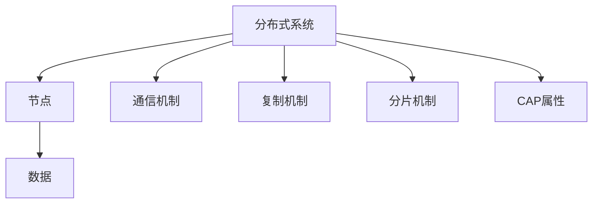

# 4.3.3 结构图与表

<!-- TOC START -->

- [4.3.3 结构图与表](#433-结构图与表)
  - [1. 结构图](#1-结构图)
  - [2. 层次关系图](#2-层次关系图)
  - [3. 关联矩阵](#3-关联矩阵)
  - [4. 结构表](#4-结构表)
  - [5. 多表征](#5-多表征)
  - [6. 规范说明](#6-规范说明)

<!-- TOC END -->

## 1. 结构图

## 2. 层次关系图

## 3. 关联矩阵

| 组件 | 节点 | 通信 | 复制 | 分片 | CAP |
|------|------|------|------|------|-----|
| 节点 | √    | √    | √    | √    |     |
| 通信 |      | √    |      |      |     |
| 复制 |      |      | √    |      | √   |
| 分片 |      |      |      | √    | √   |
| CAP  |      |      | √    | √    | √   |

## 4. 结构表

| 编号 | 结构要素 | 说明 |
|------|----------|------|
| 4.3.3.1 | 节点 | 独立计算单元，协作完成任务 |
| 4.3.3.2 | 通信机制 | 节点间消息传递方式 |
| 4.3.3.3 | 复制机制 | 数据冗余与同步策略 |
| 4.3.3.4 | 分片机制 | 数据分布与扩展性方案 |
| 4.3.3.5 | CAP属性 | 一致性、可用性、分区容忍性属性 |

## 5. 多表征

- 结构图、层次关系图、关联矩阵、结构表、符号化描述

## 6. 规范说明

- 内容需递归细化，支持多表征。
- 保留批判性分析、图表等。
- 如有遗漏，后续补全并说明。

> 本文件为递归细化与内容补全示范，后续可继续分解为4.3.3.1、4.3.3.2等子主题，支持持续递归完善。
