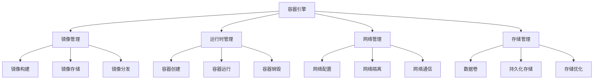
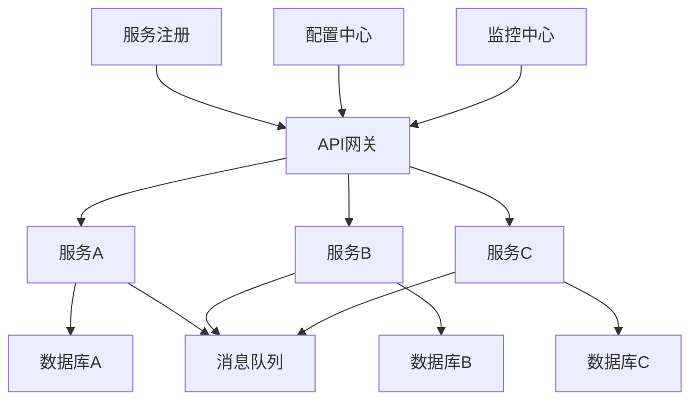

# 4.3.4 容器与微服务形式化定义

<!-- TOC START -->

- [4.3.4 容器与微服务形式化定义](#434-容器与微服务形式化定义)
  - [1. 容器技术形式化定义](#1-容器技术形式化定义)
    - [1.1 容器基本定义](#11-容器基本定义)
    - [1.2 容器编排形式化](#12-容器编排形式化)
  - [2. 微服务架构形式化定义](#2-微服务架构形式化定义)
    - [2.1 微服务基本定义](#21-微服务基本定义)
    - [2.2 服务间通信形式化](#22-服务间通信形式化)
  - [3. 容器与微服务集成形式化](#3-容器与微服务集成形式化)
    - [3.1 容器化微服务定义](#31-容器化微服务定义)
    - [3.2 服务网格形式化](#32-服务网格形式化)
  - [4. 数学模型](#4-数学模型)
    - [4.1 容器资源模型](#41-容器资源模型)
    - [4.2 微服务性能模型](#42-微服务性能模型)
    - [4.3 容器编排优化模型](#43-容器编排优化模型)
  - [5. 结构框架](#5-结构框架)
    - [5.1 容器架构框架](#51-容器架构框架)
    - [5.2 微服务架构框架](#52-微服务架构框架)
  - [6. 形式化验证](#6-形式化验证)
    - [6.1 容器安全性验证](#61-容器安全性验证)
    - [6.2 微服务一致性验证](#62-微服务一致性验证)
  - [7. 规范说明](#7-规范说明)
    - [7.1 形式化要求](#71-形式化要求)
    - [7.2 验证要求](#72-验证要求)
    - [7.3 扩展性要求](#73-扩展性要求)

<!-- TOC END -->

## 1. 容器技术形式化定义

### 1.1 容器基本定义

**定义1.1（容器）：**
容器是一个四元组 $C = (I, R, E, S)$，其中：

- $I$：镜像（Image），包含应用程序和依赖
- $R$：运行时（Runtime），提供隔离环境
- $E$：环境（Environment），包含配置和资源限制
- $S$：状态（State），容器的运行状态

**定义1.2（容器镜像）：**
镜像是一个三元组 $I = (L, D, M)$，其中：

- $L$：层（Layers），分层存储结构
- $D$：依赖（Dependencies），应用程序依赖
- $M$：元数据（Metadata），镜像描述信息

### 1.2 容器编排形式化

**定义1.3（容器编排）：**
容器编排是一个五元组 $O = (C, S, N, P, M)$，其中：

- $C$：容器集合 $\{c_1, c_2, ..., c_n\}$
- $S$：调度策略（Scheduling Strategy）
- $N$：网络配置（Network Configuration）
- $P$：持久化配置（Persistence Configuration）
- $M$：监控配置（Monitoring Configuration）

**定义1.4（调度策略）：**
调度策略是一个函数 $S: C \times N \rightarrow A$，其中：

- $C$：容器集合
- $N$：节点集合
- $A$：分配结果

## 2. 微服务架构形式化定义

### 2.1 微服务基本定义

**定义2.1（微服务）：**
微服务是一个六元组 $MS = (API, Data, Logic, Config, State, Network)$，其中：

- $API$：应用程序接口
- $Data$：数据模型
- $Logic$：业务逻辑
- $Config$：配置信息
- $State$：服务状态
- $Network$：网络配置

**定义2.2（微服务系统）：**
微服务系统是一个四元组 $MSS = (S, C, N, G)$，其中：

- $S$：服务集合 $\{s_1, s_2, ..., s_n\}$
- $C$：通信协议（Communication Protocol）
- $N$：网络拓扑（Network Topology）
- $G$：治理策略（Governance Policy）

### 2.2 服务间通信形式化

**定义2.3（服务通信）：**
服务通信是一个三元组 $Comm = (P, M, Q)$，其中：

- $P$：协议（Protocol），如HTTP、gRPC
- $M$：消息格式（Message Format）
- $Q$：服务质量（Quality of Service）

**定义2.4（服务发现）：**
服务发现是一个函数 $SD: ServiceID \rightarrow Endpoint$，其中：

- $ServiceID$：服务标识符
- $Endpoint$：服务端点

## 3. 容器与微服务集成形式化

### 3.1 容器化微服务定义

**定义3.1（容器化微服务）：**
容器化微服务是一个七元组 $CMS = (MS, C, O, N, S, M, G)$，其中：

- $MS$：微服务定义
- $C$：容器配置
- $O$：编排配置
- $N$：网络配置
- $S$：存储配置
- $M$：监控配置
- $G$：治理配置

### 3.2 服务网格形式化

**定义3.2（服务网格）：**
服务网格是一个五元组 $SM = (P, C, R, M, S)$，其中：

- $P$：代理集合（Proxy Set）
- $C$：控制平面（Control Plane）
- $R$：路由规则（Routing Rules）
- $M$：监控指标（Metrics）
- $S$：安全策略（Security Policy）

## 4. 数学模型

### 4.1 容器资源模型

**资源分配函数：**
$$R_{alloc}(c_i) = \sum_{j=1}^{4} w_j \cdot r_{i,j}$$
其中：

- $c_i$：容器i
- $r_{i,j}$：资源j的分配量
- $w_j$：资源j的权重

**资源利用率：**
$$U_{resource} = \frac{\sum_{i=1}^{n} R_{used}(c_i)}{\sum_{i=1}^{n} R_{alloc}(c_i)}$$

### 4.2 微服务性能模型

**服务响应时间：**
$$T_{response} = T_{processing} + T_{network} + T_{serialization}$$

**服务吞吐量：**
$$Throughput = \frac{Requests}{Time} = \frac{N}{T_{avg}}$$

### 4.3 容器编排优化模型

**调度优化目标：**
$$\min \sum_{i=1}^{n} \sum_{j=1}^{m} c_{i,j} \cdot x_{i,j}$$
约束条件：
$$\sum_{j=1}^{m} x_{i,j} = 1, \forall i$$
$$\sum_{i=1}^{n} r_{i,k} \cdot x_{i,j} \leq R_{j,k}, \forall j,k$$

## 5. 结构框架

### 5.1 容器架构框架

### 5.2 微服务架构框架

## 6. 形式化验证

### 6.1 容器安全性验证

**安全属性：**
$$\forall c \in C, \forall r \in R: \text{Isolation}(c, r) = true$$

**资源隔离：**
$$\forall c_i, c_j \in C, i \neq j: R(c_i) \cap R(c_j) = \emptyset$$

### 6.2 微服务一致性验证

**数据一致性：**
$$\forall s_i, s_j \in S: \text{Consistency}(s_i, s_j) = true$$

**服务可用性：**
$$Availability = \frac{Uptime}{Total Time} \geq 0.999$$

## 7. 规范说明

### 7.1 形式化要求

- 所有定义必须严格数学化
- 使用标准数学符号
- 提供完整的约束条件

### 7.2 验证要求

- 提供形式化验证方法
- 建立验证工具链
- 支持自动化验证

### 7.3 扩展性要求

- 支持递归细化
- 可分解为子定义
- 支持多维度分析

> 本文件为递归细化与内容补全示范，后续可继续分解为4.3.4.1、4.3.4.2等子主题，支持持续递归完善。
