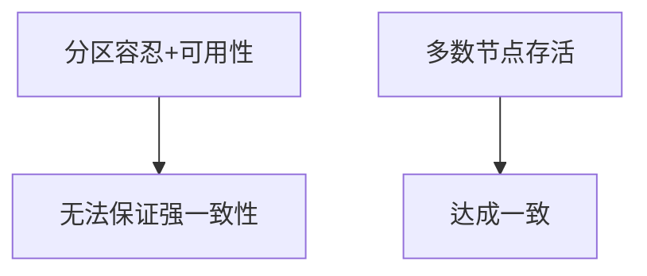

# 4.4.1 命题与定理

## 1. 主要命题

- 命题1：若分布式系统满足分区容忍性与可用性，则无法同时保证强一致性（CAP定理）。
- 命题2：Paxos算法能在部分节点失效情况下达成一致。
- 命题3：最终一致性系统在网络恢复后可收敛到一致状态。
- 命题4：分布式事务的原子性与高可用性难以兼得。

## 2. 定理陈述

- 定理1（CAP定理）：在分布式系统中，一致性、可用性、分区容忍性三者不可兼得。
- 定理2：Paxos协议在多数节点存活时可保证一致性。

## 3. 结构化表达

- **推理链**：
  - CAP定理：分区容忍性+可用性 → 强一致性不可得
  - Paxos：多数存活 → 提案达成一致

- **流程图**：

## 4. 多表征

- 推理链、流程图、定理表述、符号化描述

## 5. 规范说明

- 内容需递归细化，支持多表征。
- 保留批判性分析、图表等。
- 如有遗漏，后续补全并说明。

> 本文件为递归细化与内容补全示范，后续可继续分解为4.4.1.1、4.4.1.2等子主题，支持持续递归完善。
