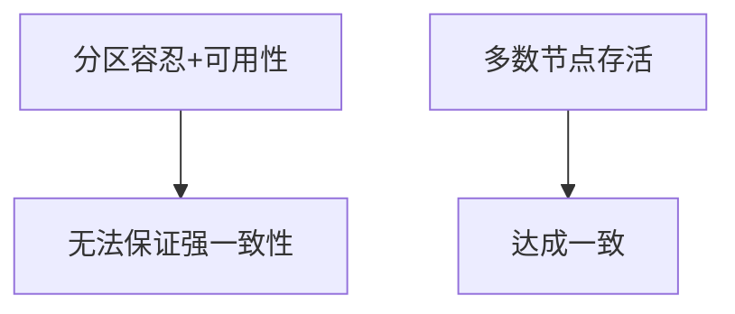

# 4.4.2 证明过程

## 1. 证明结构

- 证明命题1：若分布式系统满足分区容忍性与可用性，则无法同时保证强一致性（CAP定理）。
  - 依据：网络分区时，系统需在一致性与可用性间做出选择。
  - 推理链：分区容忍+可用性 → 某些节点无法同步 → 强一致性被破坏。

- 证明命题2：Paxos算法能在部分节点失效情况下达成一致。
  - 依据：只要多数节点存活，提案可被多数接受。
  - 推理链：多数存活 → 提案达成一致。

## 2. 推理链与流程图

- **推理链**：
  - CAP定理：分区容忍+可用性 → 强一致性不可得
  - Paxos：多数存活 → 达成一致

- **流程图**：

## 3. 多表征

- 推理链、流程图、证明结构、符号化描述

## 4. 规范说明

- 内容需递归细化，支持多表征。
- 保留批判性分析、图表等。
- 如有遗漏，后续补全并说明。

> 本文件为递归细化与内容补全示范，后续可继续分解为4.4.2.1、4.4.2.2等子主题，支持持续递归完善。
