# 4.5.1 概念图

<!-- TOC START -->

- [4.5.1 概念图](#451-概念图)
  - [概述](#概述)
  - [1. 分布式系统总体概念图 (Overall Distributed System Concept Map)](#1-分布式系统总体概念图-overall-distributed-system-concept-map)
    - [1.1 核心概念层次图](#11-核心概念层次图)
    - [1.2 分布式系统发展历程图](#12-分布式系统发展历程图)
  - [2. 系统架构概念图 (System Architecture Concept Maps)](#2-系统架构概念图-system-architecture-concept-maps)
    - [2.1 架构模式分类图](#21-架构模式分类图)
    - [2.2 系统组件关系图](#22-系统组件关系图)
  - [3. 通信机制概念图 (Communication Mechanism Concept Maps)](#3-通信机制概念图-communication-mechanism-concept-maps)
    - [3.1 通信模式分类图](#31-通信模式分类图)
    - [3.2 网络协议层次图](#32-网络协议层次图)
  - [4. 一致性模型概念图 (Consistency Model Concept Maps)](#4-一致性模型概念图-consistency-model-concept-maps)
    - [4.1 一致性级别分类图](#41-一致性级别分类图)
    - [4.2 CAP定理分析图](#42-cap定理分析图)
  - [5. 容错机制概念图 (Fault Tolerance Concept Maps)](#5-容错机制概念图-fault-tolerance-concept-maps)
    - [5.1 故障类型分类图](#51-故障类型分类图)
    - [5.2 容错策略分析图](#52-容错策略分析图)
  - [6. 负载均衡概念图 (Load Balancing Concept Maps)](#6-负载均衡概念图-load-balancing-concept-maps)
    - [6.1 负载均衡算法分类图](#61-负载均衡算法分类图)
    - [6.2 负载均衡架构图](#62-负载均衡架构图)
  - [7. 分布式算法概念图 (Distributed Algorithm Concept Maps)](#7-分布式算法概念图-distributed-algorithm-concept-maps)
    - [7.1 共识算法分类图](#71-共识算法分类图)
    - [7.2 分布式事务算法图](#72-分布式事务算法图)
  - [8. 数据管理概念图 (Data Management Concept Maps)](#8-数据管理概念图-data-management-concept-maps)
    - [8.1 数据分布策略图](#81-数据分布策略图)
    - [8.2 数据一致性算法图](#82-数据一致性算法图)
  - [9. 安全机制概念图 (Security Mechanism Concept Maps)](#9-安全机制概念图-security-mechanism-concept-maps)
    - [9.1 安全威胁分类图](#91-安全威胁分类图)
    - [9.2 安全防护策略图](#92-安全防护策略图)
  - [10. 性能优化概念图 (Performance Optimization Concept Maps)](#10-性能优化概念图-performance-optimization-concept-maps)
    - [10.1 性能指标分析图](#101-性能指标分析图)
    - [10.2 性能优化策略图](#102-性能优化策略图)

<!-- TOC END -->

## 概述

分布式系统概念图通过图形化方式展示分布式系统的核心概念、架构模式、算法和关系，帮助理解分布式系统的整体框架和内在逻辑。

## 1. 分布式系统总体概念图 (Overall Distributed System Concept Map)

### 1.1 核心概念层次图

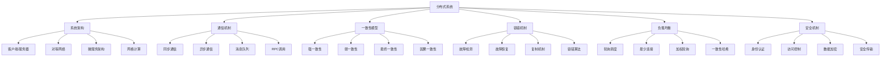

### 1.2 分布式系统发展历程图

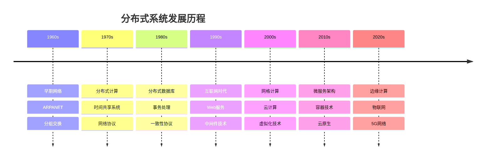

## 2. 系统架构概念图 (System Architecture Concept Maps)

### 2.1 架构模式分类图

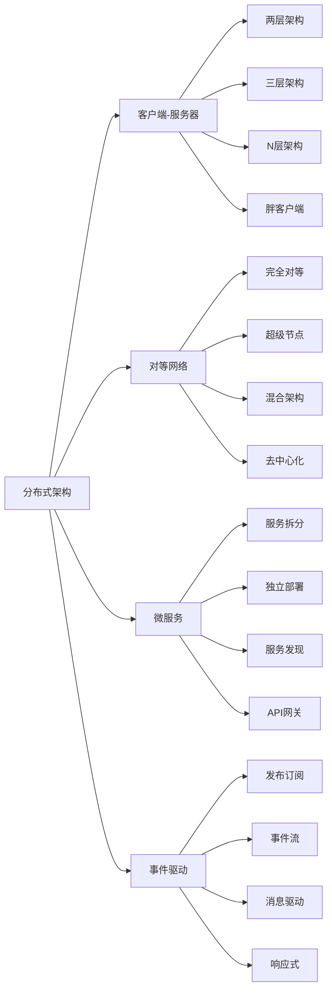

### 2.2 系统组件关系图

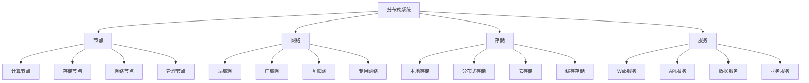

## 3. 通信机制概念图 (Communication Mechanism Concept Maps)

### 3.1 通信模式分类图

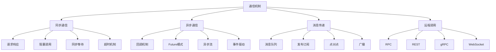

### 3.2 网络协议层次图

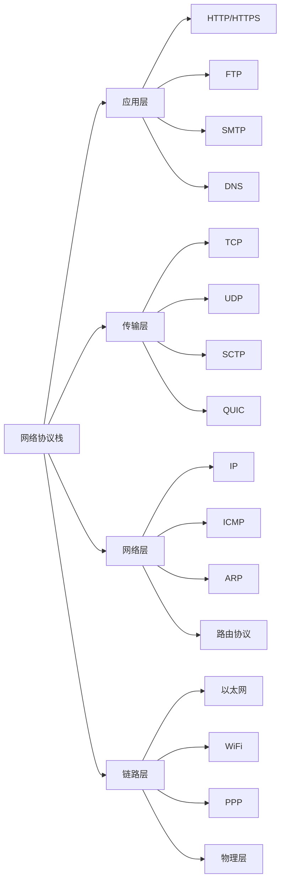

## 4. 一致性模型概念图 (Consistency Model Concept Maps)

### 4.1 一致性级别分类图

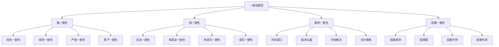

### 4.2 CAP定理分析图

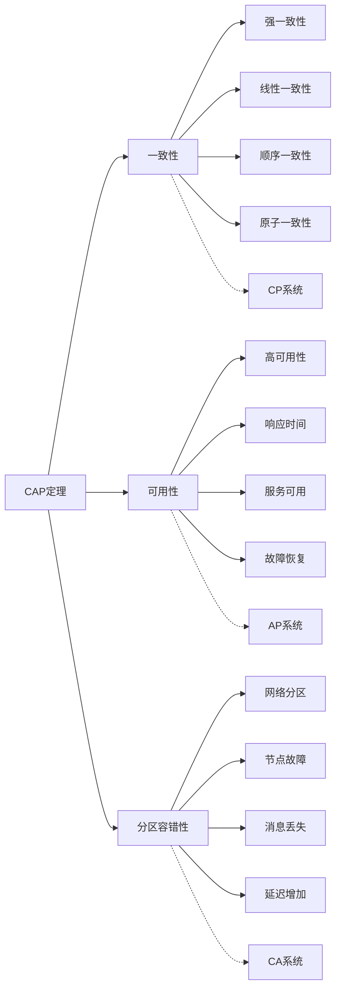

## 5. 容错机制概念图 (Fault Tolerance Concept Maps)

### 5.1 故障类型分类图

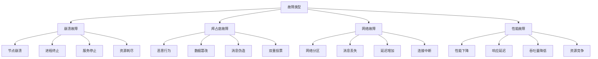

### 5.2 容错策略分析图

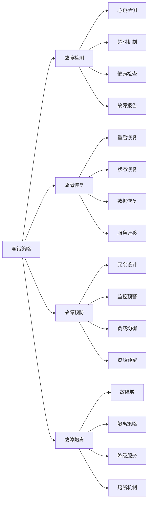

## 6. 负载均衡概念图 (Load Balancing Concept Maps)

### 6.1 负载均衡算法分类图

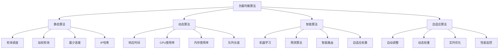

### 6.2 负载均衡架构图

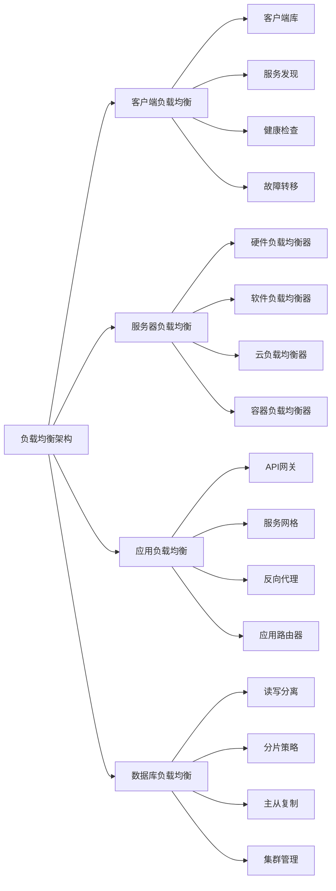

## 7. 分布式算法概念图 (Distributed Algorithm Concept Maps)

### 7.1 共识算法分类图

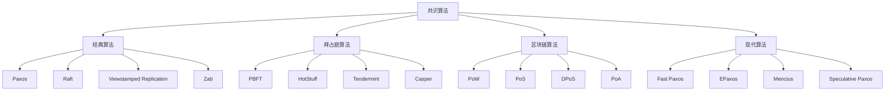

### 7.2 分布式事务算法图

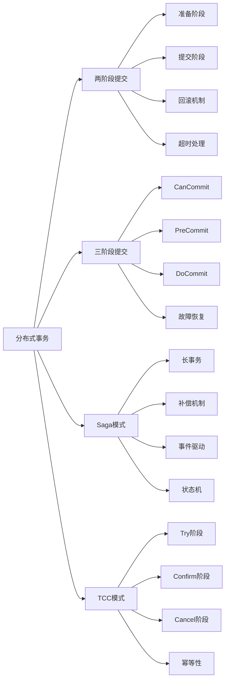

## 8. 数据管理概念图 (Data Management Concept Maps)

### 8.1 数据分布策略图

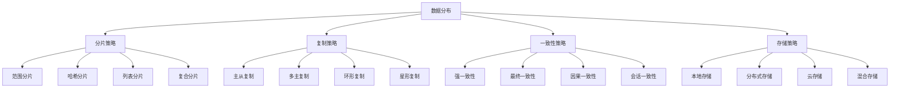

### 8.2 数据一致性算法图

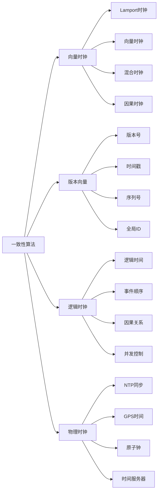

## 9. 安全机制概念图 (Security Mechanism Concept Maps)

### 9.1 安全威胁分类图

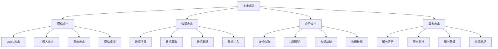

### 9.2 安全防护策略图

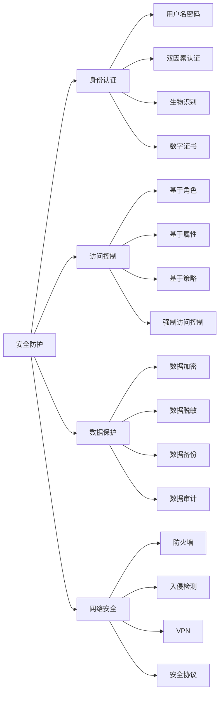

## 10. 性能优化概念图 (Performance Optimization Concept Maps)

### 10.1 性能指标分析图

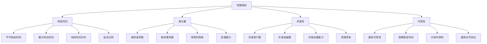

### 10.2 性能优化策略图

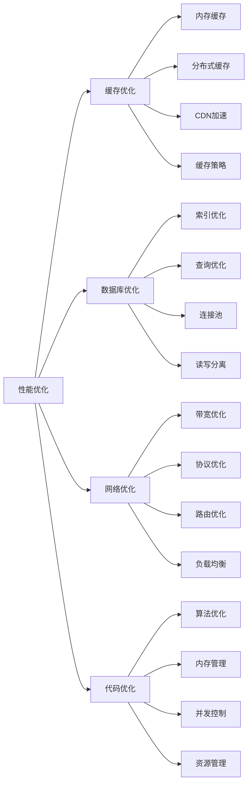
