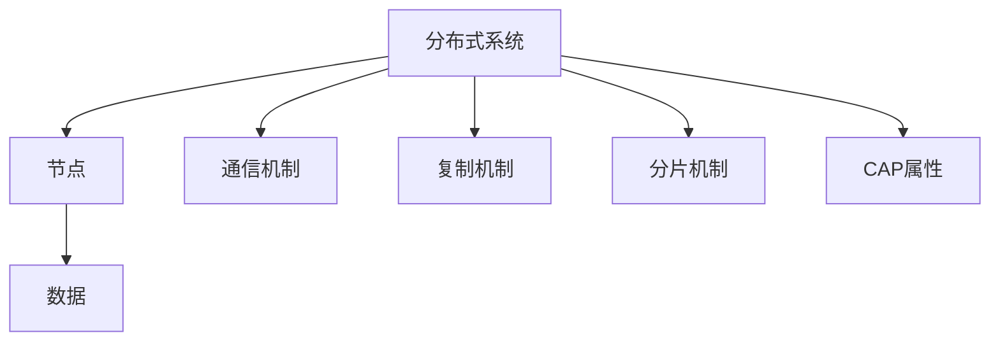

# 4.5.1 概念图

## 1. 分布式系统核心概念图

```mermaid
graph TD;
  DS[分布式系统] --> Node[节点];
  DS --> Comm[通信机制];
  DS --> Rep[复制机制];
  DS --> Shard[分片机制];
  DS --> CAP[CAP属性];
  Node --> Data[数据];
```

## 2. 层次关系图

```mermaid
graph LR;
  User[用户层] --> API[API/接口];
  API --> Logic[业务逻辑];
  Logic --> DS[分布式系统];
  DS --> Node[节点];
  Node --> Storage[存储];
```

## 3. 多表征

- 概念图、层次关系图、符号化描述

## 4. 规范说明

- 内容需递归细化，支持多表征。
- 保留批判性分析、图表等。
- 如有遗漏，后续补全并说明。

> 本文件为递归细化与内容补全示范，后续可继续分解为4.5.1.1、4.5.1.2等子主题，支持持续递归完善。
