# 4.5.4 容器与微服务多表征

## 1. 概念图表示

### 1.1 容器技术概念图

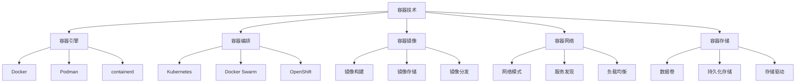

### 1.2 微服务架构概念图

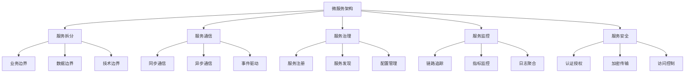

### 1.3 容器化微服务概念图

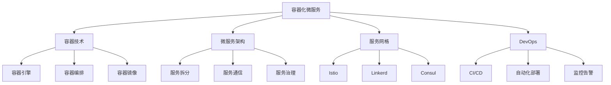

## 2. 结构表表示

### 2.1 容器技术对比表

| 特性 | Docker | Podman | containerd |
|------|--------|--------|------------|
| 架构 | 客户端-服务器 | 无守护进程 | 轻量级运行时 |
| 安全性 | 中等 | 高 | 高 |
| 兼容性 | 标准 | Docker兼容 | 标准 |
| 资源占用 | 中等 | 低 | 低 |
| 生态系统 | 完善 | 发展中 | 基础 |

### 2.2 微服务架构对比表

| 特性 | 单体架构 | 微服务架构 | 服务网格 |
|------|----------|------------|----------|
| 复杂度 | 低 | 高 | 很高 |
| 部署 | 简单 | 复杂 | 复杂 |
| 扩展性 | 差 | 好 | 很好 |
| 故障隔离 | 差 | 好 | 很好 |
| 团队协作 | 困难 | 容易 | 容易 |

### 2.3 容器编排工具对比表

| 特性 | Kubernetes | Docker Swarm | OpenShift |
|------|------------|--------------|-----------|
| 复杂度 | 高 | 中等 | 高 |
| 功能 | 丰富 | 基础 | 丰富 |
| 社区 | 活跃 | 一般 | 活跃 |
| 企业支持 | 好 | 一般 | 很好 |
| 学习曲线 | 陡峭 | 平缓 | 陡峭 |

## 3. 数学符号表示

### 3.1 容器资源模型

**容器资源分配：**
$$R_{container} = \{CPU, Memory, Storage, Network\}$$

**资源利用率：**
$$U_{resource} = \frac{\sum_{i=1}^{n} R_{used}(c_i)}{\sum_{i=1}^{n} R_{alloc}(c_i)}$$

**容器性能指标：**
$$P_{container} = \frac{Throughput}{Latency} \times \frac{1}{Resource_{usage}}$$

### 3.2 微服务通信模型

**服务间通信：**
$$C_{communication} = \sum_{i=1}^{n} \sum_{j=1}^{n} c_{i,j} \times w_{i,j}$$

**服务响应时间：**
$$T_{response} = T_{processing} + T_{network} + T_{serialization}$$

**服务可用性：**
$$A_{service} = \frac{MTBF}{MTBF + MTTR}$$

### 3.3 容器编排优化模型

**调度目标函数：**
$$\min \sum_{i=1}^{n} \sum_{j=1}^{m} c_{i,j} \cdot x_{i,j}$$

**资源约束：**
$$\sum_{i=1}^{n} r_{i,k} \cdot x_{i,j} \leq R_{j,k}, \forall j,k$$

**分配约束：**
$$\sum_{j=1}^{m} x_{i,j} = 1, \forall i$$

## 4. 流程图表示

### 4.1 容器部署流程

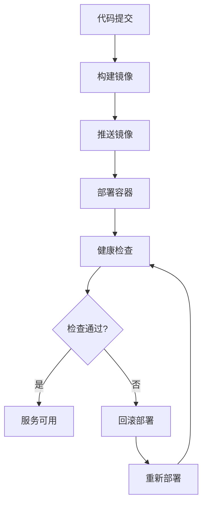

### 4.2 微服务调用流程

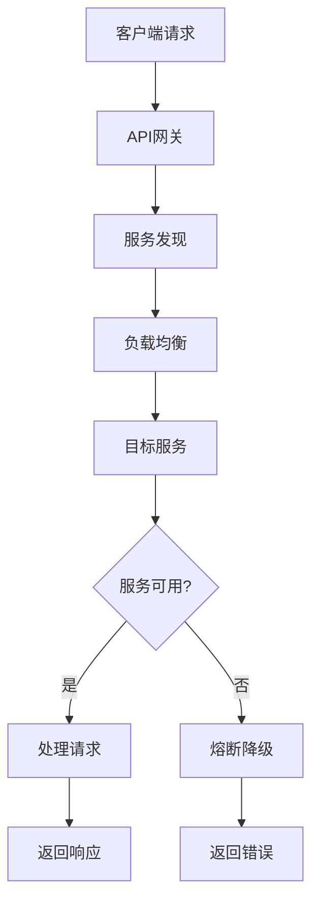

### 4.3 容器编排流程

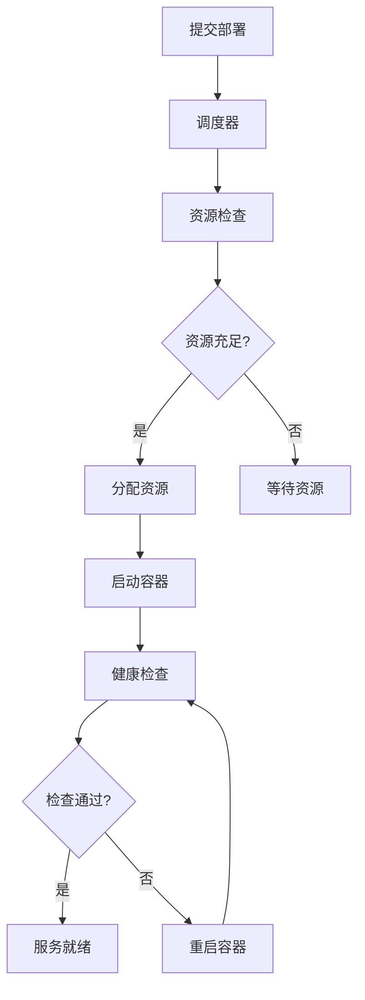

## 5. 状态转换图

### 5.1 容器生命周期状态图

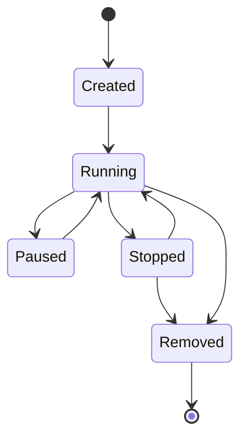

### 5.2 微服务状态转换图

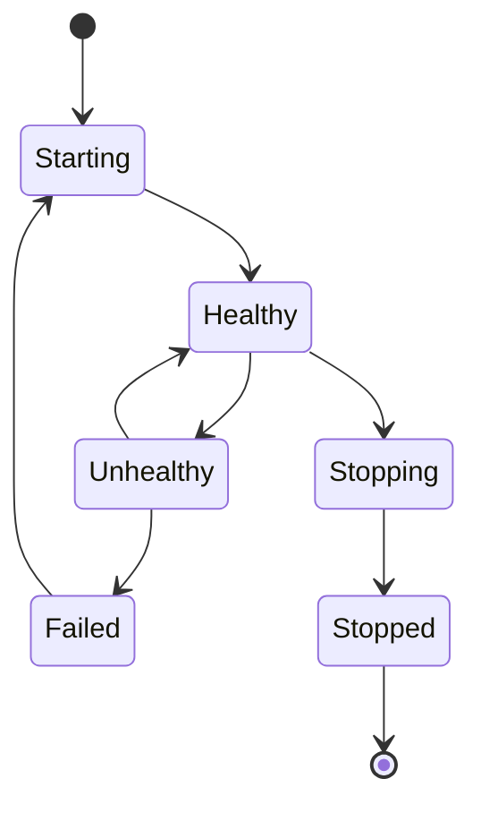

## 6. 网络拓扑图

### 6.1 容器网络拓扑

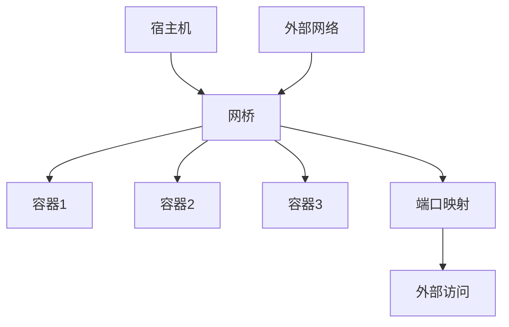

### 6.2 微服务网络拓扑

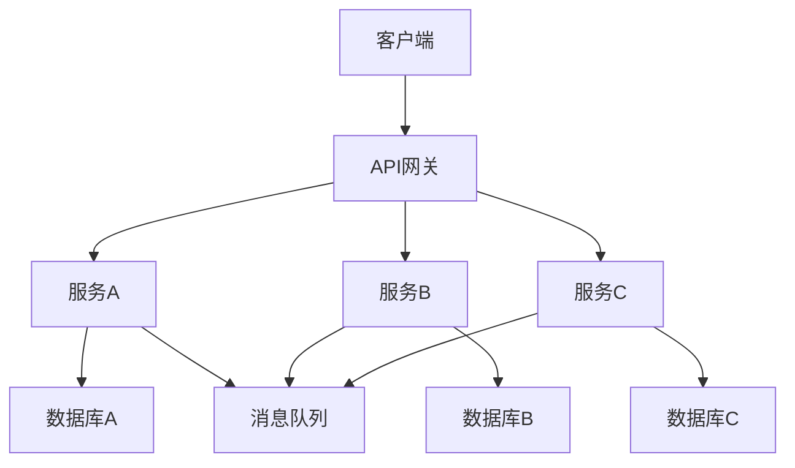

## 7. 性能监控图

### 7.1 容器性能监控

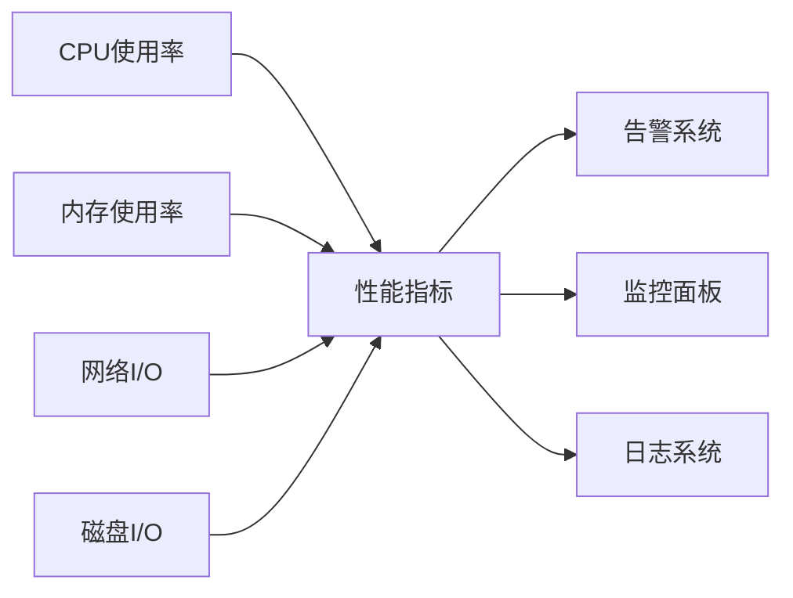

### 7.2 微服务性能监控

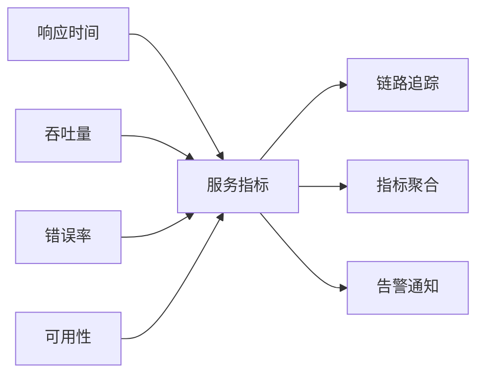

## 8. 规范说明

### 8.1 图表规范

- 使用标准mermaid语法
- 保持图表清晰易读
- 包含必要的说明文字

### 8.2 表格规范

- 使用标准Markdown表格
- 数据准确可靠
- 分类逻辑清晰

### 8.3 数学符号规范

- 使用标准LaTeX语法
- 符号定义明确
- 公式推导完整

### 8.4 扩展性要求

- 支持递归细化
- 可分解为子图表
- 支持多维度分析

> 本文件为递归细化与内容补全示范，后续可继续分解为4.5.4.1、4.5.4.2等子主题，支持持续递归完善。
