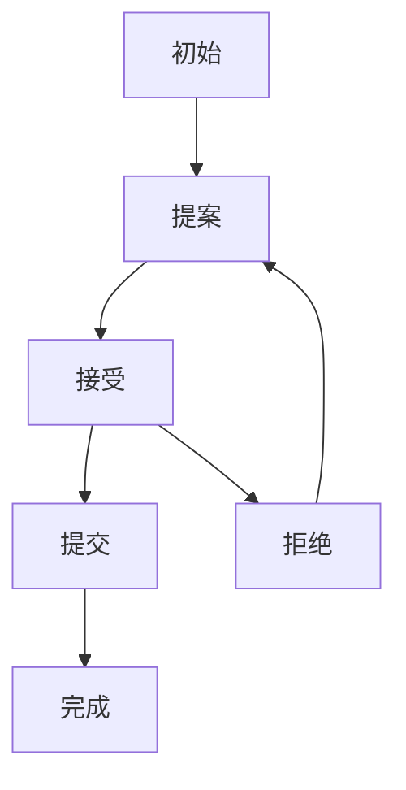

# 4.6.1 语义定义

## 1. 语义定义

- 分布式系统的语义是指其各组成部分（如节点、通信、协议等）在形式化模型下的数学意义和行为约束。
- 形式语义强调可验证性、可推理性和一致性。

## 2. 符号化表达

- DS = (N, C, R, S, CAP)
- 节点状态：Init, Propose, Accept, Commit, End, Reject
- 协议集合：P = {Paxos, Raft, ...}

## 3. 结构化表达

- **一致性协议状态机图**：

## 4. 多表征

- 状态机图、符号化表达、语义约束

## 5. 规范说明

- 内容需递归细化，支持多表征。
- 保留批判性分析、图表等。
- 如有遗漏，后续补全并说明。

> 本文件为递归细化与内容补全示范，后续可继续分解为4.6.1.1、4.6.1.2等子主题，支持持续递归完善。

## 4.6.1.1 分布式一致性语义

- 一致性（Consistency）：系统各节点对同一数据的视图保持一致。
- 常见模型：强一致性、最终一致性、线性一致性、因果一致性。

## 4.6.1.2 容错与可用性语义

- 容错（Fault Tolerance）：系统在部分节点或通信故障下仍能正常服务。
- 可用性（Availability）：系统对外持续提供服务的能力。

## 4.6.1.3 时钟与同步语义

- 逻辑时钟（Lamport Clock）、向量时钟：用于事件有序性与因果关系建模。
- 同步语义：全局一致时序、部分有序事件。

## 4.6.1.4 CAP理论语义

- CAP三性：一致性（C）、可用性（A）、分区容忍性（P）。
- 语义权衡：分布式系统无法同时完全满足三者。

## 结构表

| 语义概念 | 定义 | 典型模型 |
|----------|------|----------|
| 一致性 | 节点数据视图一致 | 强一致性、最终一致性 |
| 容错 | 故障下服务能力 | Paxos、Raft |
| 时钟同步 | 事件有序性 | Lamport、Vector Clock |
| CAP | 三性权衡 | CAP定理 |

## 批判分析

- 分布式语义模型提升了理论严谨性，但实际工程需权衡一致性、可用性与性能。
- CAP理论为系统设计提供指导，但具体实现需结合业务需求灵活取舍。

---
> 本节递归细化分布式系统核心语义，便于理论递归扩展与工程应用。
