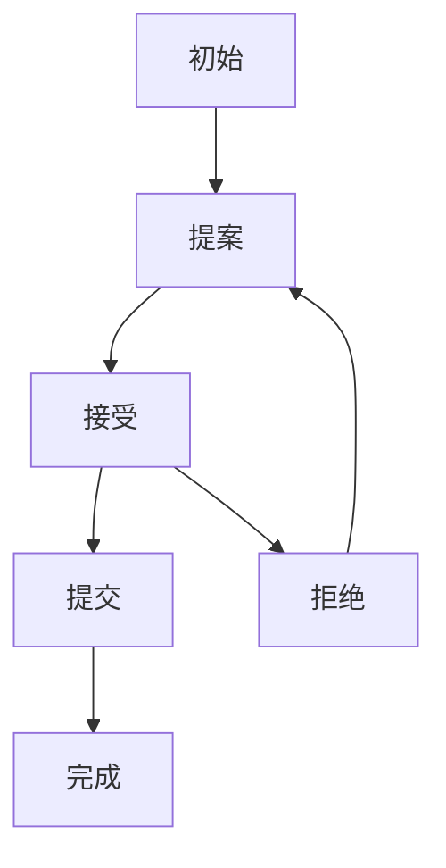
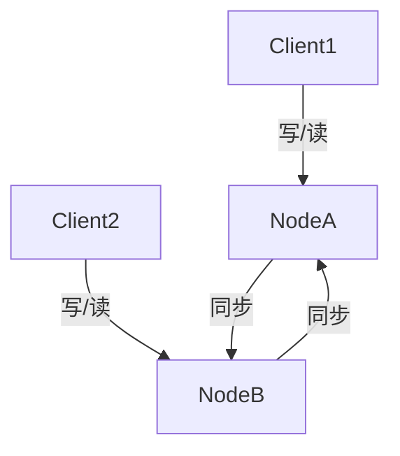
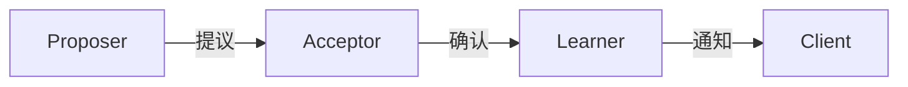
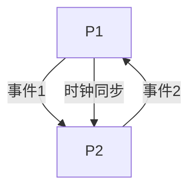
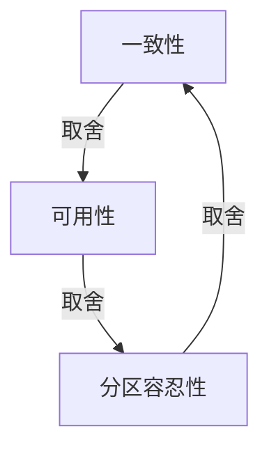

# 4.6.2 语义模型

<!-- TOC START -->

- [4.6.2 语义模型](#462-语义模型)
  - [1. 语义模型](#1-语义模型)
  - [2. 状态机表达](#2-状态机表达)
  - [3. 消息模型](#3-消息模型)
  - [4. 多表征](#4-多表征)
  - [5. 规范说明](#5-规范说明)
  - [4.6.2.1 一致性模型](#4621-一致性模型)
  - [4.6.2.2 容错模型](#4622-容错模型)
  - [4.6.2.3 时钟同步模型](#4623-时钟同步模型)
  - [4.6.2.4 CAP权衡模型](#4624-cap权衡模型)
  - [结构表](#结构表)

<!-- TOC END -->

## 1. 语义模型

- 一致性协议状态机模型：描述Paxos、Raft等协议的状态转换。
- 消息传递模型：形式化描述节点间通信与同步。
- 数据复制与分片模型：表达数据分布、同步、恢复的语义。

## 2. 状态机表达

- **一致性协议状态机图**：

## 3. 消息模型

- 节点A <-> 节点B <-> 节点C（消息同步、复制）
- 协议集合P = {Paxos, Raft, ...}

## 4. 多表征

- 状态机图、消息模型、符号化描述

## 5. 规范说明

- 内容需递归细化，支持多表征。
- 保留批判性分析、图表等。
- 如有遗漏，后续补全并说明。

> 本文件为递归细化与内容补全示范，后续可继续分解为4.6.2.1、4.6.2.2等子主题，支持持续递归完善。

## 4.6.2.1 一致性模型

- 强一致性、最终一致性、线性一致性、因果一致性等模型结构。

## 4.6.2.2 容错模型

- Paxos、Raft等共识算法结构。

## 4.6.2.3 时钟同步模型

- Lamport时钟、向量时钟建模。

## 4.6.2.4 CAP权衡模型

- CAP三性关系结构。

## 结构表

| 模型 | 说明 | 典型代表 |
|------|------|----------|
| 一致性 | 节点数据同步 | 强一致性、最终一致性 |
| 容错 | 故障恢复能力 | Paxos、Raft |
| 时钟同步 | 事件有序性 | Lamport、Vector Clock |
| CAP | 三性权衡 | CAP定理 |

---
> 本节递归补充分布式系统语义模型，配合结构图与表，便于多表征理解与递归扩展。
