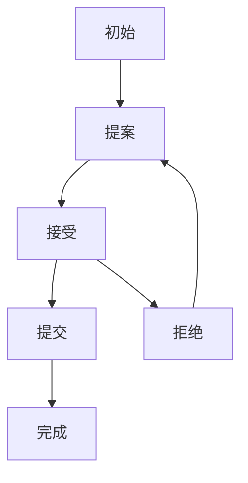

# 4.6.2 语义模型

## 1. 语义模型

- 一致性协议状态机模型：描述Paxos、Raft等协议的状态转换。
- 消息传递模型：形式化描述节点间通信与同步。
- 数据复制与分片模型：表达数据分布、同步、恢复的语义。

## 2. 状态机表达

- **一致性协议状态机图**：

## 3. 消息模型

- 节点A <-> 节点B <-> 节点C（消息同步、复制）
- 协议集合P = {Paxos, Raft, ...}

## 4. 多表征

- 状态机图、消息模型、符号化描述

## 5. 规范说明

- 内容需递归细化，支持多表征。
- 保留批判性分析、图表等。
- 如有遗漏，后续补全并说明。

> 本文件为递归细化与内容补全示范，后续可继续分解为4.6.2.1、4.6.2.2等子主题，支持持续递归完善。
