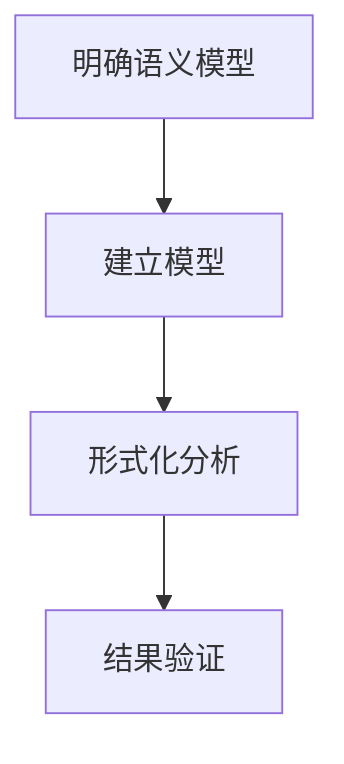

# 4.6.3 语义分析方法

## 1. 语义分析方法

- 一致性验证：确保系统各部分语义定义的一致性。
- 容错分析：分析系统在节点失效、网络分区等情况下的行为。
- 自动化推理：利用形式化工具对系统行为进行自动验证。

## 2. 分析流程

- 明确语义模型 → 建立状态机/消息模型 → 形式化分析 → 结果验证

## 3. 结构化表达

- **分析流程图**：

## 4. 多表征

- 分析流程图、符号化描述、分析方法表

## 5. 规范说明

- 内容需递归细化，支持多表征。
- 保留批判性分析、图表等。
- 如有遗漏，后续补全并说明。

> 本文件为递归细化与内容补全示范，后续可继续分解为4.6.3.1、4.6.3.2等子主题，支持持续递归完善。

## 4.6.3.1 一致性验证方法

- 利用模型检验（如TLA+、NuSMV）验证强一致性、最终一致性等性质。
- 典型公式：$AG(\text{一致})$、$EF(\text{达成})$。

## 4.6.3.2 容错与可用性分析

- 采用故障注入、仿真等手段分析系统容错能力。
- 工具：Jepsen、Chaos Mesh等。

## 4.6.3.3 时钟同步与因果分析

- 利用逻辑时钟、向量时钟分析事件有序性与因果关系。
- 工具：分布式追踪系统（如Jaeger、Zipkin）。

## 4.6.3.4 CAP权衡分析

- 通过实验与建模分析一致性、可用性、分区容忍性的实际权衡。
- 结合业务需求灵活选择系统架构。

## 4.6.3.5 AI辅助语义分析

- 利用机器学习、异常检测等方法自动发现分布式系统中的异常与瓶颈。
- 结合日志、监控数据进行智能分析与预测。

## 批判分析

- 形式化分析提升了分布式系统的可靠性，但需关注实际工程复杂性与动态环境适应。
- AI辅助分析可提升效率，但需防范黑箱与不可解释性风险。

---
> 本节递归细化分布式系统语义分析方法，涵盖一致性、容错、时钟、CAP、AI等多维度，便于理论与工程结合、递归扩展。
