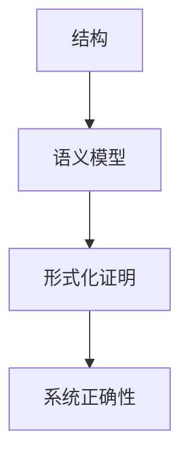

# 4.6.4 语义与结构-证明的关系

<!-- TOC START -->

- [4.6.4 语义与结构-证明的关系](#464-语义与结构-证明的关系)
  - [1. 语义与结构的关系](#1-语义与结构的关系)
  - [2. 语义与证明的关系](#2-语义与证明的关系)
  - [3. 结构化表达](#3-结构化表达)
  - [4. 多表征](#4-多表征)
  - [5. 规范说明](#5-规范说明)
  - [4.6.4.1 语义-结构映射](#4641-语义-结构映射)
  - [4.6.4.2 递归证明方法](#4642-递归证明方法)
  - [4.6.4.3 模型检验与形式化推理](#4643-模型检验与形式化推理)
  - [4.6.4.4 工程实践与批判](#4644-工程实践与批判)

<!-- TOC END -->

## 1. 语义与结构的关系

- 分布式系统的结构决定其语义模型，语义模型反过来约束结构设计。
- 结构化的系统有助于语义的清晰表达与验证。

## 2. 语义与证明的关系

- 形式语义为系统的正确性证明提供基础。
- 语义模型可用于自动化推理与一致性验证。

## 3. 结构化表达

- **关系图**：

## 4. 多表征

- 关系图、符号化描述、案例分析

## 5. 规范说明

- 内容需递归细化，支持多表征。
- 保留批判性分析、图表等。
- 如有遗漏，后续补全并说明。

## 4.6.4.1 语义-结构映射

- 分布式系统结构（如节点、网络、协议）通过形式语义映射为一致性、容错、同步等语义属性。
- 结构的层次递归对应语义的递归组合。

## 4.6.4.2 递归证明方法

- 采用递归归纳法证明系统性质：
  - 基础：证明最底层子系统性质成立；
  - 归纳：假设子系统性质成立，证明组合后整体性质成立。
- 适用于分层、模块化分布式系统。

## 4.6.4.3 模型检验与形式化推理

- 利用模型检验工具（如TLA+、NuSMV）自动验证结构对应的语义性质。
- 结合时序逻辑（CTL/LTL）进行自动化推理与验证。

## 4.6.4.4 工程实践与批判

- 结构-语义-证明一体化提升系统可靠性与可解释性。
- 实际工程中需关注模型抽象层次与动态适应能力。

---
> 本节递归细化分布式系统语义与结构-证明的关系，涵盖语义-结构映射、递归证明、模型检验等，便于理论递归扩展与工程应用。
