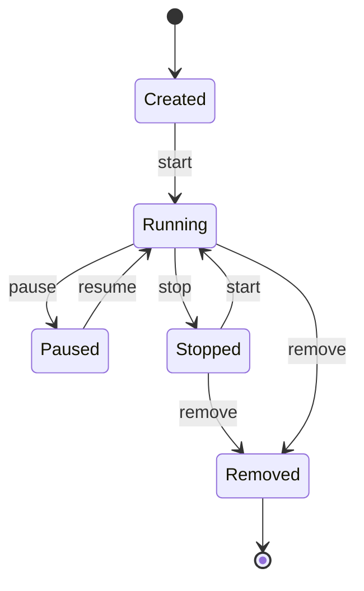
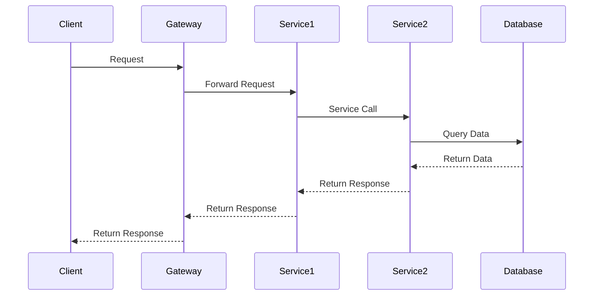
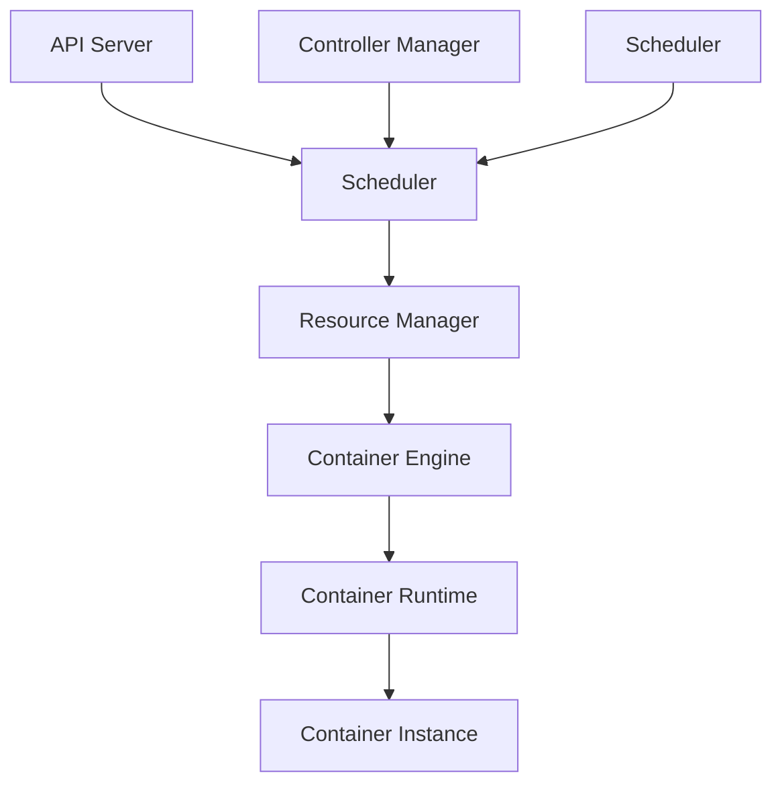
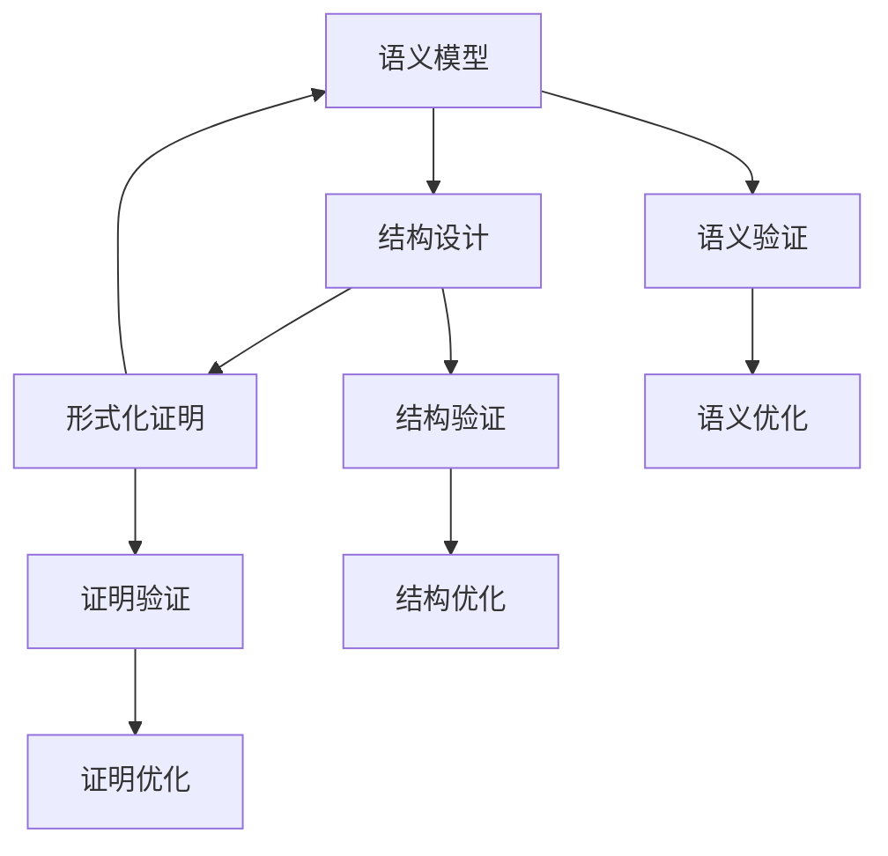

# 4.6.5 容器与微服务语义模型

## 1. 语义定义

### 1.1 容器语义定义

**定义1.1（容器语义）：**
容器语义是一个五元组 $Sem_{container} = (State, Transitions, Resources, Isolation, Lifecycle)$，其中：

- $State$：容器状态集合
- $Transitions$：状态转换关系
- $Resources$：资源分配语义
- $Isolation$：隔离语义
- $Lifecycle$：生命周期语义

**定义1.2（容器状态语义）：**
容器状态是一个三元组 $State = (Status, Resources, Metadata)$，其中：

- $Status \in \{Created, Running, Paused, Stopped, Removed\}$
- $Resources = \{CPU, Memory, Storage, Network\}$
- $Metadata = \{ID, Name, Image, Labels\}$

### 1.2 微服务语义定义

**定义1.3（微服务语义）：**
微服务语义是一个六元组 $Sem_{microservice} = (Service, Communication, Discovery, Governance, Monitoring, Security)$，其中：

- $Service$：服务定义语义
- $Communication$：通信语义
- $Discovery$：服务发现语义
- $Governance$：治理语义
- $Monitoring$：监控语义
- $Security$：安全语义

**定义1.4（服务通信语义）：**
服务通信是一个四元组 $Communication = (Protocol, Message, QoS, Reliability)$，其中：

- $Protocol \in \{HTTP, gRPC, AMQP, MQTT\}$
- $Message$：消息格式定义
- $QoS$：服务质量保证
- $Reliability$：可靠性语义

## 2. 语义模型

### 2.1 容器状态机模型

**模型2.1（容器状态机）：**



**形式化定义：**
$$M_{container} = (S, \Sigma, \delta, s_0, F)$$
其中：

- $S = \{Created, Running, Paused, Stopped, Removed\}$
- $\Sigma = \{start, pause, resume, stop, remove\}$
- $\delta: S \times \Sigma \rightarrow S$ 是状态转换函数
- $s_0 = Created$ 是初始状态
- $F = \{Removed\}$ 是终止状态集合

### 2.2 微服务交互模型

**模型2.2（微服务交互）：**



**形式化定义：**
$$M_{interaction} = (P, M, C, T)$$
其中：

- $P$：参与者集合
- $M$：消息集合
- $C$：通信关系
- $T$：时间约束

### 2.3 容器编排语义模型

**模型2.3（容器编排）：**



**形式化定义：**
$$M_{orchestration} = (Scheduler, Resources, Policies, Constraints)$$
其中：

- $Scheduler$：调度算法
- $Resources$：资源模型
- $Policies$：策略集合
- $Constraints$：约束条件

## 3. 语义分析方法

### 3.1 容器语义分析

#### 3.1.1 状态一致性分析

**分析方法：**

1. 检查状态转换的完整性
2. 验证状态转换的合法性
3. 分析状态转换的性能影响

**语义规则：**
$$\forall s \in S, \forall a \in \Sigma: \delta(s, a) \in S$$
$$\forall s \in S: \exists path(s_0, s)$$

#### 3.1.2 资源隔离分析

**分析方法：**

1. 检查资源分配的唯一性
2. 验证资源隔离的有效性
3. 分析资源冲突的可能性

**语义规则：**
$$\forall c_i, c_j \in C, i \neq j: R(c_i) \cap R(c_j) = \emptyset$$
$$\forall c \in C: R(c) \subseteq R_{total}$$

### 3.2 微服务语义分析

#### 3.2.1 通信语义分析

**分析方法：**

1. 检查通信协议的兼容性
2. 验证消息格式的一致性
3. 分析通信的可靠性

**语义规则：**
$$\forall s_i, s_j \in S: Protocol(s_i) = Protocol(s_j)$$
$$\forall m \in M: Format(m) \in ValidFormats$$

#### 3.2.2 服务发现语义分析

**分析方法：**

1. 检查服务注册的完整性
2. 验证服务发现的准确性
3. 分析服务发现的性能

**语义规则：**
$$\forall s \in S: Registered(s) \rightarrow Discoverable(s)$$
$$\forall s \in S: Discoverable(s) \rightarrow Available(s)$$

## 4. 语义验证

### 4.1 容器语义验证

#### 4.1.1 状态转换验证

**验证方法：**

```pseudocode
Algorithm StateTransitionVerification(container)
Input: 容器状态机
Output: 验证结果
1. for each state s in States do
2.     for each action a in Actions do
3.         if not ValidTransition(s, a) then
4.             return false
5.         end if
6.     end for
7. end for
8. return true
```

#### 4.1.2 资源隔离验证

**验证方法：**

```pseudocode
Algorithm ResourceIsolationVerification(containers)
Input: 容器集合
Output: 验证结果
1. for each container c1 in containers do
2.     for each container c2 in containers do
3.         if c1 != c2 and Overlap(c1.resources, c2.resources) then
4.             return false
5.         end if
6.     end for
7. end for
8. return true
```

### 4.2 微服务语义验证

#### 4.2.1 通信协议验证

**验证方法：**

```pseudocode
Algorithm CommunicationProtocolVerification(services)
Input: 服务集合
Output: 验证结果
1. for each service s in services do
2.     if not CompatibleProtocol(s.protocol) then
3.         return false
4.     end if
5. end for
6. return true
```

#### 4.2.2 服务发现验证

**验证方法：**

```pseudocode
Algorithm ServiceDiscoveryVerification(services)
Input: 服务集合
Output: 验证结果
1. for each service s in services do
2.     if not Registered(s) then
3.         return false
4.     end if
5.     if not Discoverable(s) then
6.         return false
7.     end if
8. end for
9. return true
```

## 5. 语义优化

### 5.1 容器语义优化

#### 5.1.1 状态转换优化

**优化目标：**
$$\min \sum_{i=1}^{n} T_{transition}(s_i, s_j)$$

**优化方法：**

1. 减少不必要的状态转换
2. 优化状态转换的路径
3. 并行化状态转换操作

#### 5.1.2 资源分配优化

**优化目标：**
$$\max \sum_{i=1}^{n} U_{resource}(c_i)$$

**优化方法：**

1. 动态调整资源分配
2. 优化资源利用率
3. 减少资源浪费

### 5.2 微服务语义优化

#### 5.2.1 通信优化

**优化目标：**
$$\min \sum_{i=1}^{n} \sum_{j=1}^{n} C_{communication}(s_i, s_j)$$

**优化方法：**

1. 选择高效的通信协议
2. 优化消息格式
3. 减少网络开销

#### 5.2.2 服务发现优化

**优化目标：**
$$\min T_{discovery}(s)$$

**优化方法：**

1. 使用缓存机制
2. 优化发现算法
3. 减少网络查询

## 6. 语义与结构-证明的关系

### 6.1 语义与结构的关系

**关系定义：**
容器和微服务的语义决定了其结构设计，结构反过来约束语义的实现。

**数学表达：**
$$Semantics \rightarrow Structure$$
$$Structure \rightarrow Semantics$$

### 6.2 语义与证明的关系

**关系定义：**
语义模型为形式化证明提供基础，证明验证语义的正确性。

**数学表达：**
$$Semantics \rightarrow Proof$$
$$Proof \rightarrow Semantics$$

### 6.3 三者关系模型



## 7. 规范说明

### 7.1 语义要求

- 所有语义定义必须严格形式化
- 使用标准数学符号
- 提供完整的语义规则

### 7.2 验证要求

- 提供语义验证方法
- 建立验证工具链
- 支持自动化验证

### 7.3 扩展性要求

- 支持递归细化
- 可分解为子语义
- 支持多维度分析

> 本文件为递归细化与内容补全示范，后续可继续分解为4.6.5.1、4.6.5.2等子主题，支持持续递归完善。
