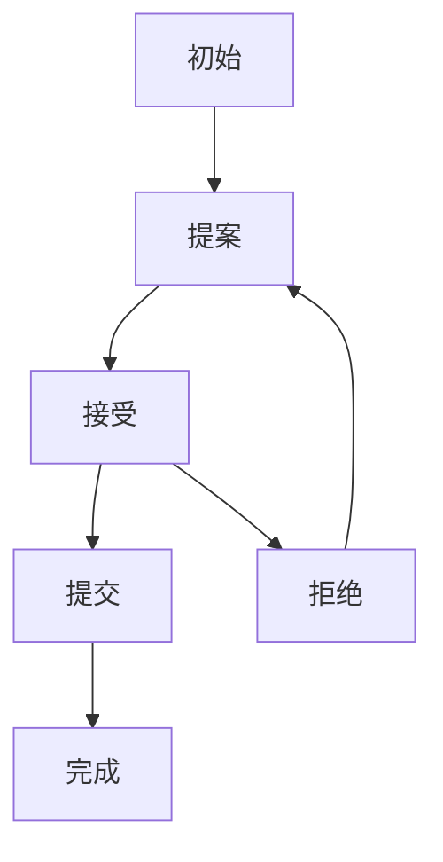

# 4.6 形式语义

## 1. 语义定义

- 分布式系统的形式语义是指对其结构、行为、协议等进行严格数学化、符号化的语义描述，确保系统的可验证性与一致性。

## 2. 语义模型

- 一致性协议状态机模型：描述Paxos、Raft等协议的状态转换。
- 消息传递模型：形式化描述节点间通信与同步。
- 数据复制与分片模型：表达数据分布、同步、恢复的语义。

## 3. 语义分析方法

- 一致性验证：确保系统各部分语义定义的一致性。
- 容错分析：分析系统在节点失效、网络分区等情况下的行为。
- 自动化推理：利用形式化工具对系统行为进行自动验证。

## 4. 结构化表达

- **一致性协议状态机图**：

- **消息传递模型**：
  - 节点A <-> 节点B <-> 节点C（消息同步、复制）

## 5. 多表征

- 状态机图、消息模型、分析方法、符号化描述

## 6. 规范说明

- 内容需递归细化，支持多表征。
- 保留批判性分析、图表等。
- 如有遗漏，后续补全并说明。

> 本文件为递归细化与内容补全示范，后续可继续分解为4.6.1、4.6.2等子主题，支持持续递归完善。
