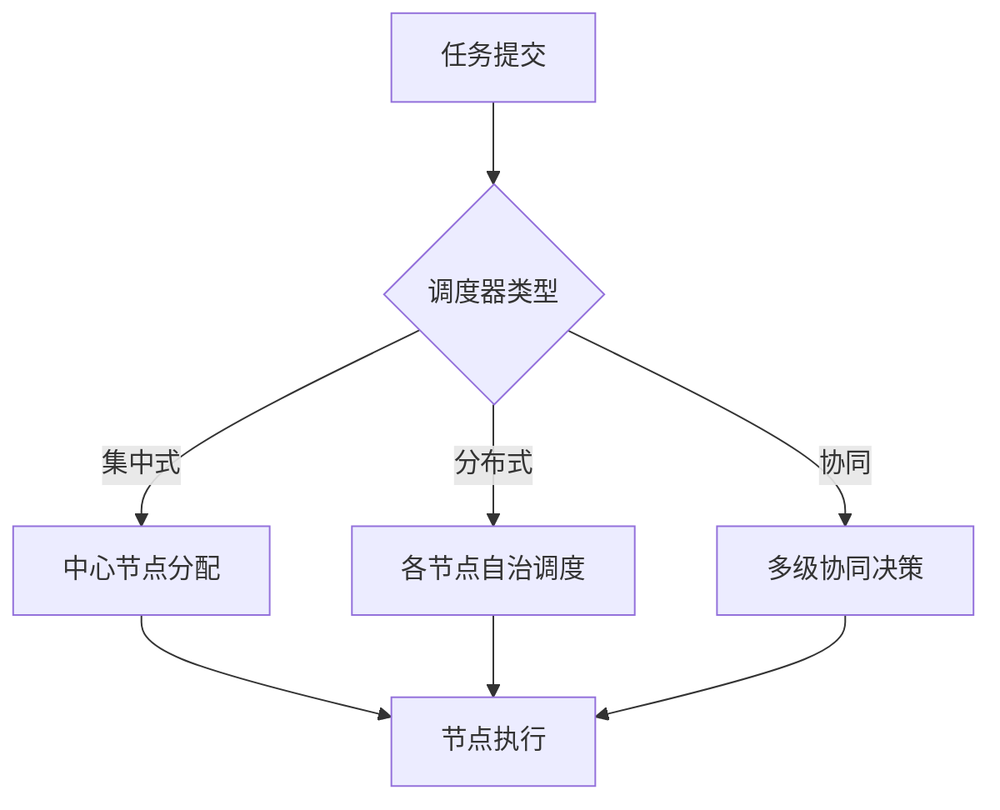

# 4.7.1 运行时行为与调度模型


<!-- TOC START -->

- [4.7.1 运行时行为与调度模型](#471-运行时行为与调度模型)
  - [1. 主题简介](#1-主题简介)
  - [2. 典型运行时行为](#2-典型运行时行为)
  - [3. 调度模型分类与对比](#3-调度模型分类与对比)
  - [4. Mermaid 调度流程示意图](#4-mermaid-调度流程示意图)
  - [5. 伪代码/公式](#5-伪代码公式)
  - [6. 工程案例](#6-工程案例)
  - [7. 未来展望](#7-未来展望)

<!-- TOC END -->

## 1. 主题简介

- 概述分布式系统运行时行为的特点与调度模型的核心作用。
- 强调分布、异步、容错等对运行时语义的特殊要求。

## 2. 典型运行时行为

- 任务分发与调度
- 节点间通信与同步
- 故障检测与恢复
- 资源动态分配

## 3. 调度模型分类与对比

| 调度模型 | 主要特征 | 适用场景 | 优缺点 |
|---|---|---|---|
| 集中式调度 | 全局视图、统一决策 | 小型集群 | 易实现，扩展性差 |
| 分布式调度 | 无中心、自治 | 大规模分布式 | 扩展性好，复杂度高 |
| 协同调度 | 多级/多域协同 | 跨域/多集群 | 灵活，通信开销大 |
| 事件驱动调度 | 响应快、弹性强 | 云原生/微服务 | 动态性强，调试难 |

## 4. Mermaid 调度流程示意图



## 5. 伪代码/公式

```pseudo
// 分布式调度伪代码
for 每个节点N:
    if N资源空闲:
        分配任务到N
    else:
        协同其他节点调度
```

## 6. 工程案例

- Kubernetes分布式调度
- Hadoop YARN资源调度

## 7. 未来展望

- AI驱动自适应调度
- 跨域多集群智能协同
