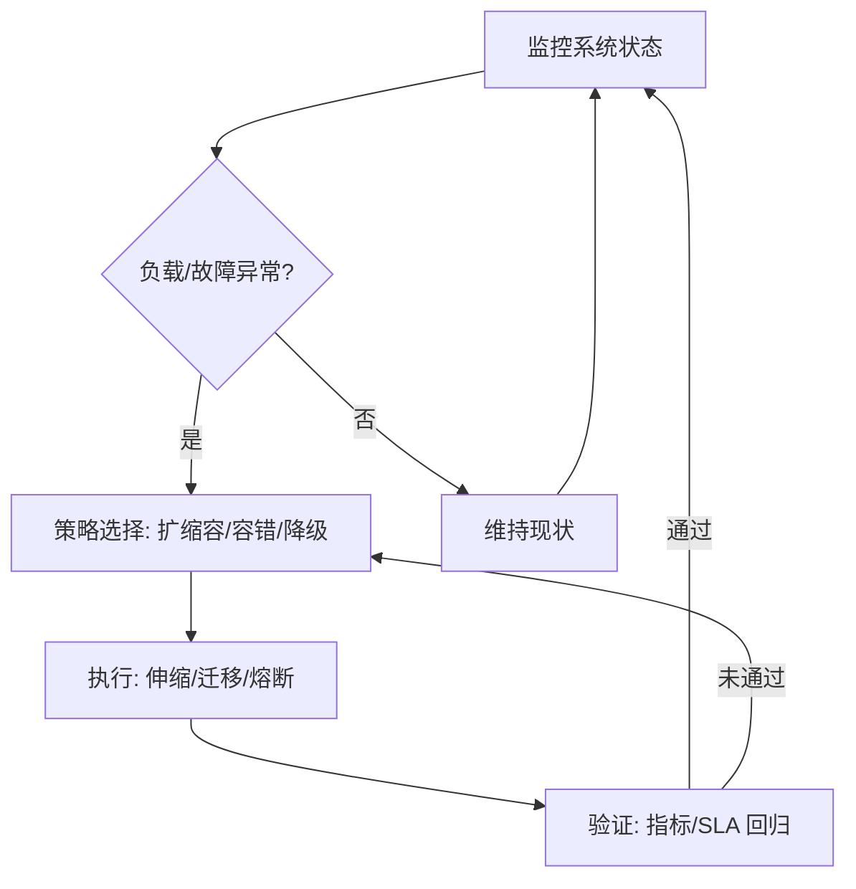

# 4.7.5 自适应与弹性运行机制

## 1. 主题简介

- 介绍分布式系统自适应与弹性运行机制的基本原理与重要性。
- 目标：在不牺牲一致性的前提下，通过监测—决策—执行闭环，提升可用性、扩展性与性价比。

## 2. 自适应机制分类

- 负载感知自适应：基于 QPS、P95 延迟、队列长度进行阈值或模型驱动调节。
- 故障自愈机制：探活失败触发重启、摘除、迁移与副本重建（如自愈控制器）。
- 异构资源自适应：按 CPU/内存/磁盘/网络瓶颈差异动态绑定与亲和性调度。
- 拓扑自适应：根据通信模式重排放置，降低跨机架/跨可用区流量成本。
- 成本自适应：按时段/价格/碳强度选择混合实例与抢占式资源。

## 3. 弹性运行策略

- 动态资源扩缩容：基于指标阈值、SLA 违约率或预测模型触发水平/垂直扩缩。
- 容错与恢复：副本冗余、主备切换、数据重放、幂等补偿、断路与舱壁隔离。
- 服务降级与迁移：可接受质量模式（Graceful Degradation）、灰度迁移、限流与排队。
- 多维弹性：计算—存储—网络协同弹性（如无共享架构下的热点分裂与合并）。

## 4. Mermaid 弹性机制流程图



## 5. 伪代码/公式

```pseudo
// 动态扩缩容（阈值+冷却时间）
if 平滑(当前负载) > 上阈值 且 距上次伸缩时间 > 冷却时长:
    扩容(replicas += step)
elif 平滑(当前负载) < 下阈值 且 距上次伸缩时间 > 冷却时长:
    缩容(replicas = max(minReplicas, replicas - step))

// 自愈：探活失败 N 次 -> 迁移/重建
if 探活连续失败 >= N:
    驱逐(pod)
    迁移到(健康节点)

// 服务降级：SLA 违约概率超过阈值
if 估计违约率(SLA_window) > p_threshold:
    启用降级策略(缓存命中优先, 关闭非关键路径)
```

公式化触发（示例）：

- 扩容触发条件：E[t|t−Δ:t] > τ_up 或 Pr(违约) > p0
- 缩容触发条件：E[t|t−Δ:t] < τ_down 且 backlog ≈ 0

## 6. 工程案例

- Kubernetes HPA/VPA + KEDA：阈值/事件驱动扩缩容与垂直调优结合。
- Cassandra/ScyllaDB：一致性可调 + 节点加入/离开重均衡与自愈修复。
- Flink/Spark Streaming：基于背压的并行度自适应与状态安全缩放。
- Service Mesh（Istio）：熔断/重试/超时/金丝雀与 A/B 驱动的降级迁移。

## 7. 指标与度量

- 可靠性：MTTR、MTBF、错误预算消耗率、成功率（SLO）。
- 性能：P95/P99 延迟、吞吐、背压深度、丢包与重试率。
- 资源：CPU/内存/IO/网络利用率、热点键分布熵、跨 AZ/Region 流量比例。
- 成本：单位请求成本、闲置率、碳强度（gCO₂e/请求）。

## 8. 策略选择矩阵（示例）

| 场景 | 首选策略 | 备选 | 风险与权衡 |
|---|---|---|---|
| 突发高峰 | 水平扩容 + 限流 | 短期垂直扩容 | 成本上升 vs. SLA 保证 |
| 局部故障 | 副本切换 + 流量绕行 | 节点隔离与重建 | 一致性与数据恢复时间 |
| 热点键 | 分片拆分 + 缓存 | 请求合并 | 写放大、热点漂移 |
| 跨域带宽瓶颈 | 拓扑亲和 + 调整放置 | 压缩与本地化 | 放置扰动与冷数据迁移 |

## 9. 未来展望

- 智能化自愈与弹性调度：结合预测与 RL 的闭环控制。
- 跨域自适应资源管理：边云协同与多云成本/碳最优化。
- 语义级弹性：结合业务 SLO/优先级进行分层降级与可接受质量计算。
