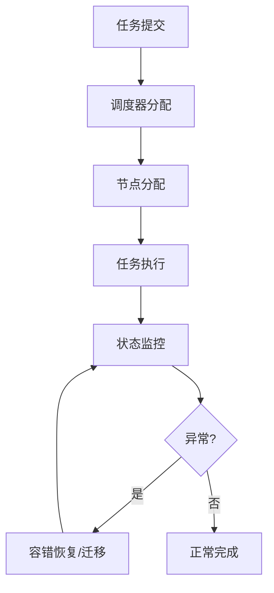

# 4.7.6 工程案例与实践

## 1. 主题简介

- 汇总分布式系统运行时语义相关的工程实践与典型案例。
- 目标：以可复用的运行时语义视角，抽象出跨系统可迁移的设计与运维策略。

## 2. 典型案例汇总

- Kubernetes 分布式调度：多维度资源与约束的可扩展调度与弹性控制。
- Hadoop/YARN 任务分发与容错：任务重试、推测执行、延迟调度降低尾延迟。
- Cassandra/ScyllaDB 弹性伸缩：一致性可调、拓扑感知、轻量级事务与自愈修复。
- Flink/Spark Streaming：基于背压的并行度自适应与状态一致性伸缩。

## 3. 关键技术剖析

- 分布式一致性协议：Raft/Paxos/EPaxos，领导者选举、日志复制、线性一致读。
- 动态资源调度：打分+约束满足、优先级与抢占、亲和/反亲和、拓扑感知。
- 容错与恢复机制：副本冗余、检查点、WAL、回放、幂等补偿、断路器。
- 运行时观测：指标/日志/追踪三件套，红/金四象限与 SLI/SLO/SLA 管理。

## 4. Mermaid 案例流程图



## 5. 伪代码/公式

```pseudo
// 任务重试 + 推测执行（防尾延迟）
if 任务执行时间 > p95_基线 * α 且 资源空闲充足:
    启动推测副本(task_id, 其他节点)

// Raft 读写路径（简化）
function put(key, val):
    复制到多数派(key, val)
    提交后对外可见

function get_linearizable(key):
    向领导者线性化读
    return 最新值
```

## 6. 案例对比分析

| 系统 | 运行时语义要点 | 优势 | 挑战 |
|---|---|---|---|
| Kubernetes | 调度/弹性/隔离/熔断 | 可扩展与生态完善 | 调参复杂、观测成本 |
| Hadoop/YARN | 批处理容错/推测 | 边大作业鲁棒 | 交互式场景不足 |
| Flink/Spark | 流式背压/状态一致性 | 低延迟高吞吐 | 状态管理复杂 |
| Cassandra | 可调一致性/拓扑感知 | 高可用低延迟 | 写放大与热点 |

## 7. SLI/SLO/SLA 视角

- SLI（指标）：可用性、成功率、P99 延迟、吞吐、错误预算消耗率。
- SLO（目标）：如 99.9% 成功率、P99 < 200ms、可用性 99.95%。
- SLA（合约）：违约赔偿条款与窗口统计；驱动限流、降级与扩缩策略。

示例触发：

```pseudo
if 错误预算消耗速率 > 阈值:
    提升优先级(可靠性变更)
    暂缓功能发布
```

## 8. 实践清单（可操作）

- 观测治理：统一指标字典与标签、建立红/金象限仪表板、Trace 采样策略。
- 弹性策略：结合预测与阈值、冷却时间与窗口回归、灰度验证与回滚。
- 容错设计：幂等/补偿/断路/舱壁、读写隔离与回压、可重放事件日志。
- 放置优化：亲和/反亲和、拓扑/成本/碳约束、冷热分层与热点治理。

## 9. 未来展望

- 跨平台运行时优化：统一 SLO 策略与控制平面 API，跨云/边协同。
- 智能化工程实践：用强化学习调度与异常根因定位，加速自愈闭环。
