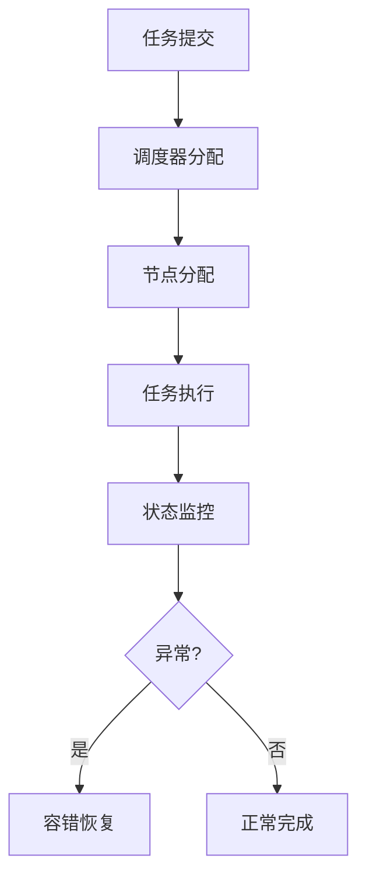

# 4.7.6 工程案例与实践

## 1. 主题简介

- 汇总分布式系统运行时语义相关的工程实践与典型案例。

## 2. 典型案例汇总

- Kubernetes分布式调度
- Hadoop任务分发与容错
- Cassandra弹性伸缩

## 3. 关键技术剖析

- 分布式一致性协议
- 动态资源调度
- 容错与恢复机制

## 4. Mermaid 案例流程图



## 5. 伪代码/公式

```pseudo
// 节点容错恢复伪代码
if 节点执行失败:
    启动任务迁移与恢复流程
```

## 6. 案例对比分析

| 案例 | 关键机制 | 优势 | 挑战 |
|---|---|---|---|
| Kubernetes | 分布式调度 | 扩展性强 | 管理复杂 |
| Hadoop | 任务容错 | 高可用 | 资源利用率 |
| Cassandra | 弹性伸缩 | 灵活 | 一致性权衡 |

## 7. 未来展望

- 跨平台运行时优化
- 智能化工程实践
