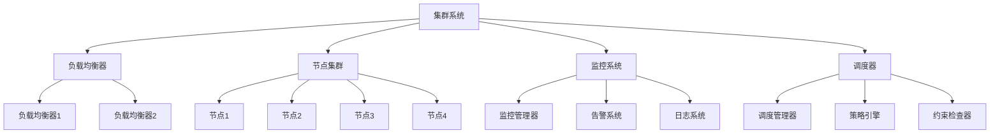
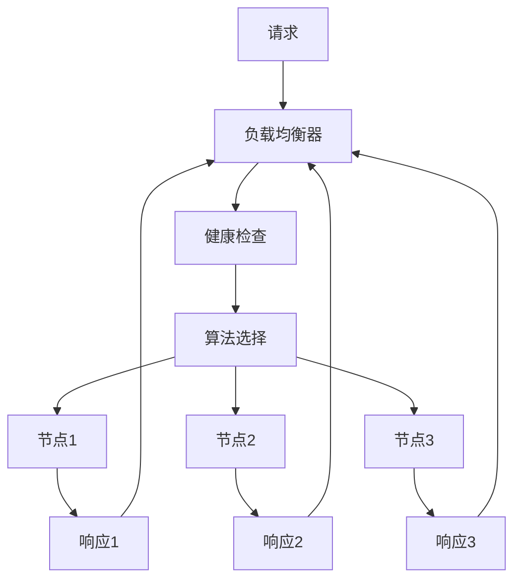
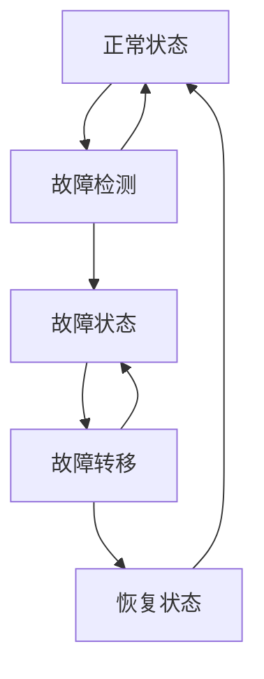

# 5.1.1 基本概念


<!-- TOC START -->

- [5.1.1 基本概念](#511-基本概念)
  - [1. 集群系统形式化定义](#1-集群系统形式化定义)
    - [1.1 集群系统基本定义](#11-集群系统基本定义)
    - [1.2 节点形式化定义](#12-节点形式化定义)
    - [1.3 负载均衡器定义](#13-负载均衡器定义)
  - [2. 负载均衡算法](#2-负载均衡算法)
    - [2.1 轮询算法](#21-轮询算法)
    - [2.2 最少连接算法](#22-最少连接算法)
    - [2.3 加权轮询算法](#23-加权轮询算法)
  - [3. 调度算法](#3-调度算法)
    - [3.1 调度器定义](#31-调度器定义)
    - [3.2 优先级调度](#32-优先级调度)
    - [3.3 公平调度](#33-公平调度)
  - [4. 容错机制](#4-容错机制)
    - [4.1 故障转移定义](#41-故障转移定义)
    - [4.2 故障检测算法](#42-故障检测算法)
    - [4.3 故障转移算法](#43-故障转移算法)
  - [5. 资源管理](#5-资源管理)
    - [5.1 资源池定义](#51-资源池定义)
    - [5.2 资源分配算法](#52-资源分配算法)
    - [5.3 自动扩缩容](#53-自动扩缩容)
  - [6. 监控系统](#6-监控系统)
    - [6.1 监控指标定义](#61-监控指标定义)
    - [6.2 告警系统](#62-告警系统)
  - [7. 安全管理](#7-安全管理)
    - [7.1 认证授权定义](#71-认证授权定义)
    - [7.2 访问控制](#72-访问控制)
  - [8. 集群拓扑](#8-集群拓扑)
    - [8.1 主从架构](#81-主从架构)
    - [8.2 对等架构](#82-对等架构)
  - [9. 多表征](#9-多表征)
    - [9.1 集群系统架构图](#91-集群系统架构图)
    - [9.2 负载均衡流程图](#92-负载均衡流程图)
    - [9.3 故障转移状态图](#93-故障转移状态图)
    - [9.4 集群性能指标表](#94-集群性能指标表)
  - [10. 规范说明](#10-规范说明)

<!-- TOC END -->

## 1. 集群系统形式化定义

### 1.1 集群系统基本定义

**定义5.1.1.1（集群系统）**：集群系统CS是一个有序七元组：

```text
CS = (N, LB, S, F, M, R, A)
```

其中：

- N = {n₁, n₂, ..., nₖ} 是节点集合
- LB = (algorithm, health_check, session_sticky) 是负载均衡器
- S = (scheduler, policy, metrics) 是调度器
- F = (failover, recovery, redundancy) 是容错机制
- M = (monitoring, alerting, logging) 是监控系统
- R = (resource_pool, allocation, scaling) 是资源管理
- A = (authentication, authorization, isolation) 是安全管理

### 1.2 节点形式化定义

**定义5.1.1.2（集群节点）**：集群节点n是一个六元组：

```text
n = (node_id, role, resources, state, services, health)
```

其中：

- node_id ∈ ℕ 是节点标识符
- role ∈ {MASTER, WORKER, BACKUP} 是节点角色
- resources = (cpu, memory, storage, network) 是资源容量
- state ∈ {ONLINE, OFFLINE, DEGRADED, FAILED} 是节点状态
- services ⊆ Services 是节点运行的服务集合
- health = (status, metrics, last_check) 是健康状态

### 1.3 负载均衡器定义

**定义5.1.1.3（负载均衡器）**：负载均衡器LB是一个四元组：

```text
LB = (algorithm, health_check, session_sticky, metrics)
```

其中：

- algorithm ∈ {ROUND_ROBIN, LEAST_CONNECTIONS, WEIGHTED, IP_HASH} 是负载均衡算法
- health_check: node → boolean 是健康检查函数
- session_sticky: session_id → node_id 是会话粘性函数
- metrics = (response_time, throughput, error_rate) 是性能指标

## 2. 负载均衡算法

### 2.1 轮询算法

**定义5.1.1.4（轮询算法）**：轮询算法RR是一个函数：

```text
RR: request × nodes → selected_node
```

**轮询算法实现**：

```text
RoundRobin(request, nodes):
  current_index = (last_index + 1) % len(nodes)
  selected_node = nodes[current_index]
  last_index = current_index
  return selected_node
```

### 2.2 最少连接算法

**定义5.1.1.5（最少连接算法）**：最少连接算法LC是一个函数：

```text
LC: request × nodes → selected_node
```

**最少连接算法实现**：

```text
LeastConnections(request, nodes):
  min_connections = ∞
  selected_node = null
  
  for each node in nodes:
    if node.connections < min_connections:
      min_connections = node.connections
      selected_node = node
  
  return selected_node
```

### 2.3 加权轮询算法

**定义5.1.1.6（加权轮询算法）**：加权轮询算法WR是一个函数：

```text
WR: request × weighted_nodes → selected_node
```

**加权轮询算法实现**：

```text
WeightedRoundRobin(request, weighted_nodes):
  total_weight = sum(node.weight for node in weighted_nodes)
  current_weight = (last_weight + 1) % total_weight
  
  cumulative_weight = 0
  for each node in weighted_nodes:
    cumulative_weight += node.weight
    if current_weight < cumulative_weight:
      selected_node = node
      break
  
  last_weight = current_weight
  return selected_node
```

## 3. 调度算法

### 3.1 调度器定义

**定义5.1.1.7（调度器）**：调度器S是一个四元组：

```text
S = (scheduler_type, policy, metrics, constraints)
```

其中：

- scheduler_type ∈ {FIFO, PRIORITY, FAIR, DEADLINE} 是调度器类型
- policy: task × nodes → selected_node 是调度策略
- metrics = (cpu_usage, memory_usage, queue_length) 是调度指标
- constraints = (resource_limits, affinity, anti_affinity) 是调度约束

### 3.2 优先级调度

**定义5.1.1.8（优先级调度）**：优先级调度PS是一个函数：

```text
PS: tasks × nodes → schedule
```

**优先级调度算法**：

```text
PriorityScheduling(tasks, nodes):
  sorted_tasks = sort_by_priority(tasks)
  schedule = {}
  
  for each task in sorted_tasks:
    available_node = find_available_node(task, nodes)
    if available_node:
      schedule[task] = available_node
      allocate_resources(available_node, task)
  
  return schedule
```

### 3.3 公平调度

**定义5.1.1.9（公平调度）**：公平调度FS是一个函数：

```text
FS: tasks × nodes → schedule
```

**公平调度算法**：

```text
FairScheduling(tasks, nodes):
  // 计算每个用户/队列的资源配额
  quotas = calculate_quotas(tasks)
  
  // 按配额分配资源
  schedule = {}
  for each user in users:
    user_tasks = get_tasks_by_user(tasks, user)
    user_quota = quotas[user]
    
    for each task in user_tasks:
      if user_quota > 0:
        available_node = find_available_node(task, nodes)
        if available_node:
          schedule[task] = available_node
          user_quota -= task.resource_requirement
  
  return schedule
```

## 4. 容错机制

### 4.1 故障转移定义

**定义5.1.1.10（故障转移）**：故障转移FT是一个三元组：

```text
FT = (detection, failover, recovery)
```

其中：

- detection: node → {HEALTHY, FAILED} 是故障检测
- failover: failed_node → backup_node 是故障转移
- recovery: failed_node → {RECOVERED, FAILED} 是故障恢复

### 4.2 故障检测算法

**定义5.1.1.11（故障检测）**：故障检测FD是一个函数：

```text
FD: node × timeout → {HEALTHY, FAILED}
```

**心跳检测算法**：

```text
HeartbeatDetection(node, timeout):
  last_heartbeat = get_last_heartbeat(node)
  current_time = get_current_time()
  
  if current_time - last_heartbeat > timeout:
    return FAILED
  else:
    return HEALTHY
```

### 4.3 故障转移算法

**定义5.1.1.12（故障转移）**：故障转移算法FA是一个函数：

```text
FA: failed_node × backup_nodes → selected_backup
```

**故障转移实现**：

```text
Failover(failed_node, backup_nodes):
  // 检测故障
  if not is_healthy(failed_node):
    // 选择备份节点
    selected_backup = select_backup_node(backup_nodes)
    
    // 转移服务
    transfer_services(failed_node, selected_backup)
    
    // 更新路由
    update_routing_table(failed_node, selected_backup)
    
    return selected_backup
  else:
    return failed_node
```

## 5. 资源管理

### 5.1 资源池定义

**定义5.1.1.13（资源池）**：资源池RP是一个四元组：

```text
RP = (cpu_pool, memory_pool, storage_pool, network_pool)
```

其中：

- cpu_pool = {cpu_cores} 是CPU资源池
- memory_pool = {memory_blocks} 是内存资源池
- storage_pool = {storage_volumes} 是存储资源池
- network_pool = {network_bandwidth} 是网络资源池

### 5.2 资源分配算法

**定义5.1.1.14（资源分配）**：资源分配RA是一个函数：

```text
RA: request × resource_pool → allocation_result
```

**资源分配算法**：

```text
ResourceAllocation(request, resource_pool):
  required_resources = request.resource_requirements
  available_resources = get_available_resources(resource_pool)
  
  if can_allocate(required_resources, available_resources):
    allocation = allocate_resources(required_resources, available_resources)
    update_resource_pool(resource_pool, allocation)
    return SUCCESS
  else:
    return FAILURE
```

### 5.3 自动扩缩容

**定义5.1.1.15（自动扩缩容）**：自动扩缩容AS是一个函数：

```text
AS: metrics × thresholds → scaling_action
```

**自动扩缩容算法**：

```text
AutoScaling(metrics, thresholds):
  current_load = calculate_load(metrics)
  
  if current_load > scale_up_threshold:
    return SCALE_UP
  elif current_load < scale_down_threshold:
    return SCALE_DOWN
  else:
    return MAINTAIN
```

## 6. 监控系统

### 6.1 监控指标定义

**定义5.1.1.16（监控指标）**：监控指标M是一个四元组：

```text
M = (performance_metrics, health_metrics, business_metrics, custom_metrics)
```

其中：

- performance_metrics = (cpu_usage, memory_usage, response_time, throughput)
- health_metrics = (node_status, service_status, error_rate)
- business_metrics = (user_sessions, transactions, revenue)
- custom_metrics = (application_specific_metrics)

### 6.2 告警系统

**定义5.1.1.17（告警系统）**：告警系统AS是一个三元组：

```text
AS = (alert_rules, notification_channels, escalation_policy)
```

其中：

- alert_rules: metric × threshold → alert 是告警规则
- notification_channels = {email, sms, webhook, slack} 是通知渠道
- escalation_policy: alert × time → action 是升级策略

**告警算法**：

```text
AlertSystem(metric, threshold):
  if metric.value > threshold:
    alert = create_alert(metric, threshold)
    send_notification(alert)
    
    if alert.duration > escalation_time:
      escalate_alert(alert)
```

## 7. 安全管理

### 7.1 认证授权定义

**定义5.1.1.18（认证授权）**：认证授权AA是一个四元组：

```text
AA = (authentication, authorization, encryption, audit)
```

其中：

- authentication: credentials → user 是身份认证
- authorization: user × resource × action → boolean 是权限控制
- encryption: data × key → encrypted_data 是数据加密
- audit: action × user × timestamp → log_entry 是审计日志

### 7.2 访问控制

**定义5.1.1.19（访问控制）**：访问控制AC是一个函数：

```text
AC: user × resource × action → {ALLOW, DENY}
```

**访问控制算法**：

```text
AccessControl(user, resource, action):
  user_permissions = get_user_permissions(user)
  resource_permissions = get_resource_permissions(resource)
  
  if action in user_permissions and action in resource_permissions:
    return ALLOW
  else:
    return DENY
```

## 8. 集群拓扑

### 8.1 主从架构

**定义5.1.1.20（主从架构）**：主从架构MS是一个三元组：

```text
MS = (master_node, slave_nodes, replication_strategy)
```

其中：

- master_node ∈ N 是主节点
- slave_nodes ⊆ N 是从节点集合
- replication_strategy: master_data → slave_data 是复制策略

### 8.2 对等架构

**定义5.1.1.21（对等架构）**：对等架构PA是一个二元组：

```text
PA = (peer_nodes, consensus_algorithm)
```

其中：

- peer_nodes ⊆ N 是对等节点集合
- consensus_algorithm: proposals → decision 是共识算法

## 9. 多表征

### 9.1 集群系统架构图



### 9.2 负载均衡流程图



### 9.3 故障转移状态图



### 9.4 集群性能指标表

| 指标类型 | 指标名称 | 计算公式 | 目标值 | 监控频率 |
|---------|---------|---------|--------|---------|
| 性能指标 | 响应时间 | avg(response_time) | < 100ms | 实时 |
| 性能指标 | 吞吐量 | requests_per_second | > 1000 rps | 实时 |
| 可用性指标 | 可用性 | uptime / total_time | > 99.9% | 分钟级 |
| 资源指标 | CPU使用率 | cpu_usage / cpu_capacity | < 80% | 实时 |
| 资源指标 | 内存使用率 | memory_usage / memory_capacity | < 80% | 实时 |
| 错误指标 | 错误率 | error_count / total_requests | < 0.1% | 实时 |

## 10. 规范说明

- 内容需递归细化，支持多表征
- 保留批判性分析、符号、图表等
- 如有遗漏，后续补全并说明
- 所有定义需严格形式化
- 算法需提供伪代码
- 图表需使用mermaid语法
- 表格需包含完整信息
- 性能指标需量化

> 本文件为递归细化与内容补全示范，后续可继续分解为5.1.1.1、5.1.1.2等子主题，支持持续递归完善。
