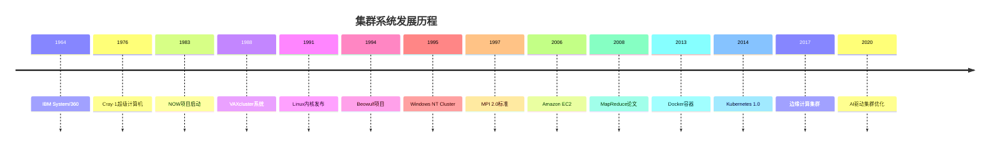

# 5.1.2 发展历程

<!-- TOC START -->

- [5.1.2 发展历程](#512-发展历程)
  - [概述](#概述)
  - [早期发展阶段 (1960s-1980s)](#早期发展阶段-1960s-1980s)
    - [大型机时代](#大型机时代)
    - [关键里程碑](#关键里程碑)
    - [技术特征](#技术特征)
  - [集群技术萌芽期 (1980s-1990s)](#集群技术萌芽期-1980s-1990s)
    - [学术研究阶段](#学术研究阶段)
    - [关键技术突破](#关键技术突破)
    - [代表性系统](#代表性系统)
  - [集群技术成熟期 (1990s-2000s)](#集群技术成熟期-1990s-2000s)
    - [商业化发展](#商业化发展)
    - [技术标准化](#技术标准化)
    - [应用领域扩展](#应用领域扩展)
  - [现代集群时代 (2000s-2010s)](#现代集群时代-2000s-2010s)
    - [云计算影响](#云计算影响)
    - [容器化革命](#容器化革命)
    - [微服务架构](#微服务架构)
  - [云原生集群时代 (2010s-至今)](#云原生集群时代-2010s-至今)
    - [云原生技术](#云原生技术)
    - [边缘计算集群](#边缘计算集群)
    - [智能化集群](#智能化集群)
  - [主要发展流派](#主要发展流派)
    - [高可用性集群 (HA Cluster)](#高可用性集群-ha-cluster)
    - [负载均衡集群 (LB Cluster)](#负载均衡集群-lb-cluster)
    - [高性能计算集群 (HPC Cluster)](#高性能计算集群-hpc-cluster)
    - [存储集群 (Storage Cluster)](#存储集群-storage-cluster)
  - [技术演进趋势](#技术演进趋势)
    - [架构演进](#架构演进)
    - [技术融合](#技术融合)
    - [智能化发展](#智能化发展)
  - [关键人物和贡献](#关键人物和贡献)
    - [学术贡献者](#学术贡献者)
    - [工业界贡献者](#工业界贡献者)
    - [开源社区贡献者](#开源社区贡献者)
  - [发展里程碑时间线](#发展里程碑时间线)
  - [未来发展趋势](#未来发展趋势)
    - [技术方向](#技术方向)
    - [应用领域](#应用领域)
    - [技术挑战](#技术挑战)
  - [总结](#总结)

<!-- TOC END -->

## 概述

集群系统的发展历程反映了计算机技术从单机到分布式、从集中式到去中心化的演进过程，体现了高可用性、高性能和可扩展性需求的不断增长。

## 早期发展阶段 (1960s-1980s)

### 大型机时代

- **1960年代**: IBM System/360系列引入多处理器架构
- **1970年代**: CDC 6600超级计算机采用多处理器设计
- **1980年代**: Cray超级计算机推动并行计算发展

### 关键里程碑

- **1964年**: IBM System/360发布，支持多处理器配置
- **1976年**: Cray-1超级计算机，向量并行处理
- **1982年**: Sequent Computer Systems推出对称多处理系统

### 技术特征

- 集中式架构
- 共享内存模型
- 专用硬件设计
- 高昂的成本

## 集群技术萌芽期 (1980s-1990s)

### 学术研究阶段

- **1983年**: 加州大学伯克利分校开始NOW (Network of Workstations)项目
- **1986年**: Beowulf集群概念提出
- **1989年**: 斯坦福大学DASH项目研究分布式共享内存

### 关键技术突破

- **1988年**: VAXcluster系统，DEC公司首个商业集群
- **1991年**: Linux内核发布，为集群发展奠定基础
- **1994年**: Beowulf集群项目正式启动

### 代表性系统

- **VAXcluster**: 首个商业集群系统
- **Beowulf**: 开源集群计算平台
- **NOW**: 网络工作站集群

## 集群技术成熟期 (1990s-2000s)

### 商业化发展

- **1995年**: 微软Windows NT Cluster Server
- **1996年**: Sun Microsystems Sun Cluster
- **1998年**: IBM RS/6000 SP超级计算机

### 技术标准化

- **1997年**: MPI (Message Passing Interface) 2.0标准发布
- **1999年**: OpenSSI (Open Single System Image)项目启动
- **2000年**: Linux-HA项目开始

### 应用领域扩展

- **科学计算**: 大规模并行计算
- **Web服务**: 高可用性网站
- **数据库**: 分布式数据库集群

## 现代集群时代 (2000s-2010s)

### 云计算影响

- **2006年**: Amazon Web Services推出EC2
- **2008年**: Google发布MapReduce论文
- **2009年**: Apache Hadoop成为主流大数据平台

### 容器化革命

- **2013年**: Docker容器技术发布
- **2014年**: Kubernetes容器编排系统
- **2015年**: Docker Swarm集群管理

### 微服务架构

- **2014年**: Netflix微服务架构实践
- **2015年**: Spring Cloud微服务框架
- **2016年**: Istio服务网格技术

## 云原生集群时代 (2010s-至今)

### 云原生技术

- **2014年**: Kubernetes 1.0发布
- **2016年**: CNCF (Cloud Native Computing Foundation)成立
- **2018年**: Istio 1.0服务网格发布

### 边缘计算集群

- **2017年**: Kubernetes Edge项目启动
- **2019年**: KubeEdge边缘计算平台
- **2020年**: 5G边缘计算集群

### 智能化集群

- **2018年**: 机器学习集群管理
- **2019年**: 自动化运维和自愈能力
- **2020年**: AI驱动的集群优化

## 主要发展流派

### 高可用性集群 (HA Cluster)

**发展历程**:

- **1980s**: VAXcluster高可用性设计
- **1990s**: 双机热备技术成熟
- **2000s**: 多节点高可用集群
- **2010s**: 云原生高可用架构

**技术特征**:

- 故障检测和自动恢复
- 数据同步和一致性
- 负载分担和故障转移

**代表系统**:

- IBM PowerHA
- Microsoft Failover Cluster
- Linux-HA (Heartbeat/Pacemaker)

### 负载均衡集群 (LB Cluster)

**发展历程**:

- **1990s**: 硬件负载均衡器
- **2000s**: 软件负载均衡技术
- **2010s**: 云原生负载均衡

**技术特征**:

- 请求分发算法
- 健康检查和故障检测
- 会话保持和状态同步

**代表系统**:

- F5 BIG-IP
- HAProxy
- Nginx
- Kubernetes Service

### 高性能计算集群 (HPC Cluster)

**发展历程**:

- **1980s**: 向量并行计算
- **1990s**: 消息传递并行计算
- **2000s**: 网格计算和分布式计算
- **2010s**: 云计算和GPU集群

**技术特征**:

- 并行算法和编程模型
- 高性能网络互连
- 大规模数据处理

**代表系统**:

- Beowulf集群
- Cray超级计算机
- IBM Blue Gene
- 天河超级计算机

### 存储集群 (Storage Cluster)

**发展历程**:

- **1990s**: RAID存储阵列
- **2000s**: 分布式文件系统
- **2010s**: 软件定义存储
- **2020s**: 云原生存储

**技术特征**:

- 数据冗余和容错
- 分布式数据管理
- 高性能I/O处理

**代表系统**:

- Ceph分布式存储
- GlusterFS
- HDFS (Hadoop Distributed File System)
- Kubernetes Storage

## 技术演进趋势

### 架构演进

1. **集中式 → 分布式**: 从单机到多机集群
2. **同构 → 异构**: 支持不同类型节点
3. **静态 → 动态**: 支持动态扩缩容
4. **手动 → 自动**: 自动化运维和管理

### 技术融合

1. **虚拟化技术**: 虚拟机集群
2. **容器技术**: 容器化集群
3. **微服务**: 服务网格集群
4. **边缘计算**: 边缘集群

### 智能化发展

1. **自动化运维**: 自动故障检测和恢复
2. **智能调度**: AI驱动的资源调度
3. **预测性维护**: 基于机器学习的故障预测
4. **自适应优化**: 动态性能调优

## 关键人物和贡献

### 学术贡献者

- **Gene Amdahl**: Amdahl定律，并行计算理论
- **Seymour Cray**: Cray超级计算机，向量并行计算
- **David Patterson**: RISC架构，计算机体系结构
- **John Hennessy**: MIPS架构，计算机系统设计

### 工业界贡献者

- **Linus Torvalds**: Linux内核，开源集群基础
- **Brendan Gregg**: 性能分析和调优工具
- **Brian Behlendorf**: Apache Web服务器
- **Werner Vogels**: Amazon云计算架构

### 开源社区贡献者

- **Kelsey Hightower**: Kubernetes和云原生技术
- **Brendan Burns**: Kubernetes联合创始人
- **Joe Beda**: Kubernetes和容器技术
- **Craig McLuckie**: Kubernetes项目管理

## 发展里程碑时间线

## 未来发展趋势

### 技术方向

1. **量子计算集群**: 量子比特集群管理
2. **神经形态计算**: 类脑计算集群
3. **光子计算**: 光互连集群网络
4. **生物计算**: DNA计算集群

### 应用领域

1. **自动驾驶**: 车联网集群
2. **智慧城市**: 城市管理集群
3. **医疗健康**: 医疗数据集群
4. **金融科技**: 金融交易集群

### 技术挑战

1. **能源效率**: 绿色计算集群
2. **安全性**: 量子安全集群
3. **可扩展性**: 超大规模集群
4. **智能化**: 自学习集群系统

## 总结

集群系统的发展历程体现了：

1. **技术演进**: 从硬件集群到软件定义集群
2. **应用扩展**: 从科学计算到通用计算
3. **架构创新**: 从集中式到分布式再到云原生
4. **智能化发展**: 从手动管理到自动化运维
5. **开源生态**: 从商业专有到开源开放

这一发展历程为现代分布式系统和云计算技术奠定了坚实基础。
