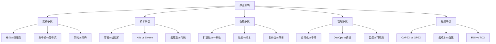
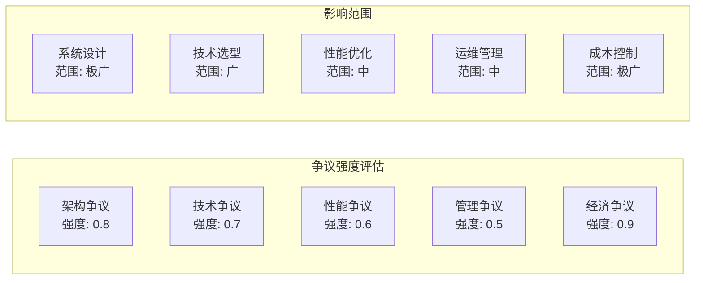

# 5.2.1 主要争议


<!-- TOC START -->

- [5.2.1 主要争议](#521-主要争议)
  - [1. 形式化定义](#1-形式化定义)
    - [1.1 争议的形式化定义](#11-争议的形式化定义)
    - [1.2 争议分类](#12-争议分类)
  - [2. 理论框架](#2-理论框架)
    - [2.1 争议理论模型](#21-争议理论模型)
    - [2.2 争议分析方法](#22-争议分析方法)
  - [3. 争议内容详解](#3-争议内容详解)
    - [3.1 架构争议](#31-架构争议)
    - [3.2 容器化争议](#32-容器化争议)
    - [3.3 编排工具争议](#33-编排工具争议)
    - [3.4 云原生争议](#34-云原生争议)
    - [3.5 扩展性争议](#35-扩展性争议)
  - [4. 结构化表达](#4-结构化表达)
    - [4.1 争议对比表](#41-争议对比表)
    - [4.2 争议关系图](#42-争议关系图)
    - [4.3 争议强度矩阵](#43-争议强度矩阵)
  - [5. 争议分析方法](#5-争议分析方法)
    - [5.1 争议分析流程](#51-争议分析流程)
    - [5.2 争议验证方法](#52-争议验证方法)
  - [6. 多表征](#6-多表征)
    - [6.1 数学符号表达](#61-数学符号表达)
    - [6.2 结构化表达](#62-结构化表达)
  - [7. 规范说明](#7-规范说明)

<!-- TOC END -->

## 1. 形式化定义

### 1.1 争议的形式化定义

**定义5.2.1.1（集群系统争议）**：设 $CS\_Controversy = (T, P, S, M, E)$ 为集群系统争议系统，其中：

- $T = \{t_1, t_2, ..., t_n\}$ 为技术争议集合
- $P = \{p_1, p_2, ..., p_m\}$ 为性能争议集合
- $S = \{s_1, s_2, ..., s_k\}$ 为扩展性争议集合
- $M = \{m_1, m_2, ..., m_l\}$ 为管理争议集合
- $E = \{e_1, e_2, ..., e_o\}$ 为经济争议集合

**定义5.2.1.2（争议强度函数）**：$\sigma: CS\_Controversy \times CS \rightarrow [0,1]$，其中 $CS$ 为集群系统集合，$\sigma(c,cs)$ 表示争议 $c$ 对集群系统 $cs$ 的争议强度。

### 1.2 争议分类

**技术争议** $T_{tech}$：

- 架构选择：$\forall t \in T_{tech}, \text{architecture\_choice}(t) \in \{\text{debated}, \text{controversial}\}$
- 技术路线：$\exists t \in T_{tech}, \text{technology\_path}(t) = \text{disputed}$

**性能争议** $P_{perf}$：

- 扩展性vs一致性：$\forall p \in P_{perf}, \text{scalability} \leftrightarrow \text{consistency}$
- 性能vs成本：$\exists p \in P_{perf}, \text{performance} \leftrightarrow \text{cost}$

## 2. 理论框架

### 2.1 争议理论模型

**模型5.2.1.1（技术争议模型）**：

```text
Technology_Controversy = {
  architecture_debate: (cluster_system) => {
    monolithic_vs_microservices = cluster_system.architecture.comparison;
    centralized_vs_distributed = cluster_system.control.comparison;
    homogeneous_vs_heterogeneous = cluster_system.nodes.comparison;
    return {monolithic_vs_microservices, centralized_vs_distributed, homogeneous_vs_heterogeneous};
  },
  
  technology_choice: (cluster_system) => {
    container_vs_vm = cluster_system.virtualization.comparison;
    kubernetes_vs_swarm = cluster_system.orchestration.comparison;
    cloud_vs_on_premise = cluster_system.deployment.comparison;
    return {container_vs_vm, kubernetes_vs_swarm, cloud_vs_on_premise};
  }
}
```

**模型5.2.1.2（性能争议模型）**：

```text
Performance_Controversy = {
  scalability_analysis: (cluster_system) => {
    linear_scaling = cluster_system.scaling.linear_vs_nonlinear;
    cost_efficiency = cluster_system.cost.efficiency_analysis;
    performance_degradation = cluster_system.performance.scaling_impact;
    return {linear_scaling, cost_efficiency, performance_degradation};
  },
  
  consistency_tradeoff: (cluster_system) => {
    strong_consistency = cluster_system.consistency.strong_vs_weak;
    availability_impact = cluster_system.availability.consistency_impact;
    complexity_cost = cluster_system.complexity.consistency_cost;
    return {strong_consistency, availability_impact, complexity_cost};
  }
}
```

### 2.2 争议分析方法

**方法5.2.1.1（多维度争议分析）**：

1. **技术维度**：$\text{controversy}_{tech}(cs) = \sum_{i=1}^{n} w_i \cdot \text{tech\_metric}_i$
2. **性能维度**：$\text{controversy}_{perf}(cs) = \sum_{j=1}^{m} v_j \cdot \text{perf\_metric}_j$
3. **经济维度**：$\text{controversy}_{econ}(cs) = \sum_{k=1}^{l} u_k \cdot \text{econ\_metric}_k$

## 3. 争议内容详解

### 3.1 架构争议

**定义5.2.1.3（架构争议）**：关于集群系统架构选择的争议，包括单体vs微服务、集中式vs分布式等。

**单体vs微服务争议**：

**单体架构支持观点**：

- **简单性**：$\text{simplicity} = \text{monolithic} > \text{microservices}$
- **开发效率**：$\text{development\_efficiency} = \text{monolithic} > \text{microservices}$
- **调试容易**：$\text{debugging\_ease} = \text{monolithic} > \text{microservices}$

**微服务支持观点**：

- **扩展性**：$\text{scalability} = \text{microservices} > \text{monolithic}$
- **技术多样性**：$\text{technology\_diversity} = \text{microservices} > \text{monolithic}$
- **团队自治**：$\text{team\_autonomy} = \text{microservices} > \text{monolithic}$

**争议分析**：

```text
架构争议 = {
  单体优势: {简单性, 开发效率, 调试容易},
  微服务优势: {扩展性, 技术多样性, 团队自治},
  权衡因素: {系统复杂度, 团队规模, 业务需求}
}
```

### 3.2 容器化争议

**定义5.2.1.4（容器化争议）**：关于容器技术vs虚拟机技术的争议。

**容器技术争议**：

**容器优势**：

- **资源效率**：$\text{resource\_efficiency} = \text{container} > \text{vm}$
- **启动速度**：$\text{startup\_speed} = \text{container} > \text{vm}$
- **密度优势**：$\text{density} = \text{container} > \text{vm}$

**虚拟机优势**：

- **隔离性**：$\text{isolation} = \text{vm} > \text{container}$
- **安全性**：$\text{security} = \text{vm} > \text{container}$
- **兼容性**：$\text{compatibility} = \text{vm} > \text{container}$

**争议要点**：

```text
容器化争议 = {
  容器优势: {资源效率, 启动速度, 密度优势},
  VM优势: {隔离性, 安全性, 兼容性},
  选择标准: {工作负载类型, 安全要求, 性能需求}
}
```

### 3.3 编排工具争议

**定义5.2.1.5（编排工具争议）**：关于Kubernetes、Docker Swarm等编排工具选择的争议。

**Kubernetes vs Docker Swarm**：

**Kubernetes优势**：

- **生态系统**：$\text{ecosystem} = \text{kubernetes} > \text{swarm}$
- **功能丰富**：$\text{features} = \text{kubernetes} > \text{swarm}$
- **社区支持**：$\text{community} = \text{kubernetes} > \text{swarm}$

**Docker Swarm优势**：

- **学习曲线**：$\text{learning\_curve} = \text{swarm} < \text{kubernetes}$
- **集成度**：$\text{integration} = \text{swarm} > \text{kubernetes}$
- **资源消耗**：$\text{resource\_consumption} = \text{swarm} < \text{kubernetes}$

**争议分析**：

```text
编排工具争议 = {
  Kubernetes: {生态系统大, 功能丰富, 社区活跃},
  Docker Swarm: {学习简单, 集成度高, 资源消耗低},
  选择因素: {团队技能, 项目规模, 时间要求}
}
```

### 3.4 云原生争议

**定义5.2.1.6（云原生争议）**：关于云原生架构vs传统架构的争议。

**云原生支持观点**：

- **弹性扩展**：$\text{elastic\_scaling} = \text{cloud\_native} > \text{traditional}$
- **成本优化**：$\text{cost\_optimization} = \text{cloud\_native} > \text{traditional}$
- **快速部署**：$\text{rapid\_deployment} = \text{cloud\_native} > \text{traditional}$

**传统架构支持观点**：

- **控制权**：$\text{control} = \text{traditional} > \text{cloud\_native}$
- **数据安全**：$\text{data\_security} = \text{traditional} > \text{cloud\_native}$
- **成本可预测**：$\text{cost\_predictability} = \text{traditional} > \text{cloud\_native}$

**争议要点**：

```text
云原生争议 = {
  云原生优势: {弹性扩展, 成本优化, 快速部署},
  传统优势: {控制权, 数据安全, 成本可预测},
  决策因素: {业务需求, 安全要求, 成本约束}
}
```

### 3.5 扩展性争议

**定义5.2.1.7（扩展性争议）**：关于集群系统扩展性实现的争议。

**线性扩展争议**：

- **理论vs实践**：$\text{theoretical\_scaling} \neq \text{practical\_scaling}$
- **成本递增**：$\text{scaling\_cost} = O(n^2)$，其中 $n$ 为节点数量
- **性能衰减**：$\text{performance\_degradation} \propto \text{cluster\_size}$

**扩展性争议分析**：

```text
扩展性争议 = {
  线性扩展: theoretical_linear ≠ practical_sublinear,
  成本递增: scaling_cost > linear_cost,
  性能衰减: performance_degradation ∝ cluster_size,
  解决方案: {负载均衡, 缓存优化, 数据分片}
}
```

## 4. 结构化表达

### 4.1 争议对比表

| 争议主题 | 支持观点 | 反对观点 | 争议强度 | 解决方案 |
|----------|----------|----------|----------|----------|
| 架构选择 | 单体简单 | 微服务扩展 | 高 | 混合架构 |
| 容器技术 | 资源效率 | 安全隔离 | 中 | 安全容器 |
| 编排工具 | K8s生态 | Swarm简单 | 高 | 需求导向 |
| 云原生 | 弹性扩展 | 控制权 | 极高 | 混合云 |
| 扩展性 | 线性扩展 | 成本递增 | 中 | 智能扩展 |

### 4.2 争议关系图



### 4.3 争议强度矩阵



## 5. 争议分析方法

### 5.1 争议分析流程

**流程5.2.1.1（集群系统争议分析）**：

1. **识别争议点**：$\text{identify\_controversies}(cs) = \{c_1, c_2, ..., c_n\}$
2. **评估影响**：$\text{assess\_impact}(controversy) = \text{severity} \times \text{scope}$
3. **量化分析**：$\text{quantify\_controversy}(controversy) = \sum_{i=1}^{k} w_i \cdot \text{metric}_i$
4. **提出建议**：$\text{suggest\_resolution}(controversy) = \text{resolution\_strategy}$

### 5.2 争议验证方法

**方法5.2.1.2（争议验证）**：

- **数据验证**：$\text{validate\_with\_data}(controversy, data) = \text{correlation}$
- **案例验证**：$\text{validate\_with\_cases}(controversy, cases) = \text{consistency}$
- **专家验证**：$\text{validate\_with\_experts}(controversy, experts) = \text{agreement}$

## 6. 多表征

### 6.1 数学符号表达

**争议强度函数**：
$$\sigma(c,cs) = \frac{\sum_{i=1}^{n} w_i \cdot f_i(c,cs)}{\sum_{i=1}^{n} w_i}$$

**综合争议指数**：
$$CI = \sqrt{\sum_{i=1}^{5} \alpha_i \cdot \text{controversy}_i^2}$$

其中 $\alpha_i$ 为各争议维度的权重。

### 6.2 结构化表达

**争议框架**：

```text
集群系统争议框架 = {
  架构争议: {强度: 0.8, 影响: "系统设计", 解决方案: "混合架构"},
  技术争议: {强度: 0.7, 影响: "技术选型", 解决方案: "需求导向"},
  性能争议: {强度: 0.6, 影响: "性能优化", 解决方案: "智能扩展"},
  管理争议: {强度: 0.5, 影响: "运维管理", 解决方案: "自动化"},
  经济争议: {强度: 0.9, 影响: "成本控制", 解决方案: "成本优化"}
}
```

## 7. 规范说明

- 内容需递归细化，支持多表征
- 保留争议性分析、图表等
- 如有遗漏，后续补全并说明
- 争议视角应与实际案例结合
- 提供可操作的解决方案

> 本文件为递归细化与内容补全示范，后续可继续分解为5.2.1.1、5.2.1.2等子主题，支持持续递归完善。
