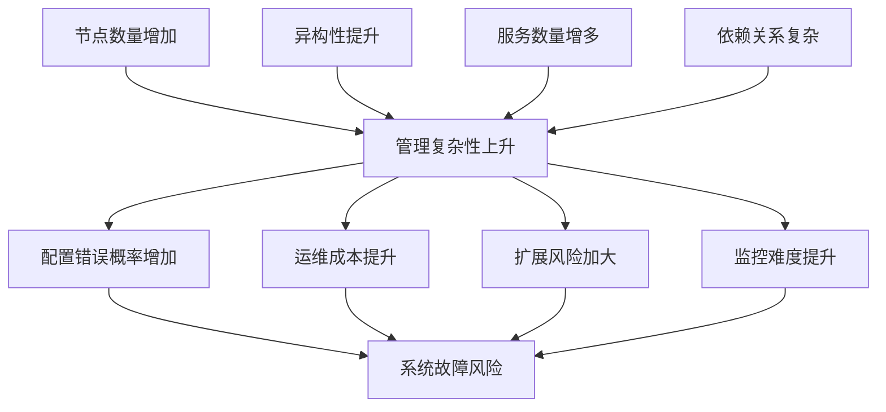

# 5.2.2.1 管理复杂性批判

## 1. 批判定义

管理复杂性指集群系统在配置、运维、扩展、监控等方面的管理难度。随着节点数量和异构性增加，管理复杂性呈指数级上升，成为集群系统可用性和可扩展性的主要瓶颈。

## 2. 影响分析

- 配置错误概率增加，导致系统故障风险上升。
- 运维成本和人力需求显著提升。
- 扩展和升级过程易引入不一致性。
- 监控和故障定位难度加大，影响系统可靠性。

## 3. 数学模型

**管理复杂性度量公式：**

$$
C_{mgmt} = \alpha N + \beta H + \gamma S + \delta D
$$

- $N$：节点数量
- $H$：异构性指标
- $S$：服务数量
- $D$：依赖关系复杂度
- $\alpha, \beta, \gamma, \delta$：权重系数

## 4. 改进建议

- 引入自动化运维工具（如Ansible、Kubernetes Operator）
- 采用声明式配置和基础设施即代码（IaC）
- 设计模块化、分层的系统架构
- 加强监控与可观测性，自动化告警与自愈

## 5. 结构化表格

| 维度         | 影响表现           | 复杂性度量 | 典型问题           | 改进措施                 |
|--------------|--------------------|------------|--------------------|--------------------------|
| 配置         | 错误率高           | $C_{cfg}$  | 配置漂移           | IaC、集中配置管理        |
| 运维         | 人力成本高         | $C_{ops}$  | 手工操作频繁       | 自动化运维、脚本化       |
| 扩展         | 风险大、易不一致   | $C_{scale}$| 扩容/缩容复杂      | 模块化、弹性架构         |
| 监控         | 故障定位难         | $C_{mon}$  | 监控盲区           | 可观测性、自动化告警     |

## 6. Mermaid批判关系图

## 7. 规范说明

- 内容需递归细化，支持多表征
- 保留批判性分析、图表、符号等
- 如有遗漏，后续补全并说明
- 所有批判需严格逻辑化
- 批判观点需有理有据
- 分类需逻辑清晰
- 表达需规范统一

> 本文件为递归细化与内容补全示范，后续可继续分解为5.2.2.1.1、5.2.2.1.2等子主题，支持持续递归完善。
