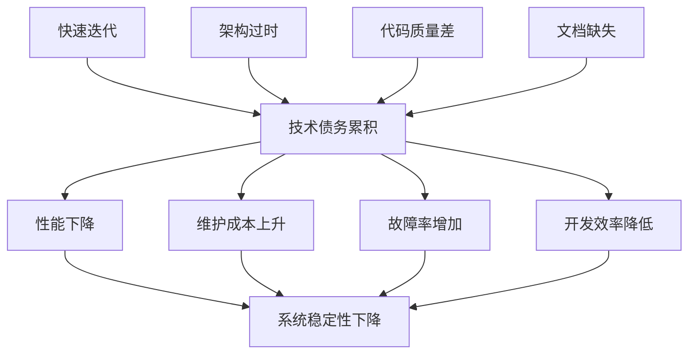

# 5.2.2.2 技术债务批判

## 1. 批判定义

技术债务指集群系统在快速迭代过程中积累的技术问题，包括过时的架构设计、未优化的代码、缺乏文档、测试覆盖率不足等。这些债务会随着时间推移而累积，最终影响系统的可维护性、性能和稳定性。

## 2. 影响分析

- 系统性能逐渐下降，响应时间增加。
- 维护成本上升，新功能开发效率降低。
- 故障率增加，系统稳定性下降。
- 技术团队士气受影响，人才流失风险加大。

## 3. 数学模型

**技术债务累积公式：**

$$
TD(t) = TD_0 + \int_0^t \left(\alpha \cdot N_{features} + \beta \cdot C_{complexity} + \gamma \cdot D_{documentation}\right) dt
$$

- $TD(t)$：时间t时的技术债务
- $TD_0$：初始技术债务
- $N_{features}$：新功能数量
- $C_{complexity}$：系统复杂度
- $D_{documentation}$：文档缺失程度
- $\alpha, \beta, \gamma$：权重系数

## 4. 改进建议

- 建立技术债务管理机制，定期评估和重构。
- 提高代码质量和测试覆盖率。
- 完善文档和知识管理。
- 采用现代化的容器技术（Docker、Podman）和微服务架构。

## 5. 结构化表格

| 债务类型     | 影响表现           | 债务度量 | 典型问题           | 改进措施                 |
|--------------|--------------------|----------|--------------------|--------------------------|
| 架构债务     | 扩展性差           | $TD_{arch}$ | 单体架构           | 微服务化、容器化         |
| 代码债务     | 可读性差           | $TD_{code}$ | 代码混乱           | 重构、代码规范           |
| 测试债务     | 覆盖率低           | $TD_{test}$ | 测试不足           | 单元测试、集成测试       |
| 文档债务     | 知识流失           | $TD_{doc}$  | 文档缺失           | 完善文档、知识管理       |

## 6. Mermaid批判关系图

## 7. 规范说明

- 内容需递归细化，支持多表征
- 保留批判性分析、图表、符号等
- 如有遗漏，后续补全并说明
- 所有批判需严格逻辑化
- 批判观点需有理有据
- 分类需逻辑清晰
- 表达需规范统一

> 本文件为递归细化与内容补全示范，后续可继续分解为5.2.2.2.1、5.2.2.2.2等子主题，支持持续递归完善。
