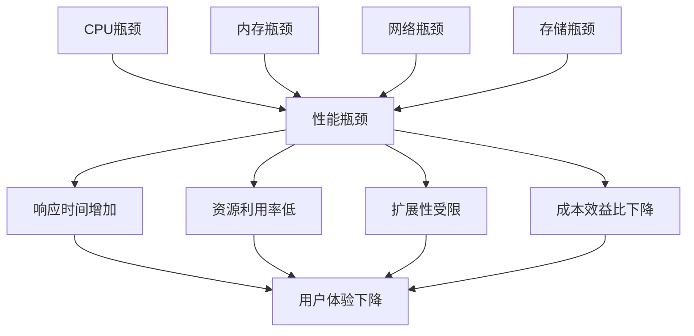

# 5.2.2.3 性能瓶颈批判

## 1. 批判定义

性能瓶颈指集群系统中限制整体性能的关键环节，包括网络带宽、存储I/O、CPU计算能力、内存容量等。这些瓶颈会导致系统无法充分利用资源，影响用户体验和业务效率。

## 2. 影响分析

- 系统响应时间增加，用户体验下降。
- 资源利用率不均衡，造成浪费。
- 扩展性受限，无法满足业务增长需求。
- 成本效益比下降，投资回报率降低。

## 3. 数学模型

**性能瓶颈识别公式：**

$$
B_{perf} = \max\left(\frac{L_{cpu}}{C_{cpu}}, \frac{L_{mem}}{C_{mem}}, \frac{L_{net}}{C_{net}}, \frac{L_{disk}}{C_{disk}}\right)
$$

- $L_{cpu}, L_{mem}, L_{net}, L_{disk}$：各资源负载
- $C_{cpu}, C_{mem}, C_{net}, C_{disk}$：各资源容量
- $B_{perf}$：性能瓶颈指标

## 4. 改进建议

- 采用负载均衡和智能调度算法。
- 引入缓存机制和CDN加速。
- 优化数据库查询和存储架构。
- 使用容器化技术（Docker、Podman）提高资源利用率。

## 5. 结构化表格

| 瓶颈类型     | 影响表现           | 瓶颈度量 | 典型问题           | 改进措施                 |
|--------------|--------------------|----------|--------------------|--------------------------|
| CPU瓶颈      | 计算能力不足       | $B_{cpu}$ | 单线程处理         | 多核并行、负载均衡       |
| 内存瓶颈     | 内存不足           | $B_{mem}$ | 内存泄漏           | 内存优化、缓存策略       |
| 网络瓶颈     | 带宽限制           | $B_{net}$ | 网络延迟           | CDN加速、网络优化        |
| 存储瓶颈     | I/O性能差          | $B_{disk}$| 磁盘I/O慢          | SSD存储、分布式存储      |

## 6. Mermaid批判关系图

## 7. 规范说明

- 内容需递归细化，支持多表征
- 保留批判性分析、图表、符号等
- 如有遗漏，后续补全并说明
- 所有批判需严格逻辑化
- 批判观点需有理有据
- 分类需逻辑清晰
- 表达需规范统一

> 本文件为递归细化与内容补全示范，后续可继续分解为5.2.2.3.1、5.2.2.3.2等子主题，支持持续递归完善。
