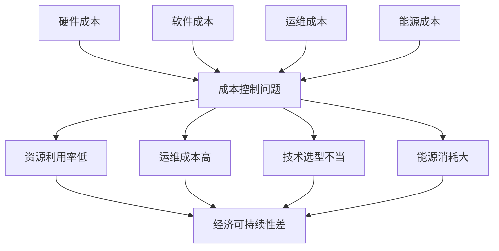

# 5.2.2.4 成本控制批判

<!-- TOC START -->

- [5.2.2.4 成本控制批判](#5224-成本控制批判)
  - [1. 批判定义](#1-批判定义)
  - [2. 影响分析](#2-影响分析)
  - [3. 数学模型](#3-数学模型)
  - [4. 改进建议](#4-改进建议)
  - [5. 结构化表格](#5-结构化表格)
  - [6. Mermaid批判关系图](#6-mermaid批判关系图)
  - [7. 规范说明](#7-规范说明)

<!-- TOC END -->

## 1. 批判定义

成本控制批判指集群系统在资源使用、运维管理、技术选型等方面的成本效益问题。随着系统规模扩大，成本呈非线性增长，包括硬件成本、软件许可、人力成本、能源消耗等，影响系统的经济可持续性。

## 2. 影响分析

- 资源利用率低，造成成本浪费。
- 运维成本高，人力投入大。
- 技术选型不当，增加不必要的成本。
- 能源消耗大，影响环境可持续性。

## 3. 数学模型

**成本效益分析公式：**

$$
ROI = \frac{\text{收益} - \text{成本}}{\text{成本}} = \frac{\text{业务价值} - (C_{hw} + C_{sw} + C_{ops} + C_{energy})}{C_{hw} + C_{sw} + C_{ops} + C_{energy}}
$$

- $C_{hw}$：硬件成本
- $C_{sw}$：软件成本
- $C_{ops}$：运维成本
- $C_{energy}$：能源成本

## 4. 改进建议

- 采用容器化技术（Docker、Podman）提高资源利用率。
- 实施自动化运维，减少人力成本。
- 选择开源解决方案，降低软件许可成本。
- 优化能源使用，采用绿色计算技术。

## 5. 结构化表格

| 成本类型     | 影响表现           | 成本度量 | 典型问题           | 改进措施                 |
|--------------|--------------------|----------|--------------------|--------------------------|
| 硬件成本     | 资源利用率低       | $C_{hw}$ | 过度配置           | 容器化、弹性伸缩         |
| 软件成本     | 许可费用高         | $C_{sw}$ | 商业软件依赖       | 开源替代、云原生         |
| 运维成本     | 人力投入大         | $C_{ops}$ | 手工运维           | 自动化运维、DevOps       |
| 能源成本     | 能耗高             | $C_{energy}$ | 散热问题           | 绿色计算、节能优化       |

## 6. Mermaid批判关系图

## 7. 规范说明

- 内容需递归细化，支持多表征
- 保留批判性分析、图表、符号等
- 如有遗漏，后续补全并说明
- 所有批判需严格逻辑化
- 批判观点需有理有据
- 分类需逻辑清晰
- 表达需规范统一

> 本文件为递归细化与内容补全示范，后续可继续分解为5.2.2.4.1、5.2.2.4.2等子主题，支持持续递归完善。
