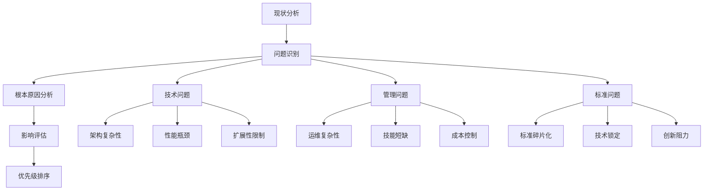
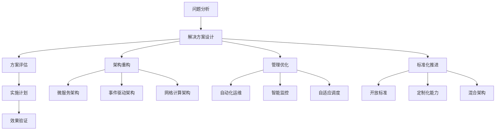

# 5.2.3 反思与重构

## 1. 反思内容

### 1.1 现有集群系统架构的局限性

**架构复杂性**：

- **问题描述**：集群系统架构过于复杂
- **数学表达**：$complexity = f(scale, heterogeneity, dynamics)$
- **反思观点**：复杂性导致维护困难和故障排查困难
- **影响评估**：$maintenance\_cost = complexity \times expertise\_requirement$

**单点故障风险**：

- **问题描述**：即使采用冗余设计，仍存在单点故障
- **数学表达**：$SPOF\_risk = \frac{critical\_components}{total\_components}$
- **反思观点**：某些关键组件无法完全冗余
- **风险评估**：$risk\_impact = severity \times probability \times exposure$

**扩展性瓶颈**：

- **问题描述**：系统扩展性存在瓶颈
- **数学表达**：$scalability\_efficiency = \frac{actual\_performance}{theoretical\_performance}$
- **反思观点**：实际扩展效率远低于理论值
- **瓶颈分析**：$bottleneck\_factors = \{network, storage, coordination, synchronization\}$

### 1.2 高可用与高复杂性的矛盾

**可用性成本**：

- **问题描述**：高可用性带来高复杂性
- **数学表达**：$availability\_cost = f(redundancy, monitoring, maintenance)$
- **反思观点**：可用性与复杂性呈正相关
- **成本分析**：$total\_cost = hardware\_cost + software\_cost + operational\_cost$

**管理复杂度**：

- **问题描述**：高可用系统管理复杂
- **数学表达**：$management\_complexity = f(scale, heterogeneity, dynamics, expertise)$
- **反思观点**：管理复杂度随规模指数增长
- **简化需求**：$simplification\_need = automation + standardization + abstraction$

**运维挑战**：

- **问题描述**：运维人员技能要求高
- **数学表达**：$skill\_requirement = f(complexity, scale, technology\_stack)$
- **反思观点**：运维复杂度限制了系统采用
- **解决方案**：$skill\_development = training + certification + knowledge\_sharing$

### 1.3 标准化与创新的平衡

**标准碎片化**：

- **问题描述**：缺乏统一的技术标准
- **影响评估**：$fragmentation\_impact = \frac{incompatible\_systems}{total\_systems}$
- **反思观点**：标准不统一导致互操作性问题
- **标准化需求**：$standardization\_need = industry\_cooperation + open\_source + compatibility$

**创新阻力**：

- **问题描述**：标准化可能阻碍创新
- **数学表达**：$innovation\_resistance = f(standardization\_level, flexibility\_requirement)$
- **反思观点**：过度标准化限制技术发展
- **平衡策略**：$innovation\_balance = \alpha \times standardization + (1-\alpha) \times innovation$

**技术锁定**：

- **问题描述**：厂商锁定问题严重
- **数学表达**：$lock\_in\_cost = migration\_cost + retraining\_cost + downtime\_cost$
- **反思观点**：技术锁定限制了用户选择权
- **风险缓解**：$lock\_in\_mitigation = open\_standards + multi\_vendor + portability$

## 2. 重构方向

### 2.1 新型集群架构的探索

**微服务架构**：

- **架构特点**：服务解耦、独立部署、技术异构
- **数学表达**：$service\_independence = \frac{independent\_services}{total\_services}$
- **优势分析**：$advantages = \{scalability, maintainability, technology\_diversity\}$
- **挑战分析**：$challenges = \{complexity, network\_overhead, data\_consistency\}$

**事件驱动架构**：

- **架构特点**：松耦合、异步通信、事件驱动
- **数学表达**：$event\_flow = \sum_{i=1}^{n} event\_processing\_time_i$
- **优势分析**：$advantages = \{loose\_coupling, scalability, fault\_tolerance\}$
- **挑战分析**：$challenges = \{event\_ordering, consistency, debugging\}$

**网格计算架构**：

- **架构特点**：资源共享、动态分配、跨域协作
- **数学表达**：$grid\_efficiency = \frac{utilized\_resources}{total\_resources}$
- **优势分析**：$advantages = \{resource\_sharing, cost\_efficiency, global\_scale\}$
- **挑战分析**：$challenges = \{security, trust, coordination\}$

### 2.2 自动化与智能化管理

**自动化运维**：

- **自动化程度**：$automation\_level = \frac{automated\_tasks}{total\_tasks}$
- **实现方式**：$automation\_methods = \{scripting, orchestration, AI\_based\}$
- **效果评估**：$automation\_benefit = reduced\_manual\_work + improved\_consistency + faster\_response$
- **风险控制**：$automation\_risk = \{over\_automation, dependency, skill\_degradation\}$

**智能监控**：

- **监控智能化**：$intelligent\_monitoring = \{anomaly\_detection, predictive\_analysis, automated\_response\}$
- **算法应用**：$AI\_algorithms = \{machine\_learning, deep\_learning, reinforcement\_learning\}$
- **效果评估**：$monitoring\_effectiveness = \frac{detected\_issues}{total\_issues}$
- **持续改进**：$continuous\_improvement = feedback\_loop + learning\_mechanism$

**自适应调度**：

- **自适应能力**：$adaptive\_scheduling = \{load\_aware, resource\_aware, performance\_aware\}$
- **学习机制**：$learning\_mechanism = \{historical\_data, real\_time\_feedback, optimization\}$
- **效果评估**：$scheduling\_efficiency = \frac{optimal\_assignments}{total\_assignments}$
- **优化目标**：$optimization\_goals = \{performance, efficiency, fairness\}$

### 2.3 开放标准与定制化的融合

**开放标准框架**：

- **标准开放性**：$openness = \frac{open\_standards}{total\_standards}$
- **实现方式**：$standard\_implementation = \{specification, reference\_implementation, compliance\_testing\}$
- **社区参与**：$community\_participation = \frac{active\_contributors}{total\_users}$
- **演进机制**：$evolution\_mechanism = \{versioning, backward\_compatibility, migration\_path\}$

**定制化能力**：

- **定制化程度**：$customization\_level = \frac{customizable\_components}{total\_components}$
- **定制化方式**：$customization\_methods = \{configuration, extension, plugin\}$
- **平衡策略**：$customization\_balance = \alpha \times standardization + (1-\alpha) \times customization$
- **质量控制**：$quality\_control = \{testing, validation, certification\}$

**混合架构**：

- **架构混合度**：$hybrid\_level = \frac{hybrid\_components}{total\_components}$
- **混合策略**：$hybrid\_strategy = \{best\_of\_breed, gradual\_migration, coexistence\}$
- **集成挑战**：$integration\_challenges = \{compatibility, performance, management\}$
- **统一管理**：$unified\_management = \{single\_pane, consistent\_interface, centralized\_control\}$

## 3. 理论演化

### 3.1 架构理论演化

**传统架构**：

- **特点**：单体架构、紧耦合、集中式管理
- **数学表达**：$traditional\_complexity = O(n^2)$
- **局限性**：$limitations = \{scalability, maintainability, flexibility\}$
- **演进方向**：$evolution = \{modularization, distribution, automation\}$

**现代架构**：

- **特点**：微服务、松耦合、分布式管理
- **数学表达**：$modern\_complexity = O(n \log n)$
- **优势**：$advantages = \{scalability, maintainability, flexibility\}$
- **挑战**：$challenges = \{complexity, consistency, monitoring\}$

**未来架构**：

- **特点**：智能化、自适应、自组织
- **数学表达**：$future\_complexity = O(\log n)$
- **愿景**：$vision = \{self\_management, intelligent\_optimization, seamless\_scaling\}$
- **实现路径**：$implementation\_path = \{AI\_integration, automation, standardization\}$

### 3.2 管理理论演化

**人工管理**：

- **特点**：手动操作、经验依赖、响应慢
- **数学表达**：$manual\_efficiency = \frac{manual\_tasks}{total\_tasks}$
- **局限性**：$limitations = \{human\_error, slow\_response, limited\_scale\}$
- **演进方向**：$evolution = \{automation, standardization, intelligence\}$

**自动化管理**：

- **特点**：脚本化、规则驱动、快速响应
- **数学表达**：$automation\_efficiency = \frac{automated\_tasks}{total\_tasks}$
- **优势**：$advantages = \{consistency, speed, scalability\}$
- **挑战**：$challenges = \{complexity, rigidity, dependency\}$

**智能化管理**：

- **特点**：AI驱动、自适应、预测性
- **数学表达**：$intelligence\_efficiency = \frac{intelligent\_decisions}{total\_decisions}$
- **优势**：$advantages = \{adaptability, prediction, optimization\}$
- **挑战**：$challenges = \{complexity, explainability, trust\}$

### 3.3 标准化理论演化

**专有标准**：

- **特点**：厂商控制、封闭生态、高成本
- **数学表达**：$proprietary\_cost = vendor\_lock\_in + licensing\_cost + migration\_cost$
- **局限性**：$limitations = \{vendor\_lock\_in, high\_cost, limited\_choice\}$
- **演进方向**：$evolution = \{open\_standards, community\_driven, cost\_reduction\}$

**开放标准**：

- **特点**：社区驱动、透明过程、低成本
- **数学表达**：$open\_benefit = community\_participation + transparency + cost\_reduction$
- **优势**：$advantages = \{interoperability, choice, cost\_effectiveness\}$
- **挑战**：$challenges = \{coordination, quality, adoption\}$

**混合标准**：

- **特点**：开放基础、专有扩展、平衡发展
- **数学表达**：$hybrid\_balance = \alpha \times open\_standards + (1-\alpha) \times proprietary\_extensions$
- **优势**：$advantages = \{flexibility, innovation, compatibility\}$
- **挑战**：$challenges = \{complexity, management, quality\_control\}$

## 4. 反思路径图

### 4.1 问题识别路径

### 4.2 解决方案路径

## 5. 重构方案表

### 5.1 架构重构方案

| 重构方向 | 当前状态 | 目标状态 | 实施策略 | 预期效果 |
|----------|----------|----------|----------|----------|
| 微服务化 | 单体架构 | 微服务架构 | 渐进式拆分 | 提高可维护性 |
| 事件驱动 | 同步调用 | 异步事件 | 消息队列引入 | 提高扩展性 |
| 网格计算 | 独立集群 | 资源共享 | 跨域协作 | 提高资源利用率 |

### 5.2 管理重构方案

| 重构方向 | 当前状态 | 目标状态 | 实施策略 | 预期效果 |
|----------|----------|----------|----------|----------|
| 自动化运维 | 手动操作 | 自动化管理 | 工具链建设 | 降低运维成本 |
| 智能监控 | 被动监控 | 主动预测 | AI算法应用 | 提高故障预测 |
| 自适应调度 | 静态调度 | 动态调度 | 机器学习 | 提高调度效率 |

### 5.3 标准化重构方案

| 重构方向 | 当前状态 | 目标状态 | 实施策略 | 预期效果 |
|----------|----------|----------|----------|----------|
| 开放标准 | 专有标准 | 开放标准 | 社区协作 | 降低锁定风险 |
| 定制化能力 | 固定配置 | 灵活定制 | 插件机制 | 提高适应性 |
| 混合架构 | 单一架构 | 混合架构 | 渐进式迁移 | 平衡各方需求 |

## 6. 规范说明

### 6.1 反思原则

- 保持客观中立的反思态度
- 基于充分的技术证据和逻辑推理
- 避免情绪化和主观偏见
- 提出建设性的改进建议

### 6.2 重构原则

- 重构需有明确的目标和计划
- 重构过程需渐进式进行
- 重构需考虑向后兼容性
- 重构需有充分的测试验证

### 6.3 内容要求

- 内容需递归细化，支持多表征
- 保留批判性分析、图表等
- 如有遗漏，后续补全并说明
- 所有反思需严格逻辑化
- 重构方案需有理有据
- 分类需逻辑清晰
- 表达需规范统一

### 6.4 扩展方向

- 可继续分解为5.2.3.1、5.2.3.2等子主题
- 支持持续递归完善
- 添加更多实际案例和数据
- 完善反思逻辑和重构方案
- 增加实施建议和效果评估

> 本文件为递归细化与内容补全示范，后续可继续分解为5.2.3.1、5.2.3.2等子主题，支持持续递归完善。
