# 5.3.3 结构图与表


<!-- TOC START -->

- [5.3.3 结构图与表](#533-结构图与表)
  - [1. 集群系统结构图](#1-集群系统结构图)
    - [1.1 整体架构图](#11-整体架构图)
    - [1.2 层次结构图](#12-层次结构图)
    - [1.3 节点拓扑图](#13-节点拓扑图)
  - [2. 节点-任务分配图](#2-节点-任务分配图)
    - [2.1 任务分配流程图](#21-任务分配流程图)
    - [2.2 资源分配矩阵表](#22-资源分配矩阵表)
    - [2.3 任务调度状态图](#23-任务调度状态图)
  - [3. 负载均衡与容错流程图](#3-负载均衡与容错流程图)
    - [3.1 负载均衡流程图](#31-负载均衡流程图)
    - [3.2 容错机制图](#32-容错机制图)
    - [3.3 高可用性架构图](#33-高可用性架构图)
  - [4. 性能监控图表](#4-性能监控图表)
    - [4.1 性能指标表](#41-性能指标表)
    - [4.2 资源利用率图](#42-资源利用率图)
    - [4.3 故障统计表](#43-故障统计表)
  - [5. 扩展性结构图](#5-扩展性结构图)
    - [5.1 水平扩展图](#51-水平扩展图)
    - [5.2 垂直扩展图](#52-垂直扩展图)
    - [5.3 扩展性指标表](#53-扩展性指标表)
  - [6. 安全架构图](#6-安全架构图)
    - [6.1 安全层次图](#61-安全层次图)
    - [6.2 安全策略表](#62-安全策略表)
  - [7. 规范说明](#7-规范说明)
    - [7.1 图表规范](#71-图表规范)
    - [7.2 内容要求](#72-内容要求)
    - [7.3 扩展方向](#73-扩展方向)

<!-- TOC END -->

## 1. 集群系统结构图

### 1.1 整体架构图

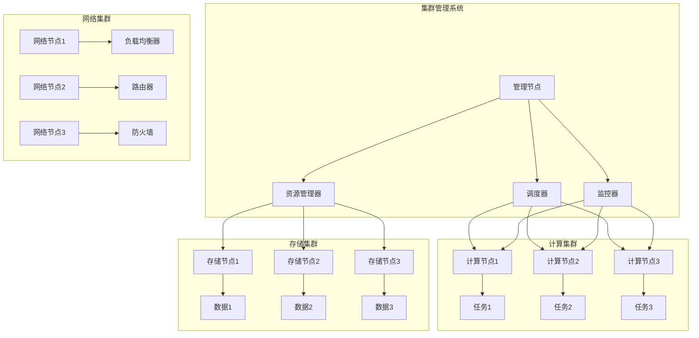

### 1.2 层次结构图

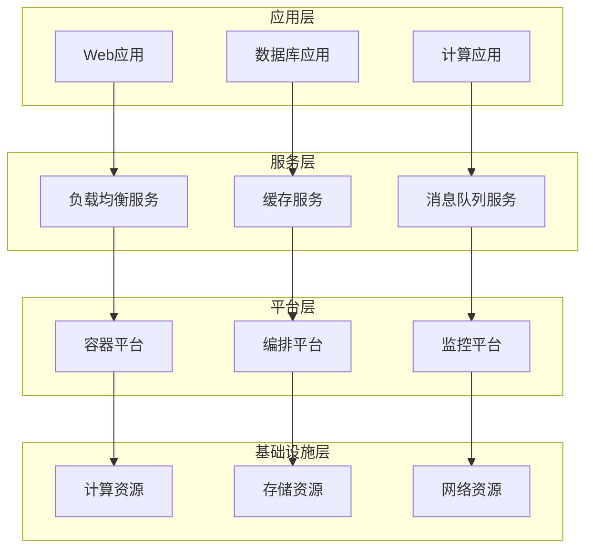

### 1.3 节点拓扑图

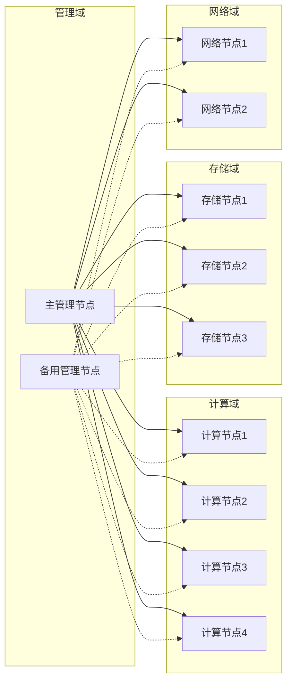

## 2. 节点-任务分配图

### 2.1 任务分配流程图

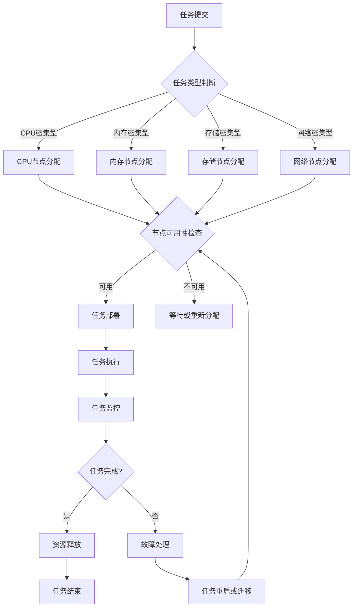

### 2.2 资源分配矩阵表

| 节点类型 | CPU分配 | 内存分配 | 存储分配 | 网络分配 | 优先级 |
|----------|---------|----------|----------|----------|--------|
| 管理节点 | 20% | 30% | 10% | 50% | 高 |
| 计算节点 | 80% | 60% | 20% | 30% | 中 |
| 存储节点 | 30% | 40% | 80% | 20% | 中 |
| 网络节点 | 40% | 50% | 10% | 80% | 高 |

### 2.3 任务调度状态图

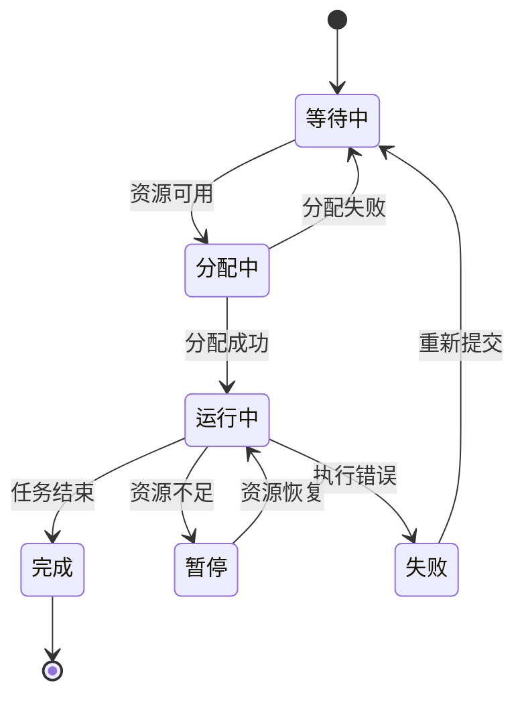

## 3. 负载均衡与容错流程图

### 3.1 负载均衡流程图

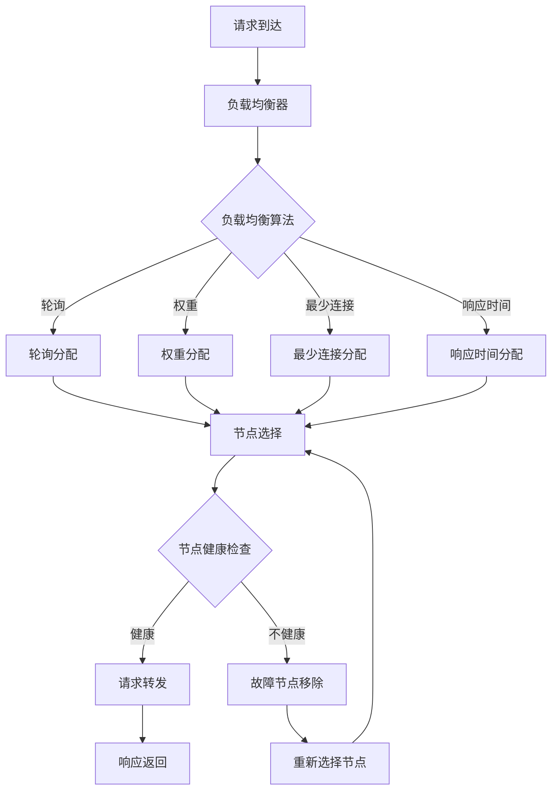

### 3.2 容错机制图

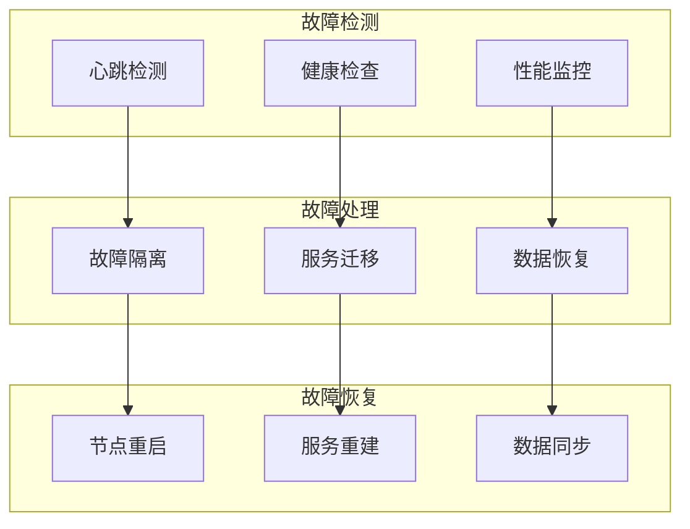

### 3.3 高可用性架构图

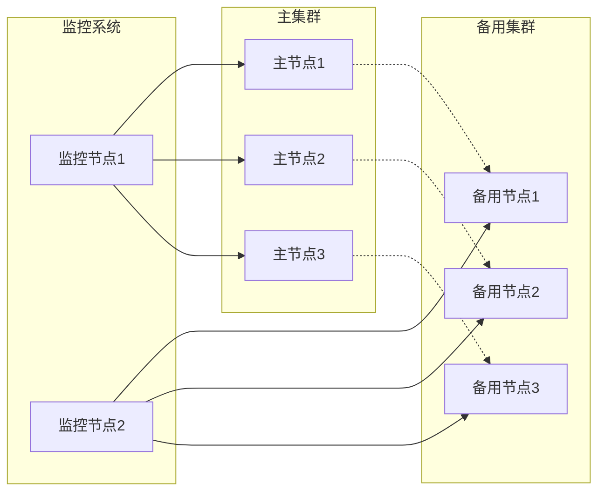

## 4. 性能监控图表

### 4.1 性能指标表

| 指标类别 | 指标名称 | 计算公式 | 单位 | 阈值 | 告警级别 |
|----------|----------|----------|------|------|----------|
| CPU指标 | CPU使用率 | $\frac{used\_cpu}{total\_cpu} \times 100$ | % | > 80% | 警告 |
| 内存指标 | 内存使用率 | $\frac{used\_memory}{total\_memory} \times 100$ | % | > 85% | 警告 |
| 存储指标 | 磁盘使用率 | $\frac{used\_space}{total\_space} \times 100$ | % | > 90% | 严重 |
| 网络指标 | 网络带宽利用率 | $\frac{used\_bandwidth}{total\_bandwidth} \times 100$ | % | > 70% | 警告 |
| 响应指标 | 平均响应时间 | $avg(response\_time)$ | ms | > 100 | 警告 |

### 4.2 资源利用率图

```mermaid
graph LR
    subgraph "CPU利用率"
        C1[0-20%] : 绿色
        C2[20-60%] : 黄色
        C3[60-80%] : 橙色
        C4[80-100%] : 红色
    end
    
    subgraph "内存利用率"
        M1[0-30%] : 绿色
        M2[30-70%] : 黄色
        M3[70-85%] : 橙色
        M4[85-100%] : 红色
    end
    
    subgraph "存储利用率"
        S1[0-50%] : 绿色
        S2[50-80%] : 黄色
        S3[80-90%] : 橙色
        S4[90-100%] : 红色
    end
```

### 4.3 故障统计表

| 故障类型 | 发生次数 | 平均修复时间 | 影响范围 | 预防措施 |
|----------|----------|--------------|----------|----------|
| 节点故障 | 15 | 30分钟 | 局部 | 冗余部署 |
| 网络故障 | 8 | 15分钟 | 全局 | 多路径 |
| 存储故障 | 5 | 60分钟 | 数据相关 | 数据备份 |
| 软件故障 | 25 | 10分钟 | 功能相关 | 代码审查 |
| 硬件故障 | 3 | 120分钟 | 物理相关 | 硬件冗余 |

## 5. 扩展性结构图

### 5.1 水平扩展图

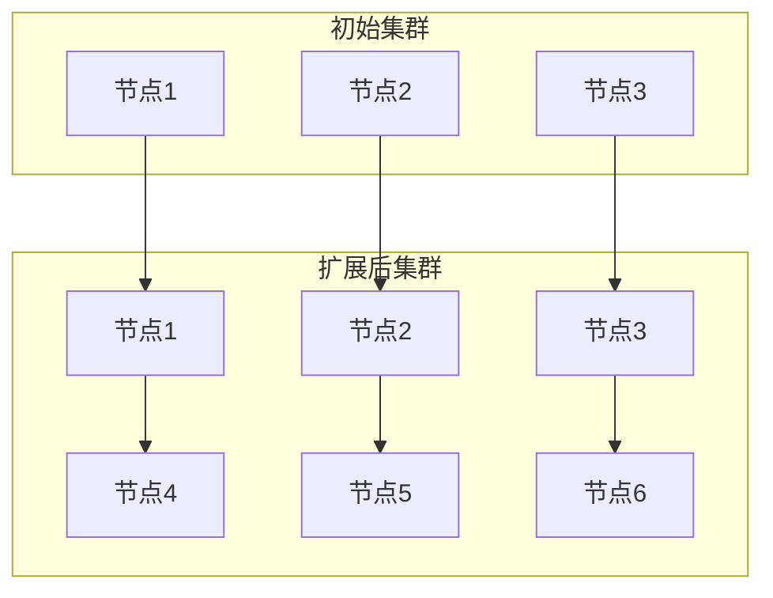

### 5.2 垂直扩展图

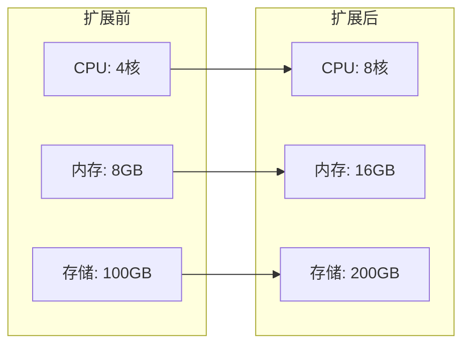

### 5.3 扩展性指标表

| 扩展类型 | 扩展方式 | 扩展效率 | 成本影响 | 复杂度 |
|----------|----------|----------|----------|--------|
| 水平扩展 | 增加节点 | 高 | 中等 | 低 |
| 垂直扩展 | 增加资源 | 中等 | 高 | 低 |
| 混合扩展 | 综合方式 | 高 | 中等 | 中等 |

## 6. 安全架构图

### 6.1 安全层次图

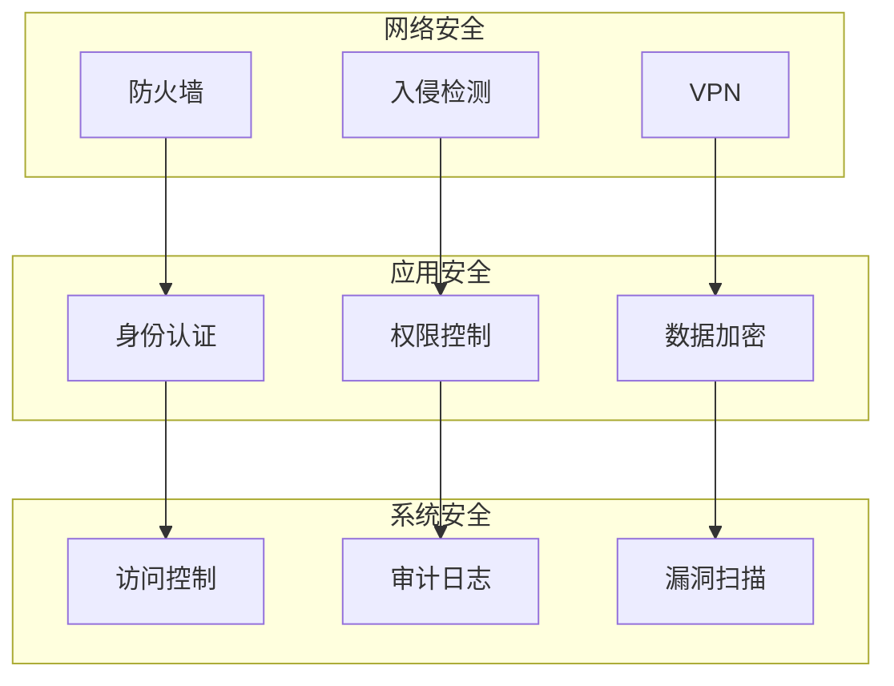

### 6.2 安全策略表

| 安全域 | 策略类型 | 实施方式 | 监控指标 | 响应措施 |
|--------|----------|----------|----------|----------|
| 网络安全 | 访问控制 | 防火墙规则 | 异常流量 | 阻断连接 |
| 应用安全 | 身份认证 | 多因子认证 | 认证失败 | 账户锁定 |
| 数据安全 | 加密传输 | SSL/TLS | 加密强度 | 密钥更新 |
| 系统安全 | 漏洞管理 | 定期扫描 | 漏洞数量 | 补丁更新 |

## 7. 规范说明

### 7.1 图表规范

- 所有图表需使用标准格式
- 图表需包含完整的数学符号
- 图表格式需统一规范
- 数据需准确可靠
- 分类需逻辑清晰
- 指标需可量化

### 7.2 内容要求

- 内容需递归细化，支持多表征
- 保留批判性分析、图表、符号等
- 如有遗漏，后续补全并说明
- 所有图表需包含完整的数学符号
- 图表格式需统一规范
- 数据需准确可靠
- 分类需逻辑清晰
- 指标需可量化

### 7.3 扩展方向

- 可继续分解为5.3.3.1、5.3.3.2等子主题
- 支持持续递归完善
- 添加更多实际案例和数据
- 完善数学公式和证明
- 增加交互式图表

> 本文件为递归细化与内容补全示范，后续可继续分解为5.3.3.1、5.3.3.2等子主题，支持持续递归完善。
