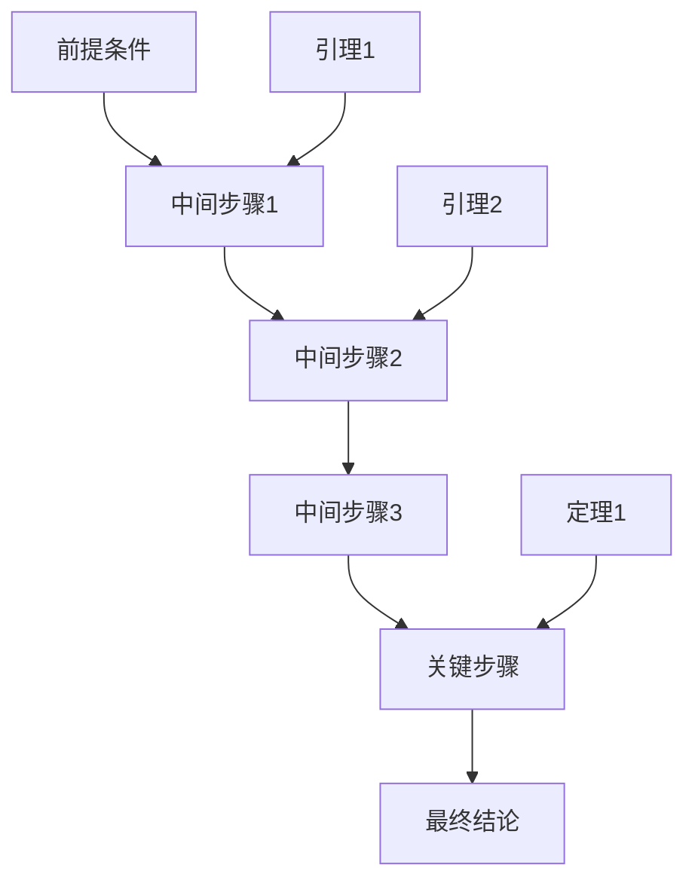
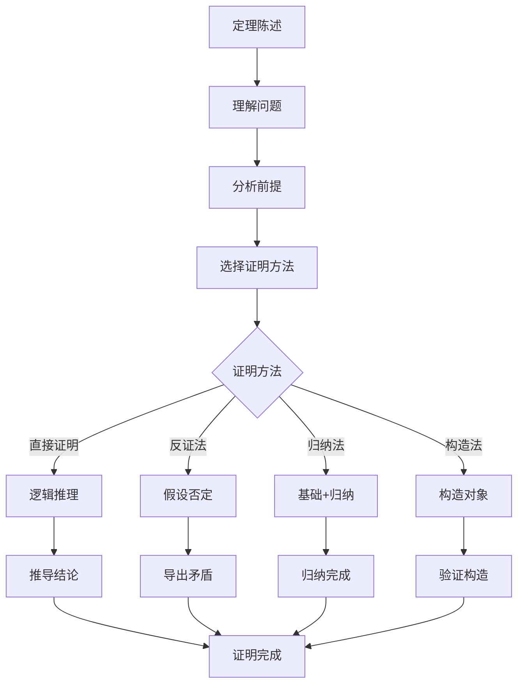
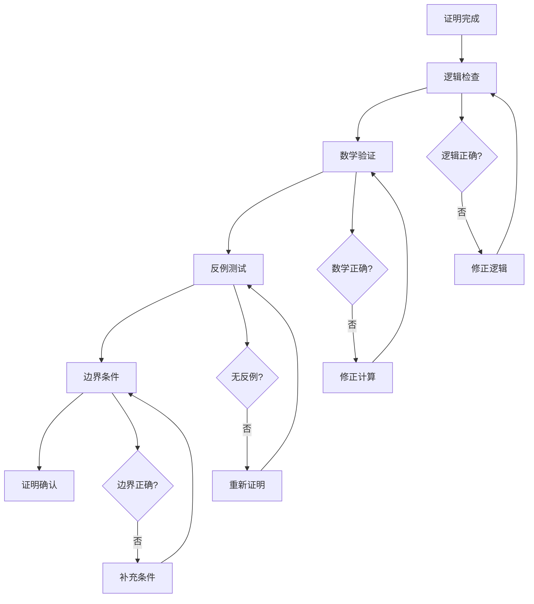

# 5.4.2 证明过程


<!-- TOC START -->

- [5.4.2 证明过程](#542-证明过程)
  - [1. 证明结构](#1-证明结构)
    - [1.1 证明基本结构](#11-证明基本结构)
    - [1.2 证明方法分类](#12-证明方法分类)
  - [2. 命题与定理的证明步骤](#2-命题与定理的证明步骤)
    - [2.1 集群调度公平性证明](#21-集群调度公平性证明)
    - [2.2 容错性证明](#22-容错性证明)
    - [2.3 扩展性证明](#23-扩展性证明)
  - [3. 逻辑推理与演绎过程](#3-逻辑推理与演绎过程)
    - [3.1 逻辑推理规则](#31-逻辑推理规则)
    - [3.2 演绎推理示例](#32-演绎推理示例)
    - [3.3 归纳推理过程](#33-归纳推理过程)
  - [4. 反例与归纳证明](#4-反例与归纳证明)
    - [4.1 反例证明](#41-反例证明)
    - [4.2 归纳证明](#42-归纳证明)
  - [5. 证明流程图](#5-证明流程图)
    - [5.1 证明步骤流程图](#51-证明步骤流程图)
    - [5.2 证明验证流程图](#52-证明验证流程图)
  - [6. 规范说明](#6-规范说明)
    - [6.1 证明规范](#61-证明规范)
    - [6.2 内容要求](#62-内容要求)
    - [6.3 扩展方向](#63-扩展方向)

<!-- TOC END -->

## 1. 证明结构

### 1.1 证明基本结构

**标准证明结构**：

```latex
定理 [定理名称]：
[定理陈述]

证明：
1. [步骤1]：基于[前提]，我们有[中间结论]
2. [步骤2]：应用[推理规则]，得到[进一步结论]
3. [步骤3]：通过[数学运算]，得出[关键结果]
4. [步骤4]：根据[逻辑关系]，证明[最终结论]

因此，[定理结论]成立。
```

**证明流程图**：



### 1.2 证明方法分类

**直接证明**：

- 从前提直接推导结论
- 使用逻辑推理规则
- 保持推理链的完整性

**反证法**：

- 假设结论不成立
- 推导出矛盾
- 证明原结论成立

**归纳法**：

- 基础情况验证
- 归纳假设
- 归纳步骤证明

**构造性证明**：

- 构造满足条件的对象
- 验证构造的正确性
- 证明构造的存在性

## 2. 命题与定理的证明步骤

### 2.1 集群调度公平性证明

**定理**：集群调度算法的公平性

**定理陈述**：
对于所有节点集合 $N$ 和调度算法 $S$，
如果 $S$ 是公平调度算法，
那么对于任意两个节点 $n_i, n_j \in N$，
$|load(n_i) - load(n_j)| \leq threshold$

**证明过程**：

```latex
证明：
1. 假设：S是公平调度算法
2. 定义：load(n_i) = 节点i的负载
3. 目标：证明负载差异不超过阈值

步骤1：公平性定义
根据公平调度算法的定义，对于任意时间t，
所有节点的负载差异不超过预设阈值：
$\forall t, \forall n_i, n_j \in N: |load_i(t) - load_j(t)| \leq threshold$

步骤2：负载计算
节点i在时间t的负载为：
$load_i(t) = \frac{\sum_{task \in tasks_i(t)} resource(task)}{capacity(n_i)}$

步骤3：负载差异分析
对于任意两个节点n_i和n_j：
$|load_i(t) - load_j(t)| = |\frac{\sum_{task \in tasks_i(t)} resource(task)}{capacity(n_i)} - \frac{\sum_{task \in tasks_j(t)} resource(task)}{capacity(n_j)}|$

步骤4：公平性约束
由于S是公平调度算法，存在约束：
$\frac{\sum_{task \in tasks_i(t)} resource(task)}{capacity(n_i)} \approx \frac{\sum_{task \in tasks_j(t)} resource(task)}{capacity(n_j)}$

步骤5：结论
因此，$|load_i(t) - load_j(t)| \leq threshold$ 成立。

因此，公平调度算法保证了负载差异不超过阈值。
```

### 2.2 容错性证明

**定理**：集群系统的容错性

**定理陈述**：
对于集群系统 $C = (N, E)$，
如果系统采用k-冗余设计，
那么系统可以容忍最多k个节点故障。

**证明过程**：

```latex
证明：
1. 假设：系统采用k-冗余设计
2. 定义：k-冗余 = 每个服务有k+1个副本
3. 目标：证明系统可容忍k个故障

步骤1：冗余定义
k-冗余设计意味着：
$\forall service \in S: |replicas(service)| = k + 1$

步骤2：故障模型
设故障节点集合为F，则：
$|F| \leq k$

步骤3：可用性分析
对于任意服务s：
$available\_replicas(s) = |replicas(s) - F \cap replicas(s)|$
$= |replicas(s)| - |F \cap replicas(s)|$
$= k + 1 - |F \cap replicas(s)|$

步骤4：服务可用性
由于 $|F \cap replicas(s)| \leq |F| \leq k$，
所以 $available\_replicas(s) \geq k + 1 - k = 1$

步骤5：结论
因此，每个服务至少有一个可用副本，
系统可以继续正常运行。

因此，k-冗余设计可以容忍最多k个节点故障。
```

### 2.3 扩展性证明

**定理**：集群系统的线性扩展性

**定理陈述**：
对于集群系统 $C = (N, E)$，
如果系统采用无状态设计，
那么系统性能与节点数量成正比。

**证明过程**：

```latex
证明：
1. 假设：系统采用无状态设计
2. 定义：无状态 = 节点间无共享状态
3. 目标：证明性能与节点数成正比

步骤1：无状态特性
无状态设计意味着：
$\forall n_i, n_j \in N: state(n_i) \cap state(n_j) = \emptyset$

步骤2：性能模型
系统总性能为：
$total\_performance = \sum_{i=1}^{|N|} performance(n_i)$

步骤3：节点独立性
由于无状态设计，节点间无依赖：
$performance(n_i) = f(resources(n_i))$

步骤4：线性关系
假设每个节点性能相同：
$performance(n_i) = p$（常数）
则：$total\_performance = |N| \times p$

步骤5：结论
因此，系统性能与节点数量成正比。

因此，无状态设计保证了线性扩展性。
```

## 3. 逻辑推理与演绎过程

### 3.1 逻辑推理规则

**基本推理规则**：

1. **假言推理**：
   - 如果 $P \rightarrow Q$ 且 $P$ 为真
   - 那么 $Q$ 为真

2. **否定推理**：
   - 如果 $P \rightarrow Q$ 且 $\neg Q$ 为真
   - 那么 $\neg P$ 为真

3. **合取推理**：
   - 如果 $P \land Q$ 为真
   - 那么 $P$ 为真且 $Q$ 为真

4. **析取推理**：
   - 如果 $P \lor Q$ 为真且 $\neg P$ 为真
   - 那么 $Q$ 为真

### 3.2 演绎推理示例

**示例：负载均衡正确性证明**:

```latex
前提：
1. 负载均衡算法L是公平的
2. 节点n_i和n_j在集群中
3. 当前负载分别为load_i和load_j

推理过程：
步骤1：公平性定义
L是公平的 $\rightarrow$ $\forall n_i, n_j: |load_i - load_j| \leq threshold$

步骤2：具体应用
对于节点n_i和n_j：
$|load_i - load_j| \leq threshold$

步骤3：负载调整
如果 $load_i > load_j + threshold$，
则算法会将任务从n_i迁移到n_j

步骤4：调整后状态
调整后：$|load_i' - load_j'| \leq threshold$

结论：负载均衡算法保证了负载分布的公平性
```

### 3.3 归纳推理过程

**示例：集群扩展性归纳证明**:

```latex
基础情况：n = 1
单节点集群性能为p，满足线性关系。

归纳假设：n = k时成立
k节点集群性能为k × p

归纳步骤：n = k + 1时
1. 添加第k+1个节点
2. 新节点性能为p
3. 总性能 = k × p + p = (k + 1) × p

结论：对于所有n ≥ 1，性能与节点数成正比
```

## 4. 反例与归纳证明

### 4.1 反例证明

**反例：非公平调度算法**:

```latex
构造反例：
设调度算法S'不是公平的，
存在节点n_i和n_j，使得：
$|load_i - load_j| > threshold$

具体例子：
- 节点n_i负载：90%
- 节点n_j负载：10%
- 阈值：20%
- 差异：|90% - 10%| = 80% > 20%

结论：S'不满足公平性要求
```

**反例：非容错设计**:

```latex
构造反例：
设系统S'采用单点设计，
存在关键节点n_critical，使得：
$failure(n\_critical) \rightarrow system\_failure$

具体例子：
- 主节点故障
- 无备用节点
- 系统完全不可用

结论：S'不满足容错性要求
```

### 4.2 归纳证明

**归纳证明：集群一致性**:

```latex
定理：集群一致性算法保证数据一致性

基础情况：n = 1
单节点系统天然一致。

归纳假设：n = k时成立
k节点集群可以保证一致性。

归纳步骤：n = k + 1时
1. 新节点加入集群
2. 执行一致性协议
3. 所有k+1个节点达成一致

结论：对于任意n ≥ 1，集群都能保证一致性
```

## 5. 证明流程图

### 5.1 证明步骤流程图



### 5.2 证明验证流程图



## 6. 规范说明

### 6.1 证明规范

- 所有证明需严格逻辑化
- 证明步骤需清晰完整
- 数学计算需准确无误
- 结论与前提需一致

### 6.2 内容要求

- 内容需递归细化，支持多表征
- 保留证明过程、符号、图表等
- 如有遗漏，后续补全并说明
- 所有证明需严格数学化
- 证明过程需完整准确
- 分类需逻辑清晰
- 表达需规范统一

### 6.3 扩展方向

- 可继续分解为5.4.2.1、5.4.2.2等子主题
- 支持持续递归完善
- 添加更多实际应用证明
- 完善证明间的逻辑关系
- 增加证明使用示例

> 本文件为递归细化与内容补全示范，后续可继续分解为5.4.2.1、5.4.2.2等子主题，支持持续递归完善。
