# 5.5.1 概念图

## 概述

集群系统概念图通过图形化方式展示集群系统的核心概念、架构模式、调度算法和关系，帮助理解集群系统的整体框架和内在逻辑。

## 1. 集群系统总体概念图 (Overall Cluster System Concept Map)

### 1.1 核心概念层次图

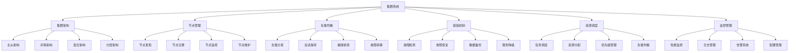

### 1.2 集群系统发展历程图

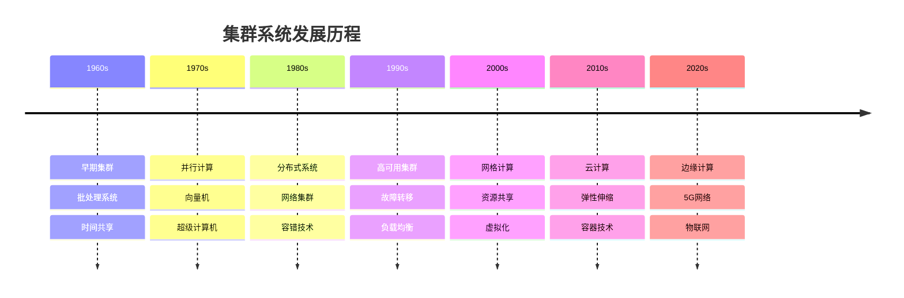

## 2. 集群架构概念图 (Cluster Architecture Concept Maps)

### 2.1 架构模式分类图

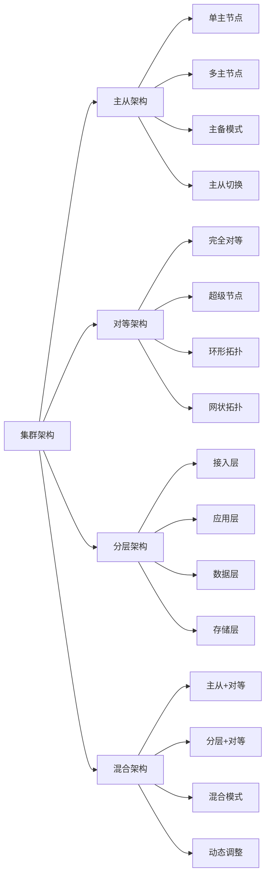

### 2.2 集群组件关系图

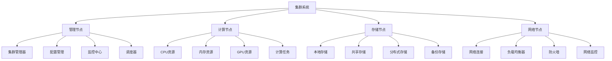

## 3. 节点管理概念图 (Node Management Concept Maps)

### 3.1 节点生命周期图

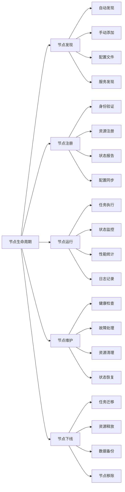

### 3.2 节点状态管理图

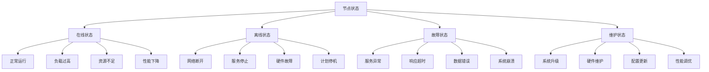

## 4. 负载均衡概念图 (Load Balancing Concept Maps)

### 4.1 负载均衡算法分类图

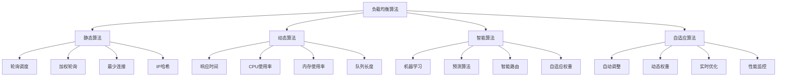

### 4.2 负载均衡架构图

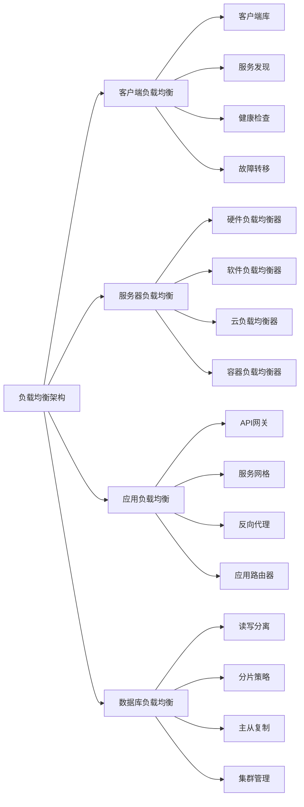

## 5. 容错机制概念图 (Fault Tolerance Concept Maps)

### 5.1 故障类型分类图

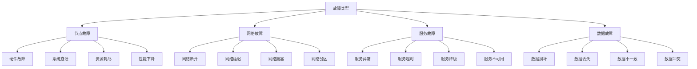

### 5.2 容错策略分析图

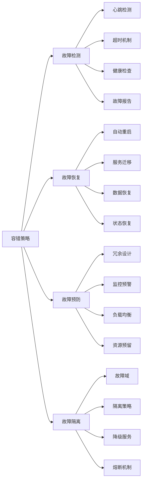

## 6. 资源调度概念图 (Resource Scheduling Concept Maps)

### 6.1 调度算法分类图

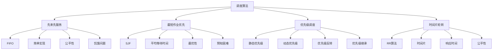

### 6.2 资源分配策略图

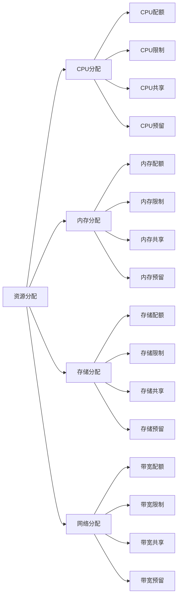

## 7. 监控管理概念图 (Monitoring Management Concept Maps)

### 7.1 监控层次图

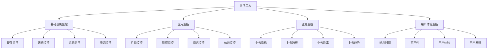

### 7.2 监控数据流图

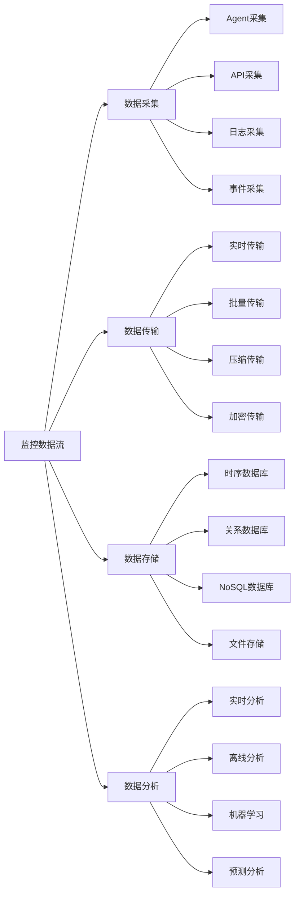

## 8. 集群类型概念图 (Cluster Type Concept Maps)

### 8.1 集群类型分类图

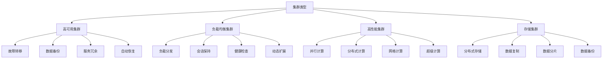

### 8.2 应用场景分析图

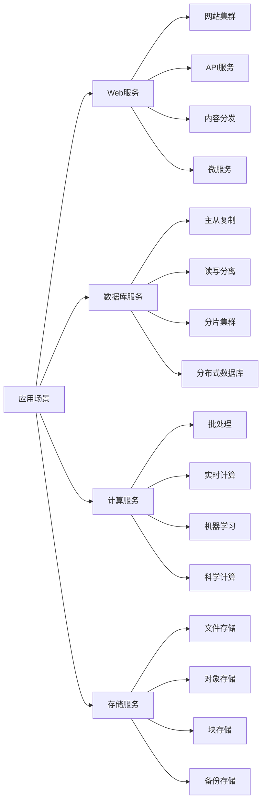

## 9. 集群管理概念图 (Cluster Management Concept Maps)

### 9.1 管理功能分类图

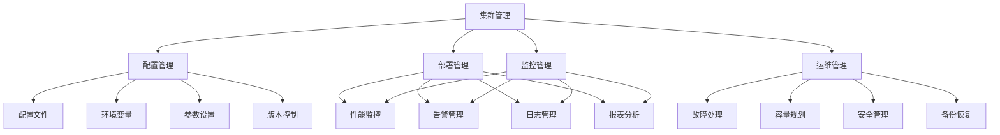

### 9.2 管理工具分析图

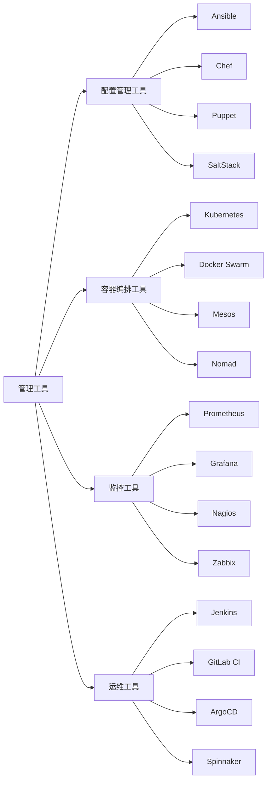

## 10. 性能优化概念图 (Performance Optimization Concept Maps)

### 10.1 性能指标分析图

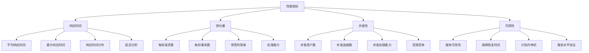

### 10.2 优化策略分析图

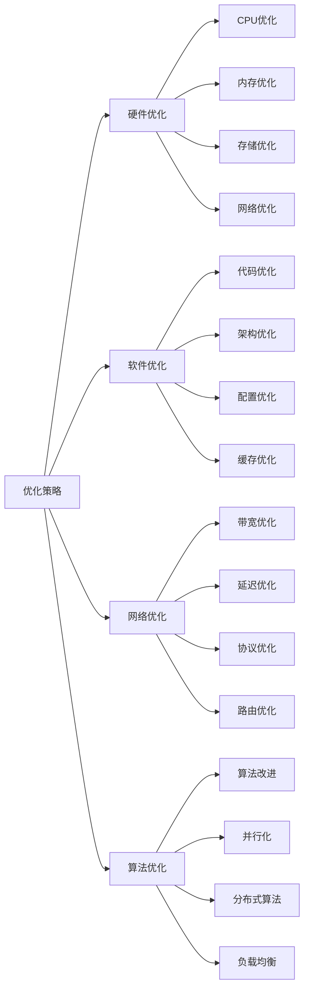
