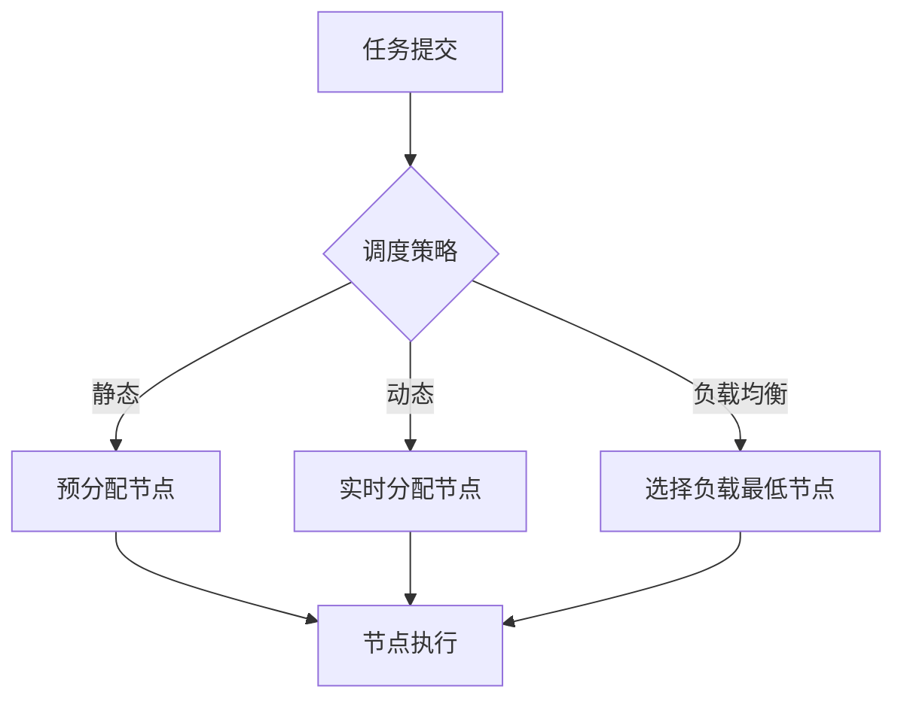

# 5.7.1 运行时行为与调度模型


<!-- TOC START -->

- [5.7.1 运行时行为与调度模型](#571-运行时行为与调度模型)
  - [1. 主题简介](#1-主题简介)
  - [2. 典型运行时行为](#2-典型运行时行为)
  - [3. 调度模型分类与对比](#3-调度模型分类与对比)
  - [4. Mermaid 调度流程示意图](#4-mermaid-调度流程示意图)
  - [5. 伪代码/公式](#5-伪代码公式)
  - [6. 工程案例](#6-工程案例)
  - [7. 未来展望](#7-未来展望)

<!-- TOC END -->

## 1. 主题简介

- 概述集群系统运行时行为的特点与调度模型的核心作用。
- 强调高可用、负载均衡、资源共享等对运行时语义的特殊要求。

## 2. 典型运行时行为

- 任务分发与调度
- 节点健康监控
- 资源动态分配
- 故障检测与恢复

## 3. 调度模型分类与对比

| 调度模型 | 主要特征 | 适用场景 | 优缺点 |
|---|---|---|---|
| 静态分配 | 预先分配、简单 | 小型集群 | 实现简单，灵活性差 |
| 动态调度 | 实时分配、弹性 | 大中型集群 | 灵活，调度开销大 |
| 负载均衡 | 均衡资源利用 | 高并发场景 | 提高利用率，调度复杂 |
| 优先级调度 | 任务分级处理 | 多业务集群 | 灵活，易饿死低优先级 |

## 4. Mermaid 调度流程示意图



## 5. 伪代码/公式

```pseudo
// 负载均衡调度伪代码
for 每个节点N:
    计算N当前负载
选择负载最低的节点分配任务
```

## 6. 工程案例

- SLURM集群调度
- Kubernetes集群负载均衡

## 7. 未来展望

- AI驱动自适应调度
- 异构资源智能分配
