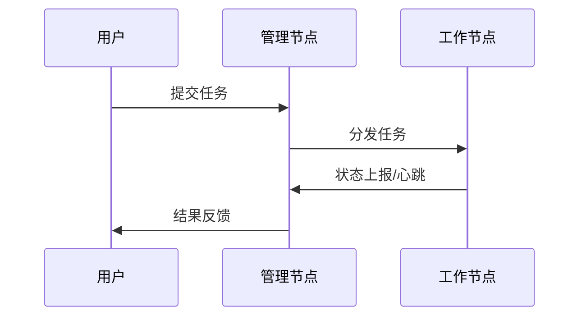
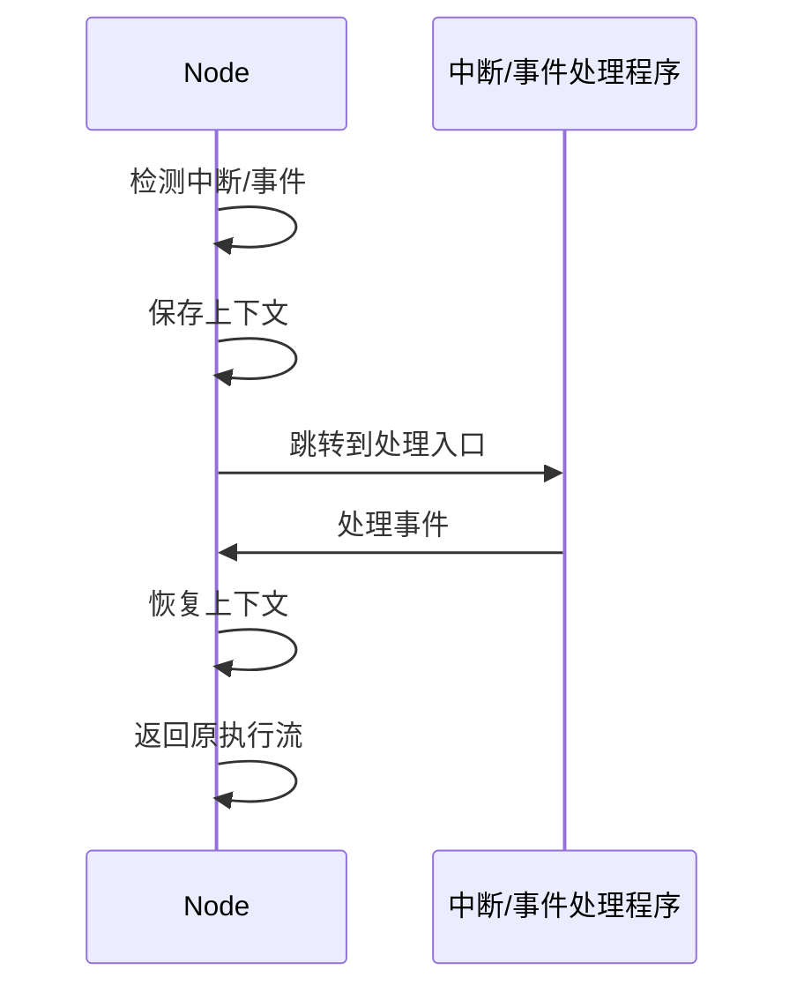

# 5.7.2 典型运行时机制分析


<!-- TOC START -->

- [5.7.2 典型运行时机制分析](#572-典型运行时机制分析)
  - [1. 主题简介](#1-主题简介)
  - [2. 典型机制分类](#2-典型机制分类)
  - [3. 关键机制流程](#3-关键机制流程)
  - [4. Mermaid 机制流程图](#4-mermaid-机制流程图)
  - [5. 伪代码/公式](#5-伪代码公式)
  - [6. 工程案例](#6-工程案例)
  - [7. 未来展望](#7-未来展望)
  - [5.7.2.x 中断上下文的起点](#572x-中断上下文的起点)
    - [1. 概念与定义](#1-概念与定义)
    - [2. 结构化流程](#2-结构化流程)
    - [3. 伪代码](#3-伪代码)
    - [4. 关键数据结构](#4-关键数据结构)
    - [5. 形式化描述](#5-形式化描述)
    - [6. 工程案例1](#6-工程案例1)
    - [7. 未来展望1](#7-未来展望1)

<!-- TOC END -->

## 1. 主题简介

- 分析集群系统运行时的关键机制及其对系统行为的影响。

## 2. 典型机制分类

- 任务分发与调度
- 节点健康监控
- 故障检测与恢复
- 资源动态管理

## 3. 关键机制流程

- 任务分发与执行
- 节点心跳与健康检查
- 故障检测与自动恢复

## 4. Mermaid 机制流程图



## 5. 伪代码/公式

```pseudo
// 节点健康检查伪代码
for 每个节点N:
    if N心跳超时:
        标记N为故障，触发恢复
```

## 6. 工程案例

- SLURM节点健康监控
- Kubernetes节点自愈

## 7. 未来展望

- 智能化健康监控
- 异构资源协同机制

## 5.7.2.x 中断上下文的起点

### 1. 概念与定义

- 集群系统中断上下文：节点本地操作系统响应中断时，保存当前任务/服务的执行环境，切换到ISR或集群事件处理流程。
- 起点：中断/事件信号到达，系统自动完成上下文保护，进入ISR/事件处理入口。

### 2. 结构化流程



### 3. 伪代码

```pseudo
on_interrupt_or_event():
    Save_Context()
    Jump_To_Handler()
    Handler()
    Restore_Context()
    Return_From_Handler()
```

### 4. 关键数据结构

- 中断/事件向量表：`Vector[ID] = Handler_Address`
- 上下文结构体：`Context = {PC, SP, Registers, Flags}`

### 5. 形式化描述

- $Event \rightarrow Save\_Context \rightarrow Handler\_Entry$
- LTL公式：`G (event -> F handler_entry)`

### 6. 工程案例1

- SLURM节点本地中断处理
- Kubernetes节点事件上下文管理

### 7. 未来展望1

- 集群级中断协同、虚拟化环境下的上下文隔离
