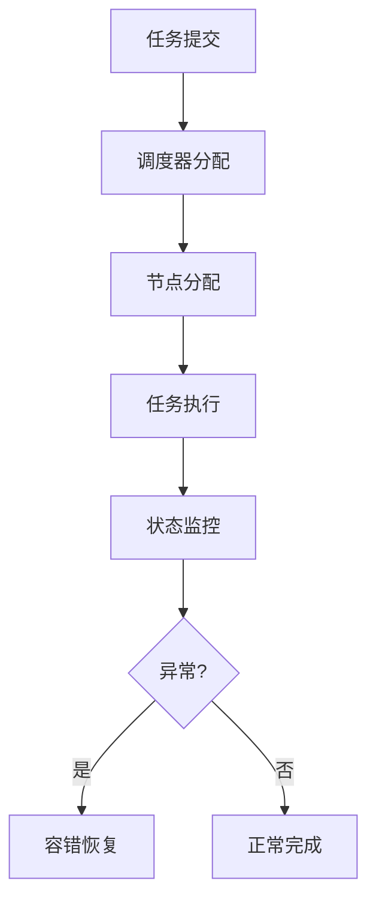

# 5.7.6 工程案例与实践

## 1. 主题简介

- 汇总集群系统运行时语义相关的工程实践与典型案例。

## 2. 典型案例汇总

- SLURM多节点调度
- Kubernetes弹性伸缩
- Hadoop集群容错

## 3. 关键技术剖析

- 分布式一致性协议
- 动态资源调度
- 容错与恢复机制

## 4. Mermaid 案例流程图



## 5. 伪代码/公式

```pseudo
// 节点容错恢复伪代码
if 节点执行失败:
    启动任务迁移与恢复流程
```

## 6. 案例对比分析

| 案例 | 关键机制 | 优势 | 挑战 |
|---|---|---|---|
| SLURM | 多节点调度 | 高效 | 配置复杂 |
| Kubernetes | 弹性伸缩 | 灵活 | 管理难度 |
| Hadoop | 容错恢复 | 高可用 | 资源利用率 |

## 7. 未来展望

- 跨平台运行时优化
- 智能化工程实践
