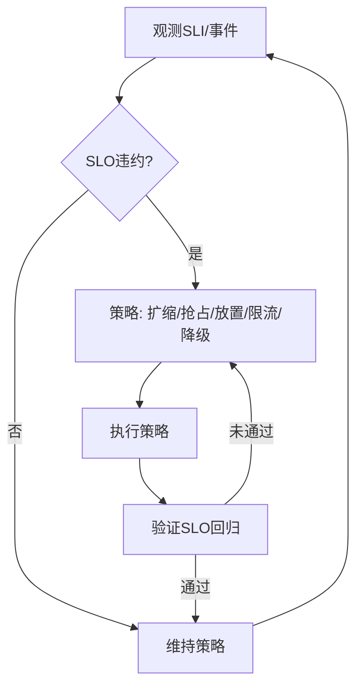

# 集群系统运行时语义

## 概述

集群系统运行时语义研究集群系统在运行过程中的行为特征、状态转换、资源调度和动态特性，为集群系统的运行时行为分析和优化提供理论基础。

## 目录结构

- **5.7.1 运行时行为与调度模型** - 集群系统的运行时行为模型和调度机制
- **5.7.2 典型运行时机制分析** - 常见集群系统运行时机制的分析
- **5.7.3 运行时语义建模与形式化验证** - 运行时语义的形式化建模和验证
- **5.7.4 多节点协同与动态调度** - 多节点系统的协同运行和动态调度
- **5.7.5 自适应与弹性运行机制** - 系统的自适应和弹性运行特性
- **5.7.6 工程案例与实践** - 实际工程中的运行时语义应用
- **5.7.7 未来发展与挑战** - 运行时语义领域的发展趋势和挑战

## 核心概念

### 运行时行为

- **集群状态**：集群系统在不同状态间的转换规律
- **节点协调**：集群节点间的协调和同步机制
- **资源分配**：集群资源的动态分配和管理
- **故障处理**：节点故障时的处理机制

### 调度模型

- **集群调度**：集群环境下的任务调度策略
- **负载均衡**：集群负载的均衡分配机制
- **资源管理**：集群资源的统一管理和优化
- **性能监控**：集群性能的实时监控

### 语义建模

- **集群语义**：集群系统操作的语义定义
- **节点语义**：集群节点行为的数学抽象
- **资源语义**：资源管理的语义描述
- **调度语义**：调度算法的语义定义

## SLO/SLI 驱动的运行时闭环

- SLI：作业成功率、P99 作业完成时延、队列长度、抢占率、资源利用率、错误预算消耗率。
- SLO：如 P99 作业完成时延 < 5min、成功率 99.9%、可用性 99.95%。
- 闭环：观测 → 诊断 → 策略选择（伸缩/放置/限流/降级/抢占）→ 执行 → 验证 → 回滚/巩固。

## Mermaid 运行时治理闭环



## 伪代码示例

```pseudo
// 多队列优先级 + 抢占
if 高优先任务等待 且 低优先占用资源:
    抢占(低优先任务)
    调度(高优先任务)

// 水平伸缩（带冷却与窗口）
if 平滑(队列长度) > 上阈 且 冷却通过:
    扩容(workers += step)
elif 平滑(利用率) < 下阈 且 冷却通过:
    缩容(workers = max(minWorkers, workers - step))
```

## 策略选择矩阵（示例）

| 场景 | 首选策略 | 备选 | 权衡 |
|---|---|---|---|
| 高峰突发 | 水平扩容 + 限流 | 优先级调度/推迟非关键作业 | 成本与SLA |
| 热点节点 | 负载迁移 + 亲和/反亲和 | 请求合并/缓存 | 迁移开销 |
| 节点故障 | 快速切换 + 重调度 | 任务重试/推测执行 | 成本与延迟 |
| 资源紧张 | 抢占 + 弹性配额 | 降级/配额重分配 | 公平性与效率 |

## 学习目标

1. **理解集群系统运行时语义的基本概念**
2. **掌握集群系统的运行时行为建模方法**
3. **学会分析和设计集群调度算法**
4. **了解形式化验证技术在集群系统中的应用**
5. **掌握多节点集群的协同运行机制**
6. **理解集群系统的自适应和弹性运行**

## 应用领域

- **高性能计算集群**
- **云计算数据中心**
- **大数据处理集群**
- **Web服务集群**
- **存储集群系统**
- **容器编排平台**

## 相关资源

- **经典文献**：《High Performance Cluster Computing》、《Cluster Computing》
- **学术期刊**：IEEE Transactions on Parallel and Distributed Systems、Journal of Parallel and Distributed Computing
- **会议论文**：HPDC、CCGrid、Cluster等顶级会议
- **在线资源**：集群管理工具文档、性能分析工具

## 实践项目

1. **集群调度器实现**：实现基本的集群任务调度算法
2. **负载均衡机制**：设计集群负载均衡策略
3. **资源管理系统**：实现集群资源的统一管理
4. **性能监控平台**：构建集群系统的性能监控平台
