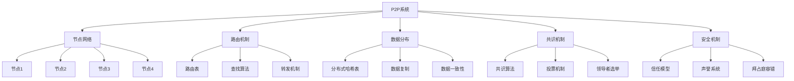
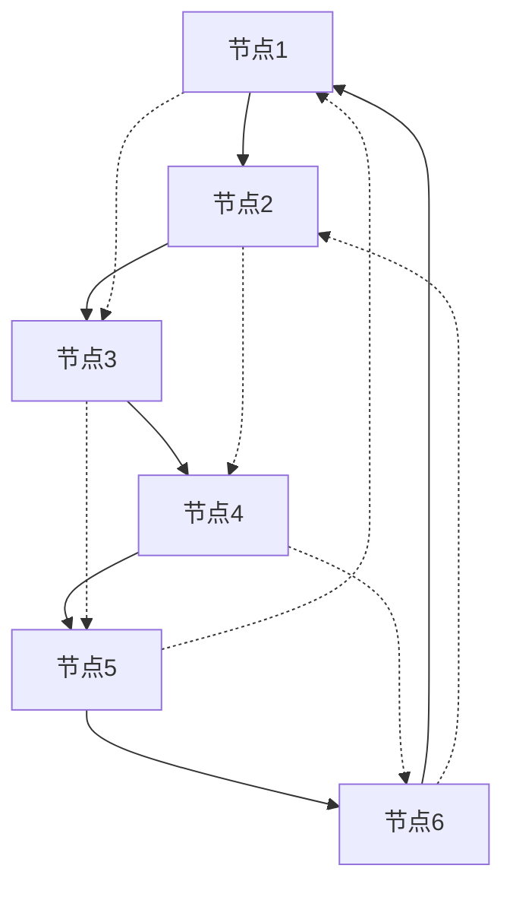
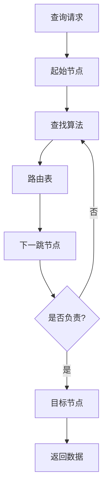

# 6.1.1 基本概念

## 1. P2P系统形式化定义

### 1.1 P2P系统基本定义

**定义6.1.1.1（P2P系统）**：P2P系统P2P是一个有序六元组：

```text
P2P = (N, R, D, C, S, T)
```

其中：

- N = {n₁, n₂, ..., nₖ} 是节点集合
- R = (routing_algorithm, topology, neighbors) 是路由机制
- D = (dht, data_distribution, replication) 是数据分布
- C = (consensus, consistency, coordination) 是共识机制
- S = (security, trust, reputation) 是安全机制
- T = (topology_type, overlay_network, physical_network) 是拓扑结构

### 1.2 节点形式化定义

**定义6.1.1.2（P2P节点）**：P2P节点n是一个六元组：

```text
n = (node_id, role, resources, neighbors, data, state)
```

其中：

- node_id ∈ ℕ 是节点标识符
- role ∈ {PEER, SUPER_PEER, BOOTSTRAP} 是节点角色
- resources = (storage, bandwidth, compute_power) 是节点资源
- neighbors ⊆ N 是邻居节点集合
- data ⊆ Data 是节点存储的数据
- state ∈ {ONLINE, OFFLINE, JOINING, LEAVING} 是节点状态

### 1.3 路由机制定义

**定义6.1.1.3（路由机制）**：路由机制R是一个四元组：

```text
R = (routing_algorithm, routing_table, lookup_strategy, forwarding)
```

其中：

- routing_algorithm ∈ {DHT, FLOODING, HIERARCHICAL} 是路由算法
- routing_table: node_id → neighbors 是路由表
- lookup_strategy: key → path 是查找策略
- forwarding: message × path → next_hop 是转发机制

## 2. 分布式哈希表（DHT）

### 2.1 DHT基本定义

**定义6.1.1.4（分布式哈希表）**：DHT是一个四元组：

```text
DHT = (key_space, hash_function, routing_table, lookup_algorithm)
```

其中：

- key_space = [0, 2^m - 1] 是键空间
- hash_function: data → key 是哈希函数
- routing_table: node_id → neighbors 是路由表
- lookup_algorithm: key → responsible_node 是查找算法

### 2.2 Chord DHT

**定义6.1.1.5（Chord DHT）**：Chord DHT是一个环形结构：

```text
Chord = (ring_topology, finger_table, successor_list, predecessor)
```

**Chord查找算法**：

```text
ChordLookup(key, start_node):
  current_node = start_node
  
  while not is_responsible(current_node, key):
    next_node = find_closest_preceding_node(current_node, key)
    if next_node = current_node:
      return current_node
    current_node = next_node
  
  return current_node
```

**Finger表构建**：

```text
BuildFingerTable(node):
  for i = 1 to m:
    finger[i] = find_successor(node.id + 2^(i-1))
```

### 2.3 Kademlia DHT

**定义6.1.1.6（Kademlia DHT）**：Kademlia DHT使用XOR距离：

```text
Kademlia = (xor_distance, k_buckets, lookup_algorithm)
```

**XOR距离计算**：

```text
XORDistance(id1, id2) = id1 ⊕ id2
```

**Kademlia查找算法**：

```text
KademliaLookup(target, start_node):
  closest_nodes = find_k_closest(start_node, target)
  
  while not converged(closest_nodes):
    new_nodes = query_closest_nodes(closest_nodes, target)
    closest_nodes = update_k_closest(closest_nodes, new_nodes)
  
  return closest_nodes
```

## 3. 数据分布与复制

### 3.1 数据分布策略

**定义6.1.1.7（数据分布）**：数据分布DD是一个三元组：

```text
DD = (distribution_strategy, replication_factor, consistency_model)
```

其中：

- distribution_strategy ∈ {HASH_BASED, RANGE_BASED, CONSISTENT_HASH} 是分布策略
- replication_factor ∈ ℕ 是复制因子
- consistency_model ∈ {STRONG, EVENTUAL, CAUSAL} 是一致性模型

### 3.2 一致性哈希

**定义6.1.1.8（一致性哈希）**：一致性哈希CH是一个函数：

```text
CH: key → responsible_node
```

**一致性哈希算法**：

```text
ConsistentHash(key, nodes):
  hash = hash_function(key)
  position = hash % ring_size
  
  for each node in sorted_nodes:
    if position <= node.position:
      return node.id
  
  return first_node.id
```

### 3.3 数据复制策略

**定义6.1.1.9（数据复制）**：数据复制DR是一个四元组：

```text
DR = (replication_strategy, replica_placement, consistency_protocol, recovery)
```

其中：

- replication_strategy ∈ {MASTER_SLAVE, MULTI_MASTER, QUORUM} 是复制策略
- replica_placement: data → replica_nodes 是副本放置
- consistency_protocol: write_operation → replication_action 是一致性协议
- recovery: failed_replica → new_replica 是恢复机制

## 4. 共识机制

### 4.1 共识定义

**定义6.1.1.10（共识）**：共识机制C是一个四元组：

```text
C = (consensus_algorithm, voting_mechanism, leader_election, fault_tolerance)
```

其中：

- consensus_algorithm ∈ {POW, POS, PBFT, RAFT} 是共识算法
- voting_mechanism: proposal × votes → decision 是投票机制
- leader_election: nodes → leader 是领导者选举
- fault_tolerance: failure_model → recovery 是容错机制

### 4.2 工作量证明（PoW）

**定义6.1.1.11（工作量证明）**：PoW是一个三元组：

```text
PoW = (difficulty, nonce, hash_function)
```

**PoW挖矿算法**：

```text
ProofOfWork(block, difficulty):
  nonce = 0
  while true:
    block.nonce = nonce
    hash = hash_function(block)
    
    if hash < target_difficulty:
      return nonce
    nonce++
```

### 4.3 权益证明（PoS）

**定义6.1.1.12（权益证明）**：PoS是一个四元组：

```text
PoS = (stake, validator_selection, block_creation, reward_distribution)
```

**PoS验证者选择**：

```text
StakeBasedSelection(validators, total_stake):
  random_value = random(0, total_stake)
  cumulative_stake = 0
  
  for each validator in validators:
    cumulative_stake += validator.stake
    if random_value <= cumulative_stake:
      return validator
  
  return last_validator
```

## 5. 网络拓扑

### 5.1 拓扑类型

**定义6.1.1.13（网络拓扑）**：网络拓扑T是一个三元组：

```text
T = (topology_type, overlay_network, physical_network)
```

其中：

- topology_type ∈ {RING, MESH, TREE, HYBRID} 是拓扑类型
- overlay_network = (V, E) 是覆盖网络图
- physical_network = (physical_nodes, physical_links) 是物理网络

### 5.2 环形拓扑

**定义6.1.1.14（环形拓扑）**：环形拓扑RT是一个四元组：

```text
RT = (ring_nodes, successor, predecessor, finger_table)
```

**环形路由算法**：

```text
RingRouting(target, start_node):
  current_node = start_node
  
  while not is_responsible(current_node, target):
    next_node = find_next_hop(current_node, target)
    if next_node = current_node:
      return current_node
    current_node = next_node
  
  return current_node
```

### 5.3 网状拓扑

**定义6.1.1.15（网状拓扑）**：网状拓扑MT是一个三元组：

```text
MT = (mesh_nodes, connections, routing_table)
```

**网状路由算法**：

```text
MeshRouting(target, start_node):
  visited = set()
  queue = [start_node]
  
  while queue:
    current = queue.pop(0)
    if current = target:
      return current
    
    visited.add(current)
    for neighbor in current.neighbors:
      if neighbor not in visited:
        queue.append(neighbor)
  
  return null
```

## 6. 安全机制

### 6.1 信任模型

**定义6.1.1.16（信任模型）**：信任模型TM是一个四元组：

```text
TM = (trust_metric, reputation_system, trust_propagation, trust_verification)
```

其中：

- trust_metric: node × node → [0,1] 是信任度量
- reputation_system: node → reputation_score 是声誉系统
- trust_propagation: trust_network → propagated_trust 是信任传播
- trust_verification: claim × evidence → verification_result 是信任验证

### 6.2 声誉系统

**定义6.1.1.17（声誉系统）**：声誉系统RS是一个三元组：

```text
RS = (reputation_calculation, reputation_update, reputation_decay)
```

**声誉计算算法**：

```text
ReputationCalculation(node, interactions):
  positive_interactions = count_positive(interactions)
  total_interactions = len(interactions)
  
  reputation = positive_interactions / total_interactions
  return reputation
```

### 6.3 拜占庭容错

**定义6.1.1.18（拜占庭容错）**：拜占庭容错BFT是一个四元组：

```text
BFT = (fault_threshold, consensus_rounds, message_validation, state_replication)
```

**拜占庭容错算法**：

```text
ByzantineFaultTolerance(nodes, fault_threshold):
  if len(nodes) < 3 * fault_threshold + 1:
    return INSUFFICIENT_NODES
  
  for round in consensus_rounds:
    messages = collect_messages(nodes)
    valid_messages = validate_messages(messages)
    
    if majority_agreement(valid_messages):
      return consensus_decision
    else:
      continue
  
  return NO_CONSENSUS
```

## 7. 数据查找与路由

### 7.1 查找算法

**定义6.1.1.19（查找算法）**：查找算法LA是一个函数：

```text
LA: key × start_node → responsible_node
```

**DHT查找算法**：

```text
DHTLookup(key, start_node):
  target_hash = hash_function(key)
  current_node = start_node
  
  while not is_responsible(current_node, target_hash):
    next_node = find_closest_preceding(current_node, target_hash)
    if next_node = current_node:
      return current_node
    current_node = next_node
  
  return current_node
```

### 7.2 路由表维护

**定义6.1.1.20（路由表维护）**：路由表维护RTM是一个函数：

```text
RTM: node × neighbor_info → updated_routing_table
```

**路由表更新算法**：

```text
UpdateRoutingTable(node, neighbor_info):
  for each entry in routing_table:
    if entry.neighbor = neighbor_info.node_id:
      entry.last_seen = current_time
      entry.latency = neighbor_info.latency
      entry.available = true
  
  // 添加新邻居
  if neighbor_info.node_id not in routing_table:
    add_entry(routing_table, neighbor_info)
  
  // 移除失效邻居
  for each entry in routing_table:
    if current_time - entry.last_seen > timeout:
      remove_entry(routing_table, entry)
```

## 8. 节点加入与离开

### 8.1 节点加入

**定义6.1.1.21（节点加入）**：节点加入NJ是一个四元组：

```text
NJ = (bootstrap, neighbor_discovery, routing_table_update, data_migration)
```

**节点加入算法**：

```text
NodeJoin(new_node, bootstrap_nodes):
  // 1. 连接到引导节点
  connect_to_bootstrap(new_node, bootstrap_nodes)
  
  // 2. 发现邻居节点
  neighbors = discover_neighbors(new_node)
  
  // 3. 更新路由表
  update_routing_tables(new_node, neighbors)
  
  // 4. 迁移数据
  migrate_data(new_node)
  
  return SUCCESS
```

### 8.2 节点离开

**定义6.1.1.22（节点离开）**：节点离开NL是一个四元组：

```text
NL = (graceful_shutdown, data_transfer, neighbor_notification, routing_update)
```

**节点离开算法**：

```text
NodeLeave(departing_node):
  // 1. 通知邻居
  notify_neighbors(departing_node)
  
  // 2. 转移数据
  transfer_data(departing_node)
  
  // 3. 更新路由表
  update_routing_tables(departing_node)
  
  // 4. 优雅关闭
  graceful_shutdown(departing_node)
  
  return SUCCESS
```

## 9. 多表征

### 9.1 P2P系统架构图



### 9.2 DHT环形拓扑图



### 9.3 数据查找流程图



### 9.4 P2P协议对比表

| 协议 | 拓扑结构 | 路由算法 | 查找复杂度 | 容错性 | 适用场景 |
|------|---------|---------|-----------|--------|---------|
| Chord | 环形 | 顺时针查找 | O(log N) | 中等 | 文件共享 |
| Kademlia | 树形 | XOR距离 | O(log N) | 高 | 分布式存储 |
| Pastry | 前缀路由 | 前缀匹配 | O(log N) | 高 | 内容分发 |
| CAN | 多维空间 | 笛卡尔距离 | O(dN^1/d) | 中等 | 地理分布 |
| Tapestry | 树形 | 前缀路由 | O(log N) | 高 | 大规模网络 |

## 10. 规范说明

- 内容需递归细化，支持多表征
- 保留批判性分析、符号、图表等
- 如有遗漏，后续补全并说明
- 所有定义需严格形式化
- 算法需提供伪代码
- 图表需使用mermaid语法
- 表格需包含完整信息
- 安全机制需详细说明

> 本文件为递归细化与内容补全示范，后续可继续分解为6.1.1.1、6.1.1.2等子主题，支持持续递归完善。
