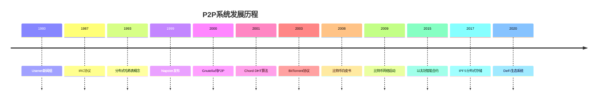

# 6.1.2 发展历程

## 概述

P2P系统的发展历程反映了网络技术从集中式到去中心化的演进过程，体现了分布式计算、资源共享和去中心化通信的技术发展。

## 早期发展阶段 (1980s-1990s)

### 理论基础

- **1980年代**: 分布式系统理论研究
- **1989年**: 拜占庭将军问题提出
- **1990年代**: 分布式算法和协议发展

### 技术萌芽

- **1980年**: Usenet新闻组系统
- **1987年**: IRC (Internet Relay Chat) 协议
- **1993年**: 分布式哈希表 (DHT) 概念提出

### 技术特征

- 理论研究为主
- 基础协议设计
- 学术实验性质

## 文件共享时代 (1990s-2000s)

### 第一代P2P系统

- **1999年**: Napster发布，集中式索引P2P
- **2000年**: Gnutella发布，纯P2P协议
- **2001年**: FastTrack (Kazaa) 混合P2P架构

### 技术突破

- **集中式索引**: 服务器维护文件索引
- **纯P2P**: 完全去中心化架构
- **混合架构**: 结合集中式和分布式优势

### 应用特征

- 文件共享为主
- 音乐、视频内容
- 版权争议问题

## 分布式计算时代 (2000s-2010s)

### 分布式哈希表 (DHT)

- **2001年**: CAN (Content Addressable Network)
- **2001年**: Chord DHT算法
- **2002年**: Pastry DHT系统
- **2003年**: Kademlia DHT协议

### 技术特征1

- **结构化P2P**: 基于DHT的查找
- **可扩展性**: 支持大规模网络
- **容错性**: 节点故障不影响系统

### 应用扩展

- **分布式存储**: 去中心化文件系统
- **分布式计算**: 网格计算和志愿计算
- **内容分发**: CDN替代方案

## 区块链和加密货币时代 (2008-至今)

### 区块链技术

- **2008年**: 比特币白皮书发布
- **2009年**: 比特币网络启动
- **2015年**: 以太坊智能合约平台

### 技术特征2

- **去中心化账本**: 分布式共识机制
- **密码学安全**: 公钥密码学应用
- **智能合约**: 可编程的分布式应用

### 应用领域

- **数字货币**: 比特币、以太币等
- **去中心化应用**: DApp生态系统
- **DeFi**: 去中心化金融

## 现代P2P系统 (2010s-至今)

### 去中心化应用 (DApp)

- **2017年**: 以太坊DApp生态发展
- **2018年**: IPFS分布式文件系统
- **2019年**: 去中心化存储网络

### 技术特征3

- **Web3技术栈**: 区块链+Web技术
- **去中心化存储**: IPFS、Filecoin
- **去中心化身份**: DID (Decentralized Identity)

### 应用扩展3

- **去中心化社交**: 抗审查社交网络
- **去中心化内容**: 创作者经济平台
- **去中心化治理**: DAO (Decentralized Autonomous Organization)

## 主要发展流派

### 文件共享P2P

**发展历程**:

- **1999年**: Napster集中式索引
- **2000年**: Gnutella纯P2P
- **2001年**: Kazaa混合架构
- **2003年**: BitTorrent协议

**技术特征**:

- 文件分片传输
- 种子文件机制
- 带宽优化算法

**代表系统**:

- Napster
- Gnutella
- Kazaa
- BitTorrent
- eMule

### 分布式计算P2P

**发展历程**:

- **1999年**: SETI@home志愿计算
- **2002年**: Folding@home蛋白质折叠
- **2005年**: BOINC分布式计算平台

**技术特征**:

- 任务分解和分发
- 结果验证机制
- 计算资源聚合

**代表系统**:

- SETI@home
- Folding@home
- BOINC
- World Community Grid

### 分布式存储P2P

**发展历程**:

- **2001年**: Freenet匿名存储
- **2003年**: OceanStore分布式存储
- **2015年**: IPFS分布式文件系统

**技术特征**:

- 数据分片和复制
- 去中心化存储
- 内容寻址

**代表系统**:

- Freenet
- OceanStore
- IPFS
- Filecoin
- Sia

### 区块链P2P

**发展历程**:

- **2008年**: 比特币区块链
- **2015年**: 以太坊智能合约
- **2017年**: 去中心化应用生态

**技术特征**:

- 分布式共识机制
- 密码学安全
- 不可篡改账本

**代表系统**:

- 比特币
- 以太坊
- 波卡 (Polkadot)
- 币安智能链

### 去中心化通信P2P

**发展历程**:

- **1993年**: IRC协议
- **2000年**: 即时消息P2P
- **2010年**: 去中心化通信协议

**技术特征**:

- 端到端加密
- 去中心化路由
- 抗审查通信

**代表系统**:

- IRC
- Tox
- Signal (部分P2P)
- Matrix

## 技术演进趋势

### 架构演进

1. **集中式 → 分布式**: 从服务器依赖到完全去中心化
2. **同构 → 异构**: 支持不同节点类型和能力
3. **静态 → 动态**: 支持动态节点加入和离开
4. **单一 → 多样**: 从文件共享到多领域应用

### 技术融合

1. **区块链技术**: 分布式共识和智能合约
2. **密码学**: 零知识证明和同态加密
3. **AI/ML**: 分布式机器学习和联邦学习
4. **边缘计算**: 边缘节点P2P网络

### 智能化发展

1. **自适应路由**: 智能网络路径选择
2. **负载均衡**: 动态负载分配
3. **故障预测**: 基于AI的节点故障预测
4. **资源优化**: 智能资源分配和调度

## 关键人物和贡献

### 学术贡献者

- **David Karger**: Chord DHT算法
- **Ion Stoica**: CAN和Pastry系统
- **Petar Maymounkov**: Kademlia协议
- **Ian Clarke**: Freenet匿名网络

### 工业界贡献者

- **Satoshi Nakamoto**: 比特币和区块链
- **Vitalik Buterin**: 以太坊和智能合约
- **Juan Benet**: IPFS和Filecoin
- **Bram Cohen**: BitTorrent协议

### 开源社区贡献者

- **Linus Torvalds**: Git分布式版本控制
- **Aaron Swartz**: 分布式系统研究
- **Tim Berners-Lee**: 去中心化Web愿景
- **Gavin Wood**: 以太坊和Web3

## 发展里程碑时间线

## 未来发展趋势

### 技术方向

1. **量子P2P**: 量子网络和量子计算
2. **AI驱动P2P**: 智能分布式系统
3. **边缘P2P**: 边缘计算节点网络
4. **绿色P2P**: 节能环保的分布式系统

### 应用领域4

1. **去中心化金融**: DeFi和数字资产
2. **去中心化身份**: 自主身份管理
3. **去中心化内容**: 创作者经济平台
4. **去中心化治理**: DAO和社区治理

### 技术挑战

1. **可扩展性**: 超大规模P2P网络
2. **安全性**: 分布式安全机制
3. **隐私保护**: 去中心化隐私技术
4. **监管合规**: 去中心化与监管平衡

## 总结

P2P系统的发展历程体现了：

1. **技术演进**: 从文件共享到多领域应用
2. **架构创新**: 从集中式到完全去中心化
3. **技术融合**: 区块链、密码学、AI等新技术融合
4. **应用扩展**: 从单一应用到生态系统
5. **社会影响**: 从技术工具到社会变革推动力

这一发展历程为现代去中心化技术和Web3生态系统奠定了坚实基础。
