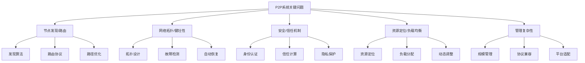
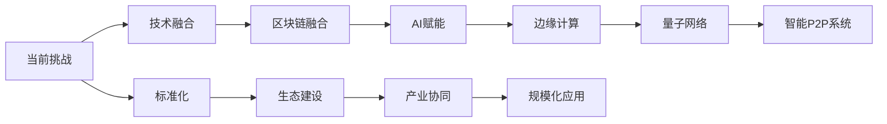

# 6.1.4 关键问题与挑战

## 1. 形式化定义

### 1.1 问题定义

**定义 6.1.4.1** (P2P问题) P2P问题是一个五元组 $P = (D, I, C, S, R)$，其中：

- $D$ 是问题描述
- $I$ 是影响范围
- $C$ 是复杂度
- $S$ 是严重程度
- $R$ 是解决难度

**定义 6.1.4.2** (挑战) 挑战是一个六元组 $C = (T, R, L, A, M, F)$，其中：

- $T$ 是技术挑战
- $R$ 是资源约束
- $L$ 是限制条件
- $A$ 是应用需求
- $M$ 是管理复杂度
- $F$ 是未来趋势

### 1.2 问题严重程度量化

$$Severity(P) = \alpha \cdot Impact(P) + \beta \cdot Complexity(P) + \gamma \cdot Urgency(P) + \delta \cdot Risk(P)$$
其中 $\alpha, \beta, \gamma, \delta$ 是权重系数。

## 2. 主要问题详细分析

### 2.1 节点发现与路由问题

**定义 6.1.4.3** (节点发现) 节点发现是一个四元组 $D = (N, P, T, A)$，其中：

- $N$ 是节点集合
- $P$ 是发现协议
- $T$ 是时间约束
- $A$ 是算法复杂度

#### 2.1.1 节点发现算法

1. **随机发现**：
   $$RandomDiscovery = \{rd_i | rd_i = (node_i, probability_i, timeout_i)\}$$
   其中：
   - $node_i$ 是目标节点
   - $probability_i$ 是发现概率
   - $timeout_i$ 是超时时间

2. **结构化发现**：
   $$StructuredDiscovery = \{sd_j | sd_j = (key_j, routing_j, hop_j)\}$$
   其中：
   - $key_j$ 是查找键
   - $routing_j$ 是路由算法
   - $hop_j$ 是跳数限制

3. **非结构化发现**：
   $$UnstructuredDiscovery = \{ud_k | ud_k = (flood_k, ttl_k, response_k)\}$$
   其中：
   - $flood_k$ 是泛洪策略
   - $ttl_k$ 是生存时间
   - $response_k$ 是响应机制

#### 2.1.2 路由算法

**定义 6.1.4.4** (路由) 路由是一个五元组 $R = (S, T, P, A, M)$，其中：

- $S$ 是源节点
- $T$ 是目标节点
- $P$ 是路径集合
- $A$ 是算法
- $M$ 是度量标准

1. **DHT路由**：
   $$DHTRouting = \{dht_i | dht_i = (key_i, node_i, distance_i)\}$$
   其中：
   - $key_i$ 是数据键
   - $node_i$ 是目标节点
   - $distance_i$ 是距离度量

2. **分层路由**：
   $$HierarchicalRouting = \{hr_j | hr_j = (level_j, supernode_j, leaf_j)\}$$
   其中：
   - $level_j$ 是层级
   - $supernode_j$ 是超级节点
   - $leaf_j$ 是叶子节点

### 2.2 网络拓扑与健壮性问题

**定义 6.1.4.5** (网络拓扑) 网络拓扑是一个四元组 $T = (N, E, P, R)$，其中：

- $N$ 是节点集合
- $E$ 是边集合
- $P$ 是拓扑属性
- $R$ 是健壮性指标

#### 2.2.1 拓扑类型

1. **随机拓扑**：
   $$RandomTopology = \{rt_i | rt_i = (degree_i, connectivity_i, randomness_i)\}$$
   其中：
   - $degree_i$ 是节点度数
   - $connectivity_i$ 是连接性
   - $randomness_i$ 是随机性

2. **结构化拓扑**：
   $$StructuredTopology = \{st_j | st_j = (pattern_j, regularity_j, symmetry_j)\}$$
   其中：
   - $pattern_j$ 是模式
   - $regularity_j$ 是规律性
   - $symmetry_j$ 是对称性

3. **小世界拓扑**：
   $$SmallWorldTopology = \{sw_k | sw_k = (clustering_k, pathlength_k, rewiring_k)\}$$
   其中：
   - $clustering_k$ 是聚类系数
   - $pathlength_k$ 是路径长度
   - $rewiring_k$ 是重连概率

#### 2.2.2 健壮性分析

**定义 6.1.4.6** (健壮性) 健壮性是一个四元组 $R = (F, R, A, T)$，其中：

- $F$ 是故障模型
- $R$ 是恢复机制
- $A$ 是自适应能力
- $T$ 是容错阈值

1. **故障检测**：
   $$FaultDetection = \{fd_i | fd_i = (sensor_i, threshold_i, alarm_i)\}$$
   其中：
   - $sensor_i$ 是检测器
   - $threshold_i$ 是阈值
   - $alarm_i$ 是告警机制

2. **故障恢复**：
   $$FaultRecovery = \{fr_j | fr_j = (trigger_j, action_j, verification_j)\}$$
   其中：
   - $trigger_j$ 是触发条件
   - $action_j$ 是恢复动作
   - $verification_j$ 是验证机制

### 2.3 安全与信任机制问题

**定义 6.1.4.7** (安全机制) 安全机制是一个五元组 $S = (A, I, C, P, T)$，其中：

- $A$ 是认证机制
- $I$ 是完整性保护
- $C$ 是机密性保护
- $P$ 是隐私保护
- $T$ 是信任管理

#### 2.3.1 认证机制

1. **身份认证**：
   $$IdentityAuth = \{ia_i | ia_i = (user_i, credential_i, verification_i)\}$$
   其中：
   - $user_i$ 是用户身份
   - $credential_i$ 是凭证
   - $verification_i$ 是验证过程

2. **节点认证**：
   $$NodeAuth = \{na_j | na_j = (node_j, certificate_j, signature_j)\}$$
   其中：
   - $node_j$ 是节点标识
   - $certificate_j$ 是证书
   - $signature_j$ 是数字签名

#### 2.3.2 信任管理

**定义 6.1.4.8** (信任) 信任是一个四元组 $T = (S, R, E, V)$，其中：

- $S$ 是信任主体
- $R$ 是信任客体
- $E$ 是信任评估
- $V$ 是信任值

1. **信任计算**：
   $$TrustComputation = \{tc_i | tc_i = (history_i, behavior_i, reputation_i)\}$$
   其中：
   - $history_i$ 是历史记录
   - $behavior_i$ 是行为模式
   - $reputation_i$ 是声誉值

2. **信任传播**：
   $$TrustPropagation = \{tp_j | tp_j = (source_j, target_j, path_j, decay_j)\}$$
   其中：
   - $source_j$ 是信任源
   - $target_j$ 是信任目标
   - $path_j$ 是传播路径
   - $decay_j$ 是衰减因子

### 2.4 资源定位与负载均衡问题

**定义 6.1.4.9** (资源定位) 资源定位是一个四元组 $L = (R, N, A, T)$，其中：

- $R$ 是资源集合
- $N$ 是节点集合
- $A$ 是定位算法
- $T$ 是时间约束

#### 2.4.1 资源定位算法

1. **哈希定位**：
   $$HashLocation = \{hl_i | hl_i = (resource_i, hash_i, node_i)\}$$
   其中：
   - $resource_i$ 是资源标识
   - $hash_i$ 是哈希值
   - $node_i$ 是目标节点

2. **范围定位**：
   $$RangeLocation = \{rl_j | rl_j = (range_j, partition_j, mapping_j)\}$$
   其中：
   - $range_j$ 是范围
   - $partition_j$ 是分区
   - $mapping_j$ 是映射关系

#### 2.4.2 负载均衡

**定义 6.1.4.10** (负载均衡) 负载均衡是一个四元组 $B = (L, N, S, A)$，其中：

- $L$ 是负载集合
- $N$ 是节点集合
- $S$ 是调度策略
- $A$ 是分配算法

1. **负载分配**：
   $$LoadAllocation = \{la_i | la_i = (load_i, node_i, capacity_i)\}$$
   其中：
   - $load_i$ 是负载量
   - $node_i$ 是目标节点
   - $capacity_i$ 是节点容量

2. **动态调整**：
   $$DynamicAdjustment = \{da_j | da_j = (monitor_j, trigger_j, action_j)\}$$
   其中：
   - $monitor_j$ 是监控机制
   - $trigger_j$ 是触发条件
   - $action_j$ 是调整动作

## 3. 挑战深度分析

### 3.1 大规模P2P网络管理复杂性

**定义 6.1.4.11** (管理复杂性) 复杂性是一个五元组 $C = (S, C, I, M, A)$，其中：

- $S$ 是规模
- $C$ 是复杂度
- $I$ 是交互
- $M$ 是管理
- $A$ 是自适应

#### 3.1.1 规模挑战

1. **节点数量**：$N_{nodes} \gg 10^6$
2. **连接复杂度**：$C_{connections} = O(N^2)$
3. **状态同步**：$S_{sync} = f(N, T, B)$

#### 3.1.2 管理策略

1. **分层管理**：
   $$HierarchicalManagement = \{hm_i | hm_i = (level_i, scope_i, authority_i)\}$$

2. **分布式管理**：
   $$DistributedManagement = \{dm_j | dm_j = (region_j, autonomy_j, coordination_j)\}$$

3. **自适应管理**：
   $$AdaptiveManagement = \{am_k | am_k = (learning_k, adjustment_k, optimization_k)\}$$

### 3.2 多协议、多平台兼容难题

**定义 6.1.4.12** (兼容性) 兼容性是一个四元组 $C = (P, I, S, T)$，其中：

- $P$ 是协议集合
- $I$ 是接口标准
- $S$ 是系统平台
- $T$ 是技术栈

#### 3.2.1 协议兼容

1. **协议转换**：
   $$ProtocolTranslation = \{pt_i | pt_i = (source_i, target_i, converter_i)\}$$

2. **协议适配**：
   $$ProtocolAdaptation = \{pa_j | pa_j = (protocol_j, adapter_j, wrapper_j)\}$$

3. **协议网关**：
   $$ProtocolGateway = \{pg_k | pg_k = (input_k, process_k, output_k)\}$$

#### 3.2.2 平台兼容

1. **跨平台支持**：
   $$CrossPlatform = \{cp_l | cp_l = (platform_l, api_l, runtime_l)\}$$

2. **标准化接口**：
   $$StandardInterface = \{si_m | si_m = (spec_m, implementation_m, compliance_m)\}$$

### 3.3 未来发展趋势挑战

**定义 6.1.4.13** (发展趋势) 趋势是一个六元组 $T = (T, I, A, C, F, E)$，其中：

- $T$ 是技术趋势
- $I$ 是产业趋势
- $A$ 是应用趋势
- $C$ 是挑战
- $F$ 是机遇
- $E$ 是演进路径

#### 3.3.1 技术融合趋势

1. **区块链融合**：
   $$BlockchainIntegration = \{bi_i | bi_i = (consensus_i, smartcontract_i, decentralization_i)\}$$

2. **AI融合**：
   $$AIIntegration = \{ai_j | ai_j = (learning_j, prediction_j, optimization_j)\}$$

3. **边缘计算融合**：
   $$EdgeComputing = \{ec_k | ec_k = (location_k, processing_k, caching_k)\}$$

#### 3.3.2 应用发展趋势

1. **去中心化应用**：
   $$DApp = \{dapp_l | dapp_l = (app_l, blockchain_l, p2p_l)\}$$

2. **分布式存储**：
   $$DistributedStorage = \{ds_m | ds_m = (storage_m, replication_m, consistency_m)\}$$

3. **内容分发网络**：
   $$CDN = \{cdn_n | cdn_n = (content_n, distribution_n, optimization_n)\}$$

## 4. 解决方案与策略

### 4.1 技术解决方案

#### 4.1.1 节点发现解决方案

1. **混合发现机制**：
   $$HybridDiscovery = \{hd_i | hd_i = (structured_i, unstructured_i, hybrid_i)\}$$

2. **智能路由**：
   $$IntelligentRouting = \{ir_j | ir_j = (ai_j, prediction_j, optimization_j)\}$$

3. **缓存机制**：
   $$Caching = \{cache_k | cache_k = (data_k, ttl_k, eviction_k)\}$$

#### 4.1.2 安全解决方案

1. **多层安全架构**：
   $$MultiLayerSecurity = \{mls_l | mls_l = (layer_l, mechanism_l, integration_l)\}$$

2. **零信任模型**：
   $$ZeroTrust = \{zt_m | zt_m = (verify_m, never_trust_m, always_verify_m)\}$$

3. **隐私保护技术**：
   $$PrivacyProtection = \{pp_n | pp_n = (encryption_n, anonymization_n, differential_privacy_n)\}$$

### 4.2 管理策略

#### 4.2.1 标准化策略

1. **协议标准化**：
   $$ProtocolStandardization = \{ps_i | ps_i = (spec_i, implementation_i, compliance_i)\}$$

2. **接口标准化**：
   $$InterfaceStandardization = \{is_j | is_j = (api_j, format_j, version_j)\}$$

3. **安全标准化**：
   $$SecurityStandardization = \{ss_k | ss_k = (policy_k, mechanism_k, audit_k)\}$$

#### 4.2.2 生态建设策略

1. **开发者生态**：
   $$DeveloperEcosystem = \{de_l | de_l = (tools_l, documentation_l, community_l)\}$$

2. **应用生态**：
   $$ApplicationEcosystem = \{ae_m | ae_m = (apps_m, marketplace_m, integration_m)\}$$

## 5. 结构化表达

### 5.1 问题树

### 5.2 挑战矩阵

| 编号 | 挑战类型 | 影响领域 | 典型难点 | 解决方案 | 优先级 |
|------|----------|----------|----------|----------|--------|
| 6.1.4.1 | 节点发现路由 | 网络连接 | 大规模网络、动态变化 | 混合发现、智能路由 | 高 |
| 6.1.4.2 | 网络拓扑健壮性 | 系统稳定性 | 故障检测、自动恢复 | 多层架构、容错机制 | 高 |
| 6.1.4.3 | 安全信任机制 | 系统安全 | 身份认证、信任计算 | 零信任、多层安全 | 高 |
| 6.1.4.4 | 资源定位负载均衡 | 性能优化 | 资源分布、负载分配 | 智能调度、动态调整 | 中 |
| 6.1.4.5 | 管理复杂性 | 运维管理 | 大规模、多协议 | 标准化、生态建设 | 中 |

### 5.3 发展趋势图

## 6. 多表征方法

### 6.1 概念图表示

- 问题分类图
- 挑战关系图
- 解决方案图

### 6.2 数学符号表示

- 形式化定义
- 量化分析模型
- 优化算法

### 6.3 结构表表示

- 问题对比表
- 挑战矩阵表
- 解决方案表

## 7. 规范说明

### 7.1 内容要求

- 内容需递归细化，支持多表征
- 保留批判性分析、图表等
- 如有遗漏，后续补全并说明

### 7.2 形式化要求

- 使用严格的数学符号
- 提供形式化定义
- 建立分析模型

### 7.3 扩展性要求

- 支持持续递归完善
- 可分解为子主题
- 支持多维度分析

> 本文件为递归细化与内容补全示范，后续可继续分解为6.1.4.1、6.1.4.2等子主题，支持持续递归完善。
