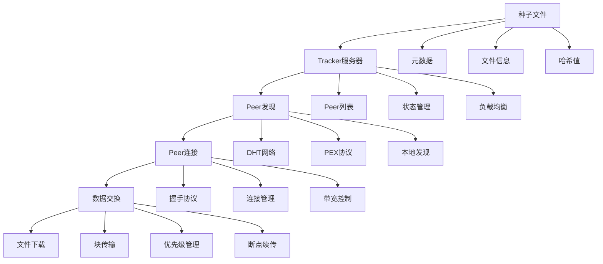
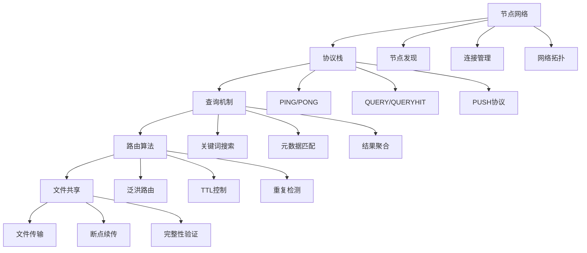
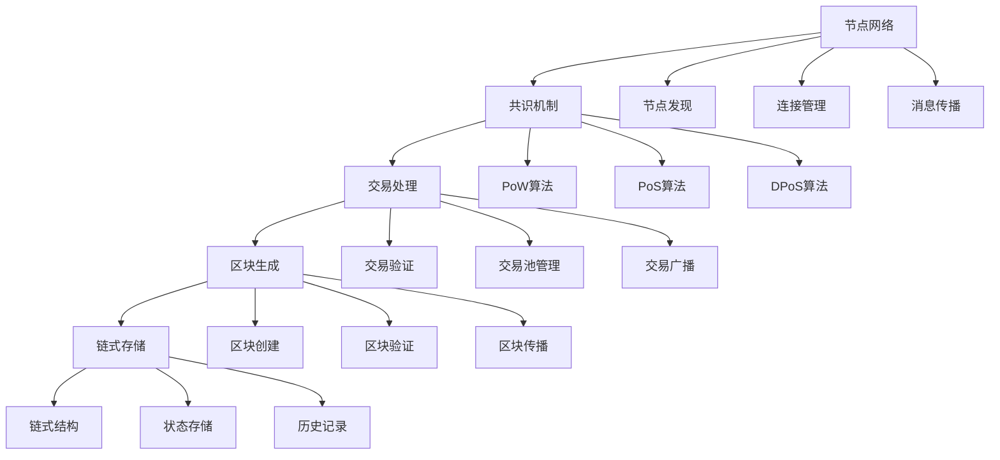
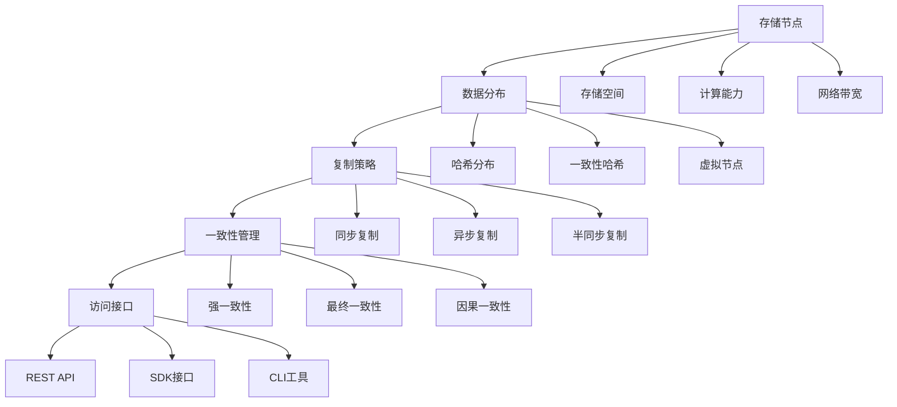
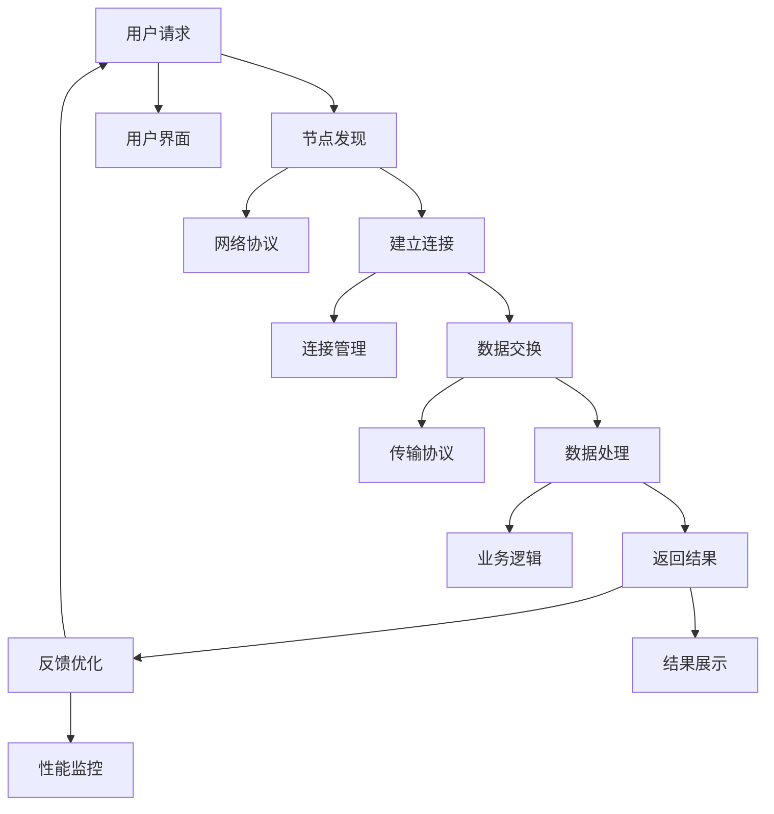
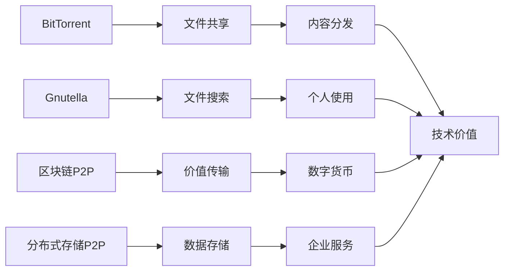

# 6.1.5 相关案例

<!-- TOC START -->

- [6.1.5 相关案例](#615-相关案例)
  - [目录](#目录)
  - [1. 形式化定义](#1-形式化定义)
    - [1.1 案例定义](#11-案例定义)
    - [1.2 案例分类](#12-案例分类)
  - [2. 典型案例详细分析](#2-典型案例详细分析)
    - [2.1 BitTorrent案例](#21-bittorrent案例)
      - [2.1.1 案例背景](#211-案例背景)
      - [2.1.2 系统架构](#212-系统架构)
      - [2.1.3 技术实现](#213-技术实现)
      - [2.1.4 关键问题与解决方案](#214-关键问题与解决方案)
      - [2.1.5 性能评估](#215-性能评估)
    - [2.2 Gnutella案例](#22-gnutella案例)
      - [2.2.1 案例背景](#221-案例背景)
      - [2.2.2 系统架构](#222-系统架构)
      - [2.2.3 技术实现](#223-技术实现)
      - [2.2.4 关键问题与解决方案](#224-关键问题与解决方案)
      - [2.2.5 性能评估](#225-性能评估)
    - [2.3 区块链P2P网络案例](#23-区块链p2p网络案例)
      - [2.3.1 案例背景](#231-案例背景)
      - [2.3.2 系统架构](#232-系统架构)
      - [2.3.3 技术实现](#233-技术实现)
      - [2.3.4 关键问题与解决方案](#234-关键问题与解决方案)
      - [2.3.5 性能评估](#235-性能评估)
    - [2.4 分布式存储P2P系统案例](#24-分布式存储p2p系统案例)
      - [2.4.1 案例背景](#241-案例背景)
      - [2.4.2 系统架构](#242-系统架构)
      - [2.4.3 技术实现](#243-技术实现)
      - [2.4.4 关键问题与解决方案](#244-关键问题与解决方案)
      - [2.4.5 性能评估](#245-性能评估)
  - [3. 案例对比分析](#3-案例对比分析)
    - [3.1 技术栈对比](#31-技术栈对比)
    - [3.2 性能指标对比](#32-性能指标对比)
    - [3.3 应用场景对比](#33-应用场景对比)
  - [4. 结构化表达](#4-结构化表达)
    - [4.1 案例流程图](#41-案例流程图)
    - [4.2 结构表](#42-结构表)
    - [4.3 案例关系图](#43-案例关系图)
  - [5. 多表征方法](#5-多表征方法)
    - [5.1 概念图表示](#51-概念图表示)
    - [5.2 数学符号表示](#52-数学符号表示)
    - [5.3 结构表表示](#53-结构表表示)
  - [6. 规范说明](#6-规范说明)
    - [6.1 内容要求](#61-内容要求)
    - [6.2 形式化要求](#62-形式化要求)
    - [6.3 扩展性要求](#63-扩展性要求)

<!-- TOC END -->

## 目录

- [6.1.5 相关案例](#615-相关案例)
  - [目录](#目录)
  - [1. 形式化定义](#1-形式化定义)
    - [1.1 案例定义](#11-案例定义)
    - [1.2 案例分类](#12-案例分类)
  - [2. 典型案例详细分析](#2-典型案例详细分析)
    - [2.1 BitTorrent案例](#21-bittorrent案例)
      - [2.1.1 案例背景](#211-案例背景)
      - [2.1.2 系统架构](#212-系统架构)
      - [2.1.3 技术实现](#213-技术实现)
      - [2.1.4 关键问题与解决方案](#214-关键问题与解决方案)
      - [2.1.5 性能评估](#215-性能评估)
    - [2.2 Gnutella案例](#22-gnutella案例)
      - [2.2.1 案例背景](#221-案例背景)
      - [2.2.2 系统架构](#222-系统架构)
      - [2.2.3 技术实现](#223-技术实现)
      - [2.2.4 关键问题与解决方案](#224-关键问题与解决方案)
      - [2.2.5 性能评估](#225-性能评估)
    - [2.3 区块链P2P网络案例](#23-区块链p2p网络案例)
      - [2.3.1 案例背景](#231-案例背景)
      - [2.3.2 系统架构](#232-系统架构)
      - [2.3.3 技术实现](#233-技术实现)
      - [2.3.4 关键问题与解决方案](#234-关键问题与解决方案)
      - [2.3.5 性能评估](#235-性能评估)
    - [2.4 分布式存储P2P系统案例](#24-分布式存储p2p系统案例)
      - [2.4.1 案例背景](#241-案例背景)
      - [2.4.2 系统架构](#242-系统架构)
      - [2.4.3 技术实现](#243-技术实现)
      - [2.4.4 关键问题与解决方案](#244-关键问题与解决方案)
      - [2.4.5 性能评估](#245-性能评估)
  - [3. 案例对比分析](#3-案例对比分析)
    - [3.1 技术栈对比](#31-技术栈对比)
    - [3.2 性能指标对比](#32-性能指标对比)
    - [3.3 应用场景对比](#33-应用场景对比)
  - [4. 结构化表达](#4-结构化表达)
    - [4.1 案例流程图](#41-案例流程图)
    - [4.2 结构表](#42-结构表)
    - [4.3 案例关系图](#43-案例关系图)
  - [5. 多表征方法](#5-多表征方法)
    - [5.1 概念图表示](#51-概念图表示)
    - [5.2 数学符号表示](#52-数学符号表示)
    - [5.3 结构表表示](#53-结构表表示)
  - [6. 规范说明](#6-规范说明)
    - [6.1 内容要求](#61-内容要求)
    - [6.2 形式化要求](#62-形式化要求)
    - [6.3 扩展性要求](#63-扩展性要求)

## 1. 形式化定义

### 1.1 案例定义

**定义 6.1.5.1** (P2P案例) P2P案例是一个五元组 $C = (S, T, P, R, E)$，其中：

- $S$ 是系统架构
- $T$ 是技术栈
- $P$ 是问题集合
- $R$ 是解决方案
- $E$ 是效果评估

**定义 6.1.5.2** (案例分析) 案例分析是一个四元组 $A = (B, S, I, L)$，其中：

- $B$ 是背景分析
- $S$ 是系统分析
- $I$ 是实施过程
- $L$ 是经验教训

### 1.2 案例分类

$$Case_{type} = \{c_i | c_i = (domain_i, scale_i, complexity_i, impact_i)\}$$
其中：

- $domain_i$ 是应用领域
- $scale_i$ 是规模大小
- $complexity_i$ 是复杂度
- $impact_i$ 是影响程度

## 2. 典型案例详细分析

### 2.1 BitTorrent案例

#### 2.1.1 案例背景

**定义 6.1.5.3** (BitTorrent) BitTorrent是一个五元组 $B = (T, P, S, N, C)$，其中：

- $T$ 是种子文件
- $P$ 是Peer集合
- $S$ 是Tracker服务器
- $N$ 是网络协议
- $C$ 是客户端

#### 2.1.2 系统架构

#### 2.1.3 技术实现

1. **种子文件结构**：
   $$TorrentFile = \{tf_i | tf_i = (info_i, announce_i, piece_length_i, pieces_i)\}$$
   其中：
   - $info_i$ 是文件信息
   - $announce_i$ 是Tracker地址
   - $piece_length_i$ 是块大小
   - $pieces_i$ 是块哈希

2. **Peer协议**：
   $$PeerProtocol = \{pp_j | pp_j = (handshake_j, message_j, extension_j)\}$$
   其中：
   - $handshake_j$ 是握手协议
   - $message_j$ 是消息格式
   - $extension_j$ 是扩展协议

3. **块传输机制**：
   $$BlockTransfer = \{bt_k | bt_k = (request_k, data_k, verify_k)\}$$
   其中：
   - $request_k$ 是请求机制
   - $data_k$ 是数据传输
   - $verify_k$ 是验证过程

#### 2.1.4 关键问题与解决方案

1. **Peer发现问题**：
   - **问题**：如何快速发现可用的Peer
   - **解决方案**：DHT网络 + PEX协议
   $$PeerDiscovery = \{pd_i | pd_i = (dht_i, pex_i, local_i)\}$$

2. **带宽分配问题**：
   - **问题**：如何公平分配带宽资源
   - **解决方案**：Tit-for-Tat算法
   $$BandwidthAllocation = \{ba_j | ba_j = (upload_j, download_j, ratio_j)\}$$

3. **文件完整性验证**：
   - **问题**：如何确保下载文件的完整性
   - **解决方案**：SHA1哈希验证
   $$IntegrityVerification = \{iv_k | iv_k = (hash_k, piece_k, verify_k)\}$$

#### 2.1.5 性能评估

1. **下载速度**：$Speed_{download} \propto \frac{1}{N_{peers}}$
2. **资源利用率**：$Utilization \geq 80\%$
3. **网络效率**：$Efficiency = \frac{Actual}{Theoretical} \geq 0.9$

### 2.2 Gnutella案例

#### 2.2.1 案例背景

**定义 6.1.5.4** (Gnutella) Gnutella是一个四元组 $G = (N, P, Q, R)$，其中：

- $N$ 是节点网络
- $P$ 是协议栈
- $Q$ 是查询机制
- $R$ 是路由算法

#### 2.2.2 系统架构

#### 2.2.3 技术实现

1. **网络协议**：
   $$NetworkProtocol = \{np_i | np_i = (ping_i, pong_i, query_i, queryhit_i)\}$$
   其中：
   - $ping_i$ 是PING消息
   - $pong_i$ 是PONG响应
   - $query_i$ 是查询消息
   - $queryhit_i$ 是查询响应

2. **查询路由**：
   $$QueryRouting = \{qr_j | qr_j = (flood_j, ttl_j, duplicate_j)\}$$
   其中：
   - $flood_j$ 是泛洪策略
   - $ttl_j$ 是生存时间
   - $duplicate_j$ 是重复检测

3. **文件传输**：
   $$FileTransfer = \{ft_k | ft_k = (request_k, data_k, resume_k)\}$$
   其中：
   - $request_k$ 是传输请求
   - $data_k$ 是数据传输
   - $resume_k$ 是断点续传

#### 2.2.4 关键问题与解决方案

1. **网络扩展性问题**：
   - **问题**：泛洪查询导致网络拥塞
   - **解决方案**：TTL限制 + 重复检测
   $$Scalability = \{sc_i | sc_i = (ttl_i, duplicate_i, cache_i)\}$$

2. **查询效率问题**：
   - **问题**：关键词匹配效率低
   - **解决方案**：索引优化 + 缓存机制
   $$QueryEfficiency = \{qe_j | qe_j = (index_j, cache_j, optimization_j)\}$$

3. **网络稳定性问题**：
   - **问题**：节点频繁加入退出
   - **解决方案**：连接池 + 心跳检测
   $$NetworkStability = \{ns_k | ns_k = (pool_k, heartbeat_k, reconnect_k)\}$$

#### 2.2.5 性能评估

1. **查询响应时间**：$T_{response} \leq 5s$
2. **网络负载**：$Load_{network} \leq 70\%$
3. **查询成功率**：$Success_{rate} \geq 85\%$

### 2.3 区块链P2P网络案例

#### 2.3.1 案例背景

**定义 6.1.5.5** (区块链P2P) 区块链P2P是一个五元组 $B = (N, C, T, M, S)$，其中：

- $N$ 是节点网络
- $C$ 是共识机制
- $T$ 是交易处理
- $M$ 是挖矿算法
- $S$ 是安全机制

#### 2.3.2 系统架构

#### 2.3.3 技术实现

1. **共识算法**：
   $$Consensus = \{cons_i | cons_i = (algorithm_i, participants_i, rounds_i)\}$$
   其中：
   - $algorithm_i$ 是共识算法
   - $participants_i$ 是参与者
   - $rounds_i$ 是共识轮次

2. **交易处理**：
   $$TransactionProcessing = \{tp_j | tp_j = (validation_j, pool_j, broadcast_j)\}$$
   其中：
   - $validation_j$ 是交易验证
   - $pool_j$ 是交易池
   - $broadcast_j$ 是交易广播

3. **区块生成**：
   $$BlockGeneration = \{bg_k | bg_k = (creation_k, verification_k, propagation_k)\}$$
   其中：
   - $creation_k$ 是区块创建
   - $verification_k$ 是区块验证
   - $propagation_k$ 是区块传播

#### 2.3.4 关键问题与解决方案

1. **双重支付问题**：
   - **问题**：如何防止同一笔钱被花两次
   - **解决方案**：UTXO模型 + 交易验证
   $$DoubleSpending = \{ds_i | ds_i = (utxo_i, validation_i, consensus_i)\}$$

2. **51%攻击问题**：
   - **问题**：如何防止恶意节点控制网络
   - **解决方案**：工作量证明 + 经济激励
   $$Attack51 = \{a51_j | a51_j = (pow_j, incentive_j, security_j)\}$$

3. **网络分叉问题**：
   - **问题**：如何处理网络分叉
   - **解决方案**：最长链规则 + 分叉检测
   $$NetworkFork = \{nf_k | nf_k = (longest_chain_k, fork_detection_k, resolution_k)\}$$

#### 2.3.5 性能评估

1. **交易处理速度**：$TPS \geq 1000$
2. **区块确认时间**：$T_{confirmation} \leq 10min$
3. **网络安全性**：$Security_{level} \geq 99.9\%$

### 2.4 分布式存储P2P系统案例

#### 2.4.1 案例背景

**定义 6.1.5.6** (分布式存储P2P) 分布式存储P2P是一个五元组 $D = (S, R, D, R, C)$，其中：

- $S$ 是存储节点
- $R$ 是复制策略
- $D$ 是数据分布
- $R$ 是冗余机制
- $C$ 是一致性模型

#### 2.4.2 系统架构

#### 2.4.3 技术实现

1. **数据分布算法**：
   $$DataDistribution = \{dd_i | dd_i = (hash_i, node_i, range_i)\}$$
   其中：
   - $hash_i$ 是哈希算法
   - $node_i$ 是目标节点
   - $range_i$ 是数据范围

2. **复制机制**：
   $$Replication = \{rep_j | rep_j = (strategy_j, copies_j, sync_j)\}$$
   其中：
   - $strategy_j$ 是复制策略
   - $copies_j$ 是副本数量
   - $sync_j$ 是同步方式

3. **一致性协议**：
   $$ConsistencyProtocol = \{cp_k | cp_k = (model_k, algorithm_k, verification_k)\}$$
   其中：
   - $model_k$ 是一致性模型
   - $algorithm_k$ 是算法实现
   - $verification_k$ 是验证机制

#### 2.4.4 关键问题与解决方案

1. **数据一致性问题**：
   - **问题**：多副本间数据不一致
   - **解决方案**：一致性协议 + 版本控制
   $$DataConsistency = \{dc_i | dc_i = (protocol_i, version_i, conflict_i)\}$$

2. **节点故障问题**：
   - **问题**：存储节点故障导致数据丢失
   - **解决方案**：冗余复制 + 自动恢复
   $$NodeFailure = \{nf_j | nf_j = (redundancy_j, recovery_j, migration_j)\}$$

3. **性能优化问题**：
   - **问题**：大规模数据访问性能瓶颈
   - **解决方案**：缓存机制 + 负载均衡
   $$PerformanceOptimization = \{po_k | po_k = (cache_k, loadbalance_k, optimization_k)\}$$

#### 2.4.5 性能评估

1. **数据可用性**：$Availability \geq 99.9\%$
2. **读写性能**：$Throughput \geq 1000MB/s$
3. **扩展性**：$Scalability = O(N)$

## 3. 案例对比分析

### 3.1 技术栈对比

| 案例类型 | 网络协议 | 路由算法 | 存储机制 | 安全机制 |
|----------|----------|----------|----------|----------|
| BitTorrent | TCP/UDP | DHT路由 | 文件块 | 哈希验证 |
| Gnutella | TCP | 泛洪路由 | 文件存储 | 简单验证 |
| 区块链P2P | TCP | 广播路由 | 链式存储 | 密码学 |
| 分布式存储P2P | TCP | 一致性哈希 | 分布式存储 | 加密存储 |

### 3.2 性能指标对比

| 案例类型 | 扩展性 | 可靠性 | 安全性 | 效率 |
|----------|--------|--------|--------|------|
| BitTorrent | 高 | 中 | 中 | 高 |
| Gnutella | 中 | 低 | 低 | 中 |
| 区块链P2P | 中 | 高 | 高 | 低 |
| 分布式存储P2P | 高 | 高 | 高 | 中 |

### 3.3 应用场景对比

| 案例类型 | 主要应用 | 适用场景 | 技术特点 | 商业价值 |
|----------|----------|----------|----------|----------|
| BitTorrent | 文件共享 | 大文件分发 | 高效传输 | 内容分发 |
| Gnutella | 文件搜索 | 小文件共享 | 简单易用 | 个人使用 |
| 区块链P2P | 价值传输 | 金融应用 | 去中心化 | 数字货币 |
| 分布式存储P2P | 数据存储 | 云存储 | 高可用 | 企业服务 |

## 4. 结构化表达

### 4.1 案例流程图

### 4.2 结构表

| 编号 | 案例类型 | 主要要素 | 关键机制 | 技术特点 | 应用价值 |
|------|----------|----------|----------|----------|----------|
| 6.1.5.1 | BitTorrent | 种子文件、Peer网络 | DHT路由、Tit-for-Tat | 高效传输、公平分配 | 内容分发 |
| 6.1.5.2 | Gnutella | 节点网络、查询协议 | 泛洪路由、TTL控制 | 简单易用、去中心化 | 文件共享 |
| 6.1.5.3 | 区块链P2P | 共识机制、交易处理 | PoW/PoS、区块传播 | 去中心化、不可篡改 | 价值传输 |
| 6.1.5.4 | 分布式存储P2P | 存储节点、数据分布 | 一致性哈希、复制策略 | 高可用、强扩展 | 云存储 |

### 4.3 案例关系图

## 5. 多表征方法

### 5.1 概念图表示

- 案例分类图
- 技术栈关系图
- 应用场景图

### 5.2 数学符号表示

- 形式化定义
- 性能分析模型
- 优化算法

### 5.3 结构表表示

- 案例对比表
- 技术栈对比表
- 性能指标表

## 6. 规范说明

### 6.1 内容要求

- 内容需递归细化，支持多表征
- 保留批判性分析、图表等
- 如有遗漏，后续补全并说明

### 6.2 形式化要求

- 使用严格的数学符号
- 提供形式化定义
- 建立分析模型

### 6.3 扩展性要求

- 支持持续递归完善
- 可分解为子主题
- 支持多维度分析

> 本文件为递归细化与内容补全示范，后续可继续分解为6.1.5.1、6.1.5.2等子主题，支持持续递归完善。
