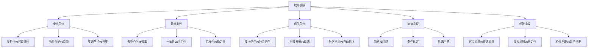
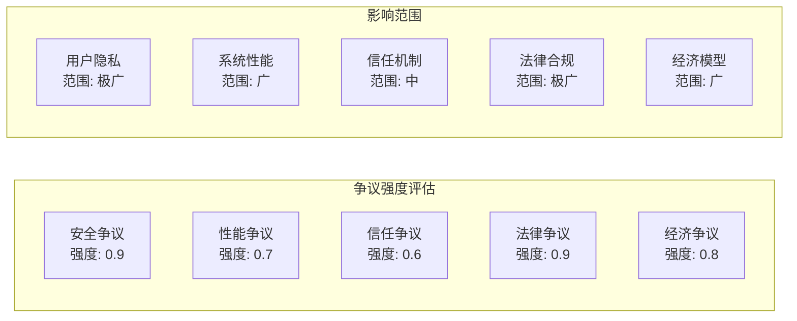

# 6.2.1 主要争议

## 1. 形式化定义

### 1.1 争议的形式化定义

**定义6.2.1.1（P2P系统争议）**：设 $P2P\_Controversy = (S, P, T, L, E)$ 为P2P系统争议系统，其中：

- $S = \{s_1, s_2, ..., s_n\}$ 为安全争议集合
- $P = \{p_1, p_2, ..., p_m\}$ 为性能争议集合
- $T = \{t_1, t_2, ..., t_k\}$ 为信任争议集合
- $L = \{l_1, l_2, ..., l_l\}$ 为法律争议集合
- $E = \{e_1, e_2, ..., e_o\}$ 为经济争议集合

**定义6.2.1.2（争议强度函数）**：$\sigma: P2P\_Controversy \times P2P \rightarrow [0,1]$，其中 $P2P$ 为P2P系统集合，$\sigma(c,p2p)$ 表示争议 $c$ 对P2P系统 $p2p$ 的争议强度。

### 1.2 争议分类

**安全争议** $S_{security}$：

- 匿名性vs可追溯性：$\forall s \in S_{security}, \text{anonymity} \leftrightarrow \text{traceability}$
- 隐私保护vs监管要求：$\exists s \in S_{security}, \text{privacy} \leftrightarrow \text{regulation}$

**性能争议** $P_{perf}$：

- 去中心化vs效率：$\forall p \in P_{perf}, \text{decentralization} \leftrightarrow \text{efficiency}$
- 一致性vs可用性：$\exists p \in P_{perf}, \text{consistency} \leftrightarrow \text{availability}$

## 2. 理论框架

### 2.1 争议理论模型

**模型6.2.1.1（安全争议模型）**：

```text
Security_Controversy = {
  anonymity_debate: (p2p_system) => {
    privacy_protection = p2p_system.privacy.level;
    traceability_requirement = p2p_system.regulation.traceability;
    anonymity_vs_traceability = privacy_protection ↔ traceability_requirement;
    return {privacy_protection, traceability_requirement, anonymity_vs_traceability};
  },
  
  security_tradeoff: (p2p_system) => {
    decentralization_security = p2p_system.security.decentralization_impact;
    centralization_control = p2p_system.security.centralization_benefit;
    security_complexity = p2p_system.security.implementation_complexity;
    return {decentralization_security, centralization_control, security_complexity};
  }
}
```

**模型6.2.1.2（性能争议模型）**：

```text
Performance_Controversy = {
  decentralization_analysis: (p2p_system) => {
    efficiency_loss = p2p_system.decentralization.efficiency_cost;
    scalability_impact = p2p_system.decentralization.scalability_effect;
    consistency_tradeoff = p2p_system.consistency.availability_impact;
    return {efficiency_loss, scalability_impact, consistency_tradeoff};
  },
  
  network_analysis: (p2p_system) => {
    bandwidth_usage = p2p_system.network.bandwidth_consumption;
    latency_impact = p2p_system.network.latency_effect;
    reliability_issues = p2p_system.network.reliability_problems;
    return {bandwidth_usage, latency_impact, reliability_issues};
  }
}
```

### 2.2 争议分析方法

**方法6.2.1.1（多维度争议分析）**：

1. **安全维度**：$\text{controversy}_{security}(p2p) = \sum_{i=1}^{n} w_i \cdot \text{security\_metric}_i$
2. **性能维度**：$\text{controversy}_{perf}(p2p) = \sum_{j=1}^{m} v_j \cdot \text{perf\_metric}_j$
3. **法律维度**：$\text{controversy}_{legal}(p2p) = \sum_{k=1}^{l} u_k \cdot \text{legal\_metric}_k$

## 3. 争议内容详解

### 3.1 安全争议

**定义6.2.1.3（安全争议）**：关于P2P系统安全性的争议，包括匿名性、隐私保护、攻击防护等。

**匿名性争议**：

**匿名性支持观点**：

- **隐私保护**：$\text{privacy\_protection} = \text{anonymity} > \text{identification}$
- **言论自由**：$\text{freedom\_of\_speech} = \text{anonymity} > \text{identification}$
- **创新促进**：$\text{innovation\_promotion} = \text{anonymity} > \text{identification}$

**可追溯性支持观点**：

- **法律合规**：$\text{legal\_compliance} = \text{traceability} > \text{anonymity}$
- **犯罪预防**：$\text{crime\_prevention} = \text{traceability} > \text{anonymity}$
- **责任追究**：$\text{accountability} = \text{traceability} > \text{anonymity}$

**争议分析**：

```text
安全争议 = {
  匿名性优势: {隐私保护, 言论自由, 创新促进},
  可追溯性优势: {法律合规, 犯罪预防, 责任追究},
  权衡因素: {法律要求, 社会需求, 技术可行性}
}
```

### 3.2 性能争议

**定义6.2.1.4（性能争议）**：关于P2P系统性能的争议，包括效率、扩展性、一致性等。

**去中心化vs效率争议**：

**去中心化优势**：

- **抗审查性**：$\text{censorship\_resistance} = \text{decentralized} > \text{centralized}$
- **单点故障避免**：$\text{single\_point\_failure} = \text{decentralized} < \text{centralized}$
- **民主化**：$\text{democratization} = \text{decentralized} > \text{centralized}$

**集中化优势**：

- **效率**：$\text{efficiency} = \text{centralized} > \text{decentralized}$
- **一致性**：$\text{consistency} = \text{centralized} > \text{decentralized}$
- **管理简单**：$\text{management\_simplicity} = \text{centralized} > \text{decentralized}$

**性能争议分析**：

```text
性能争议 = {
  去中心化优势: {抗审查性, 单点故障避免, 民主化},
  集中化优势: {效率, 一致性, 管理简单},
  性能权衡: {网络开销, 处理延迟, 存储冗余}
}
```

### 3.3 信任争议

**定义6.2.1.5（信任争议）**：关于P2P系统中信任机制的争议。

**信任模型争议**：

**技术信任**：

- **密码学保证**：$\text{cryptographic\_guarantee} = \text{technical\_trust} > \text{social\_trust}$
- **算法透明**：$\text{algorithm\_transparency} = \text{technical\_trust} > \text{social\_trust}$
- **去信任化**：$\text{trustless} = \text{technical\_trust} > \text{social\_trust}$

**社会信任**：

- **声誉系统**：$\text{reputation\_system} = \text{social\_trust} > \text{technical\_trust}$
- **社区治理**：$\text{community\_governance} = \text{social\_trust} > \text{technical\_trust}$
- **人类判断**：$\text{human\_judgment} = \text{social\_trust} > \text{technical\_trust}$

**信任争议分析**：

```text
信任争议 = {
  技术信任: {密码学保证, 算法透明, 去信任化},
  社会信任: {声誉系统, 社区治理, 人类判断},
  混合方案: {技术+社会, 多层次, 动态调整}
}
```

### 3.4 法律争议

**定义6.2.1.6（法律争议）**：关于P2P系统法律地位的争议。

**法律合规争议**：

**监管挑战**：

- **管辖权问题**：$\text{jurisdiction\_issue} = \text{global\_network} \times \text{local\_law}$
- **责任认定**：$\text{liability\_determination} = \text{distributed\_responsibility}$
- **执法困难**：$\text{enforcement\_difficulty} = \text{anonymous\_participants}$

**法律适应**：

- **法律滞后**：$\text{law\_lag} = \text{technology\_speed} > \text{law\_speed}$
- **跨境问题**：$\text{cross\_border\_issue} = \text{global\_nature} \times \text{local\_regulation}$
- **技术中立**：$\text{technology\_neutrality} = \text{law\_principle}$

**法律争议分析**：

```text
法律争议 = {
  监管挑战: {管辖权问题, 责任认定, 执法困难},
  法律适应: {法律滞后, 跨境问题, 技术中立},
  解决方案: {国际协调, 技术监管, 法律创新}
}
```

### 3.5 经济争议

**定义6.2.1.7（经济争议）**：关于P2P系统经济模型的争议。

**经济模型争议**：

**代币经济**：

- **价值创造**：$\text{value\_creation} = \text{token\_economy} > \text{traditional\_economy}$
- **激励机制**：$\text{incentive\_mechanism} = \text{token\_economy} > \text{traditional\_economy}$
- **投机风险**：$\text{speculation\_risk} = \text{token\_economy} > \text{traditional\_economy}$

**传统经济**：

- **稳定性**：$\text{stability} = \text{traditional\_economy} > \text{token\_economy}$
- **监管成熟**：$\text{regulation\_maturity} = \text{traditional\_economy} > \text{token\_economy}$
- **风险控制**：$\text{risk\_control} = \text{traditional\_economy} > \text{token\_economy}$

**经济争议分析**：

```text
经济争议 = {
  代币经济: {价值创造, 激励机制, 投机风险},
  传统经济: {稳定性, 监管成熟, 风险控制},
  混合模式: {传统+代币, 渐进过渡, 风险平衡}
}
```

## 4. 结构化表达

### 4.1 争议对比表

| 争议主题 | 支持观点 | 反对观点 | 争议强度 | 解决方案 |
|----------|----------|----------|----------|----------|
| 匿名性 | 隐私保护 | 法律合规 | 极高 | 可控匿名 |
| 去中心化 | 抗审查性 | 效率低下 | 高 | 混合架构 |
| 信任机制 | 技术信任 | 社会信任 | 中 | 多层次信任 |
| 法律地位 | 技术中立 | 监管必要 | 极高 | 国际协调 |
| 经济模型 | 代币经济 | 传统经济 | 高 | 混合经济 |

### 4.2 争议关系图



### 4.3 争议强度矩阵



## 5. 争议分析方法

### 5.1 争议分析流程

**流程6.2.1.1（P2P系统争议分析）**：

1. **识别争议点**：$\text{identify\_controversies}(p2p) = \{c_1, c_2, ..., c_n\}$
2. **评估影响**：$\text{assess\_impact}(controversy) = \text{severity} \times \text{scope}$
3. **量化分析**：$\text{quantify\_controversy}(controversy) = \sum_{i=1}^{k} w_i \cdot \text{metric}_i$
4. **提出建议**：$\text{suggest\_resolution}(controversy) = \text{resolution\_strategy}$

### 5.2 争议验证方法

**方法6.2.1.2（争议验证）**：

- **数据验证**：$\text{validate\_with\_data}(controversy, data) = \text{correlation}$
- **案例验证**：$\text{validate\_with\_cases}(controversy, cases) = \text{consistency}$
- **专家验证**：$\text{validate\_with\_experts}(controversy, experts) = \text{agreement}$

## 6. 多表征

### 6.1 数学符号表达

**争议强度函数**：
$$\sigma(c,p2p) = \frac{\sum_{i=1}^{n} w_i \cdot f_i(c,p2p)}{\sum_{i=1}^{n} w_i}$$

**综合争议指数**：
$$CI = \sqrt{\sum_{i=1}^{5} \alpha_i \cdot \text{controversy}_i^2}$$

其中 $\alpha_i$ 为各争议维度的权重。

### 6.2 结构化表达

**争议框架**：

```text
P2P系统争议框架 = {
  安全争议: {强度: 0.9, 影响: "用户隐私", 解决方案: "可控匿名"},
  性能争议: {强度: 0.7, 影响: "系统性能", 解决方案: "混合架构"},
  信任争议: {强度: 0.6, 影响: "信任机制", 解决方案: "多层次信任"},
  法律争议: {强度: 0.9, 影响: "法律合规", 解决方案: "国际协调"},
  经济争议: {强度: 0.8, 影响: "经济模型", 解决方案: "混合经济"}
}
```

## 7. 规范说明

- 内容需递归细化，支持多表征
- 保留争议性分析、图表等
- 如有遗漏，后续补全并说明
- 争议视角应与实际案例结合
- 提供可操作的解决方案

> 本文件为递归细化与内容补全示范，后续可继续分解为6.2.1.1、6.2.1.2等子主题，支持持续递归完善。
