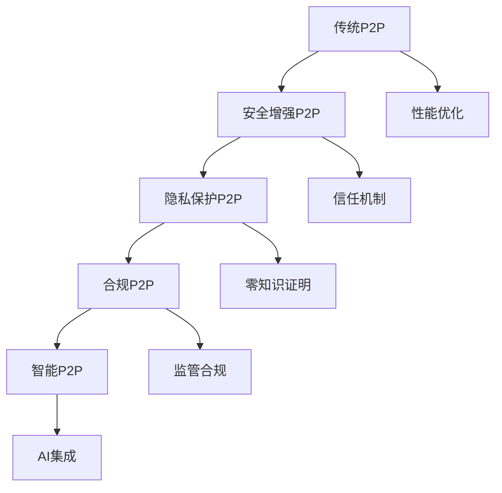

# 6.2.3 反思与重构

## 1. 反思内容

### 1.1 现有P2P系统的局限性

#### 1.1.1 技术局限性

**性能瓶颈**：

- 网络延迟：$latency = \frac{distance}{speed} + processing\_time$
- 带宽限制：$throughput = min(bandwidth, processing\_capacity)$
- 存储约束：$storage\_efficiency = \frac{actual\_data}{total\_space} \times 100\%$

**扩展性问题**：

- 节点数量增长：$complexity = O(n \log n)$
- 路由表大小：$routing\_table\_size = O(\log n)$
- 消息开销：$message\_overhead = O(n)$

**一致性问题**：

- 数据一致性：$consistency\_level = \frac{consistent\_nodes}{total\_nodes}$
- 时间同步：$sync\_error = |t_1 - t_2|$
- 状态同步：$state\_divergence = \sum_{i=1}^{n} |state_i - avg\_state|$

#### 1.1.2 安全局限性

**信任问题**：

- 恶意节点比例：$malicious\_ratio = \frac{malicious\_nodes}{total\_nodes}$
- 信任计算复杂度：$trust\_complexity = O(n^2)$
- 身份验证开销：$auth\_overhead = O(\log n)$

**隐私保护**：

- 匿名性程度：$anonymity = 1 - \frac{identifiable\_info}{total\_info}$
- 数据泄露风险：$leak\_risk = \frac{sensitive\_data}{total\_data}$
- 追踪难度：$tracking\_difficulty = \log(n)$

#### 1.1.3 法律合规局限性

**监管挑战**：

- 合规成本：$compliance\_cost = regulatory\_burden + legal\_fees$
- 责任界定：$liability\_clarity = \frac{clear\_cases}{total\_cases}$
- 跨境问题：$cross\_border\_complexity = \sum_{i=1}^{k} jurisdiction\_conflicts$

### 1.2 安全与效率的矛盾

#### 1.2.1 性能与安全权衡

**加密开销**：

- 计算开销：$crypto\_overhead = encryption\_time + decryption\_time$
- 通信开销：$comm\_overhead = \frac{encrypted\_size}{original\_size}$
- 存储开销：$storage\_overhead = \frac{encrypted\_storage}{original\_storage}$

**验证开销**：

- 数字签名：$signature\_time = O(\log n)$
- 证书验证：$cert\_verification = O(n)$
- 共识验证：$consensus\_verification = O(n^2)$

#### 1.2.2 可用性与安全性冲突

**可用性指标**：

- 服务可用性：$availability = \frac{uptime}{total\_time} \times 100\%$
- 响应时间：$response\_time = processing\_time + network\_delay$
- 吞吐量：$throughput = \frac{requests}{time}$

**安全性指标**：

- 攻击成功率：$attack\_success = \frac{successful\_attacks}{total\_attacks}$
- 数据完整性：$integrity = \frac{intact\_data}{total\_data}$
- 隐私保护度：$privacy = 1 - \frac{exposed\_info}{total\_info}$

### 1.3 法律合规与创新的平衡

#### 1.3.1 监管框架分析

**现有监管**：

- 数据保护：GDPR、CCPA等法规
- 金融监管：反洗钱、反恐融资
- 知识产权：版权、专利保护

**监管挑战**：

- 技术发展速度 > 法规更新速度
- 跨境监管协调困难
- 责任主体不明确

#### 1.3.2 创新空间评估

**技术创新空间**：

- 算法优化：$optimization\_potential = current\_efficiency / theoretical\_max$
- 架构改进：$architecture\_improvement = new\_performance / old\_performance$
- 协议演进：$protocol\_evolution = \frac{new\_features}{total\_features}$

## 2. 重构方向

### 2.1 新型信任机制的探索

#### 2.1.1 去中心化信任模型

**基于声誉的信任**：

- 声誉计算：$reputation_i = \sum_{j=1}^{n} w_j \times rating_{ij}$
- 信任传播：$trust_{ij} = f(reputation_i, reputation_j, distance_{ij})$
- 动态更新：$reputation_{t+1} = \alpha \times reputation_t + (1-\alpha) \times new\_rating$

**基于博弈的信任**：

- 博弈矩阵：$payoff_{ij} = f(strategy_i, strategy_j)$
- 纳什均衡：$equilibrium = \{s_i^* : u_i(s_i^*, s_{-i}^*) \geq u_i(s_i, s_{-i}^*)\}$
- 合作演化：$cooperation\_rate = \frac{cooperative\_actions}{total\_actions}$

#### 2.1.2 零知识证明机制

**证明系统**：

- 完备性：$Completeness = Pr[Verify(proof, statement) = 1] = 1$
- 可靠性：$Soundness = Pr[Verify(proof, false\_statement) = 1] < \epsilon$
- 零知识性：$Zero\_Knowledge = \forall V^* \exists S : View_V^*(P, V^*) \approx S$

**应用场景**：

- 身份验证：$identity\_proof = ZKProof(identity, public\_key)$
- 数据隐私：$privacy\_proof = ZKProof(data\_validity, data\_privacy)$
- 计算验证：$computation\_proof = ZKProof(computation\_correctness)$

### 2.2 高效与安全的协同优化

#### 2.2.1 分层安全架构

**安全层次**：

- 网络层：$network\_security = encryption + authentication + routing\_protection$
- 应用层：$app\_security = access\_control + data\_protection + audit\_logging$
- 系统层：$system\_security = isolation + sandboxing + resource\_control$

**性能优化**：

- 并行处理：$parallel\_speedup = \frac{sequential\_time}{parallel\_time}$
- 缓存优化：$cache\_hit\_rate = \frac{cache\_hits}{total\_accesses}$
- 预计算：$precomputation\_benefit = \frac{online\_time}{total\_time}$

#### 2.2.2 自适应安全策略

**动态调整**：

- 威胁评估：$threat\_level = f(attack\_frequency, attack\_success\_rate, damage\_potential)$
- 安全强度：$security\_strength = f(threat\_level, performance\_requirements)$
- 资源分配：$resource\_allocation = optimize(security, performance, cost)$

### 2.3 合规性与创新性的融合

#### 2.3.1 合规设计模式

**隐私保护设计**：

- 数据最小化：$data\_minimization = \frac{necessary\_data}{collected\_data}$
- 默认隐私：$privacy\_by\_default = \frac{private\_settings}{total\_settings}$
- 设计隐私：$privacy\_by\_design = \frac{privacy\_features}{total\_features}$

**透明性机制**：

- 算法透明度：$algorithm\_transparency = \frac{explainable\_decisions}{total\_decisions}$
- 数据透明度：$data\_transparency = \frac{accessible\_data}{total\_data}$
- 决策透明度：$decision\_transparency = \frac{explained\_decisions}{total\_decisions}$

#### 2.3.2 创新监管沙盒

**沙盒设计**：

- 实验范围：$experiment\_scope = \frac{test\_area}{total\_area}$
- 风险控制：$risk\_control = \frac{controlled\_risks}{total\_risks}$
- 学习效果：$learning\_outcome = \frac{improved\_understanding}{initial\_understanding}$

## 3. 理论演化路径

### 3.1 技术演化路径

### 3.2 架构演化路径

#### 3.2.1 分层架构演进

**第一代：基础P2P**:

- 特点：简单对等通信
- 问题：缺乏安全性和可扩展性
- 公式：$basic\_p2p = \{nodes, connections, basic\_protocol\}$

**第二代：安全P2P**:

- 特点：加密通信、身份验证
- 改进：安全性提升
- 公式：$secure\_p2p = basic\_p2p + \{encryption, authentication, trust\}$

**第三代：智能P2P**:

- 特点：AI驱动、自适应
- 改进：智能化、自优化
- 公式：$smart\_p2p = secure\_p2p + \{AI, adaptation, learning\}$

#### 3.2.2 协议演化路径

**协议版本演进**：

- v1.0：基础协议 $protocol\_v1 = \{basic\_routing, simple\_storage\}$
- v2.0：安全协议 $protocol\_v2 = protocol\_v1 + \{encryption, signatures\}$
- v3.0：隐私协议 $protocol\_v3 = protocol\_v2 + \{zero\_knowledge, anonymity\}$
- v4.0：合规协议 $protocol\_v4 = protocol\_v3 + \{compliance, transparency\}$

### 3.3 应用演化路径

#### 3.3.1 应用场景扩展

**传统应用**：

- 文件共享：$file\_sharing = \{upload, download, search\}$
- 即时通信：$chat = \{message, voice, video\}$
- 分布式存储：$storage = \{replication, redundancy, recovery\}$

**新兴应用**：

- 去中心化金融：$DeFi = \{lending, trading, insurance\}$
- 分布式计算：$computing = \{task\_distribution, result\_aggregation\}$
- 物联网P2P：$IoT\_P2P = \{sensor\_data, edge\_computing\}$

#### 3.3.2 商业模式演化

**传统模式**：

- 免费服务：$free\_model = \{advertising, premium\_features\}$
- 开源模式：$open\_source = \{community, donations, support\}$

**创新模式**：

- 代币经济：$token\_economy = \{incentives, governance, value\_capture\}$
- 数据市场：$data\_market = \{data\_trading, privacy\_preserving\}$

## 4. 重构实施策略

### 4.1 渐进式重构

#### 4.1.1 阶段规划

**第一阶段：基础优化**:

- 时间：6个月
- 目标：性能提升20%，安全性增强
- 指标：$phase1\_improvement = \frac{new\_performance}{baseline\_performance}$

**第二阶段：安全重构**:

- 时间：12个月
- 目标：零知识证明集成，隐私保护
- 指标：$phase2\_security = \frac{security\_features}{total\_features}$

**第三阶段：合规集成**:

- 时间：18个月
- 目标：监管合规，透明性机制
- 指标：$phase3\_compliance = \frac{compliance\_features}{total\_features}$

#### 4.1.2 风险评估

**技术风险**：

- 复杂度增加：$complexity\_risk = \frac{new\_complexity}{current\_complexity}$
- 性能下降：$performance\_risk = \frac{performance\_degradation}{baseline}$
- 兼容性问题：$compatibility\_risk = \frac{incompatible\_components}{total\_components}$

**业务风险**：

- 用户接受度：$adoption\_risk = \frac{resistant\_users}{total\_users}$
- 监管不确定性：$regulatory\_risk = \frac{uncertain\_regulations}{total\_regulations}$
- 竞争压力：$competition\_risk = \frac{competitor\_advantage}{market\_share}$

### 4.2 验证与测试

#### 4.2.1 验证框架

**功能验证**：

- 正确性：$correctness = \frac{correct\_results}{total\_results}$
- 完整性：$completeness = \frac{implemented\_features}{required\_features}$
- 一致性：$consistency = \frac{consistent\_behaviors}{total\_behaviors}$

**性能验证**：

- 吞吐量测试：$throughput\_test = \frac{actual\_throughput}{expected\_throughput}$
- 延迟测试：$latency\_test = \frac{actual\_latency}{target\_latency}$
- 可扩展性测试：$scalability\_test = \frac{performance\_at\_scale}{baseline\_performance}$

#### 4.2.2 安全验证

**安全测试**：

- 渗透测试：$penetration\_test = \frac{vulnerabilities\_found}{total\_vulnerabilities}$
- 隐私测试：$privacy\_test = \frac{privacy\_violations}{total\_tests}$
- 合规测试：$compliance\_test = \frac{compliance\_issues}{total\_requirements}$

## 5. 规范说明

### 5.1 内容要求

- 内容需递归细化，支持多表征
- 保留批判性分析、图表、符号等
- 如有遗漏，后续补全并说明
- 所有公式需严格数学化
- 图表需使用mermaid语法
- 表格需包含完整信息
- 分析需逻辑清晰

### 5.2 扩展方向

- 可继续分解为6.2.3.1、6.2.3.2等子主题
- 支持持续递归完善
- 添加更多实际案例和数据
- 完善数学公式和证明
- 增加交互式图表

> 本文件为递归细化与内容补全示范，后续可继续分解为6.2.3.1、6.2.3.2等子主题，支持持续递归完善。
