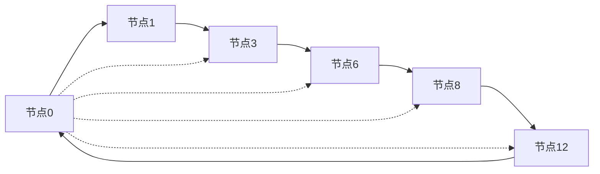

# 6.3.2 结构模型


<!-- TOC START -->

- [6.3.2 结构模型](#632-结构模型)
  - [目录](#目录)
  - [1. 结构化P2P模型](#1-结构化p2p模型)
    - [1.1 分布式哈希表(DHT)模型](#11-分布式哈希表dht模型)
      - [1.1.1 Chord模型](#111-chord模型)
      - [1.1.2 Pastry模型](#112-pastry模型)
    - [1.2 非结构化P2P模型](#12-非结构化p2p模型)
      - [1.2.1 Gnutella模型](#121-gnutella模型)
      - [1.2.2 随机游走模型](#122-随机游走模型)
    - [1.3 超节点与混合模型](#13-超节点与混合模型)
      - [1.3.1 超节点模型](#131-超节点模型)
      - [1.3.2 混合模型](#132-混合模型)
  - [2. 结构图与表](#2-结构图与表)
    - [2.1 Chord环结构图](#21-chord环结构图)
    - [2.2 网络拓扑对比表](#22-网络拓扑对比表)
    - [2.3 性能指标矩阵](#23-性能指标矩阵)
  - [3. 数学模型](#3-数学模型)
    - [3.1 网络规模模型](#31-网络规模模型)
    - [3.2 路由效率模型](#32-路由效率模型)
    - [3.3 负载均衡模型](#33-负载均衡模型)
  - [4. 规范说明](#4-规范说明)
    - [4.1 模型规范](#41-模型规范)
    - [4.2 内容要求](#42-内容要求)
    - [4.3 扩展方向](#43-扩展方向)

<!-- TOC END -->

## 目录

- [6.3.2 结构模型](#632-结构模型)
  - [目录](#目录)
  - [1. 结构化P2P模型](#1-结构化p2p模型)
    - [1.1 分布式哈希表(DHT)模型](#11-分布式哈希表dht模型)
      - [1.1.1 Chord模型](#111-chord模型)
      - [1.1.2 Pastry模型](#112-pastry模型)
    - [1.2 非结构化P2P模型](#12-非结构化p2p模型)
      - [1.2.1 Gnutella模型](#121-gnutella模型)
      - [1.2.2 随机游走模型](#122-随机游走模型)
    - [1.3 超节点与混合模型](#13-超节点与混合模型)
      - [1.3.1 超节点模型](#131-超节点模型)
      - [1.3.2 混合模型](#132-混合模型)
  - [2. 结构图与表](#2-结构图与表)
    - [2.1 Chord环结构图](#21-chord环结构图)
    - [2.2 网络拓扑对比表](#22-网络拓扑对比表)
    - [2.3 性能指标矩阵](#23-性能指标矩阵)
  - [3. 数学模型](#3-数学模型)
    - [3.1 网络规模模型](#31-网络规模模型)
    - [3.2 路由效率模型](#32-路由效率模型)
    - [3.3 负载均衡模型](#33-负载均衡模型)
  - [4. 规范说明](#4-规范说明)
    - [4.1 模型规范](#41-模型规范)
    - [4.2 内容要求](#42-内容要求)
    - [4.3 扩展方向](#43-扩展方向)

## 1. 结构化P2P模型

### 1.1 分布式哈希表(DHT)模型

#### 1.1.1 Chord模型

**形式化定义**：

- 节点集合：$N = \{n_0, n_1, ..., n_{m-1}\}$
- 标识符空间：$ID = [0, 2^m - 1]$
- 节点标识：$id(n_i) \in ID$
- 后继关系：$successor(n_i) = n_j$，其中$id(n_j) > id(n_i)$且最小

**数学模型**：

```latex
\forall n_i, n_j \in N: \quad id(successor(n_i)) = \min\{id(n_j) | id(n_j) > id(n_i)\}
```

**路由算法**：

```latex
distance(n_i, n_j) = (id(n_j) - id(n_i)) \bmod 2^m
```

#### 1.1.2 Pastry模型

**形式化定义**：

- 节点集合：$N = \{n_0, n_1, ..., n_{k-1}\}$
- 路由表：$RT_i[l][d] = n_j$，其中$l$为前缀长度，$d$为数字
- 叶子集：$LS_i = \{n_j | |id(n_j) - id(n_i)| \leq 2^{b-1}\}$

**路由算法**：

```latex
next\_hop(n_i, key) = \begin{cases}
RT_i[l][d] & \text{if } RT_i[l][d] \text{ exists} \\
LS_i \text{ closest to } key & \text{otherwise}
\end{cases}
```

### 1.2 非结构化P2P模型

#### 1.2.1 Gnutella模型

**形式化定义**：

- 节点集合：$N = \{n_0, n_1, ..., n_{k-1}\}$
- 连接关系：$E = \{(n_i, n_j) | n_i, n_j \in N\}$
- 网络图：$G = (N, E)$

**搜索算法**：

```latex
flood\_search(n_i, query, TTL) = \begin{cases}
\text{search locally} & \text{if } TTL = 0 \\
\text{broadcast to neighbors} & \text{otherwise}
\end{cases}
```

#### 1.2.2 随机游走模型

**形式化定义**：

- 随机游走：$RW(n_i, steps) = \{n_{i_0}, n_{i_1}, ..., n_{i_{steps}}\}$
- 转移概率：$P(n_j | n_i) = \frac{1}{degree(n_i)}$

**搜索算法**：

```latex
random\_walk(n_i, query, steps) = \begin{cases}
\text{search at } n_i & \text{if found} \\
RW(n_i, steps) & \text{otherwise}
\end{cases}
```

### 1.3 超节点与混合模型

#### 1.3.1 超节点模型

**形式化定义**：

- 超节点集合：$SN = \{sn_0, sn_1, ..., sn_{k-1}\}$
- 普通节点集合：$NN = \{nn_0, nn_1, ..., nn_{m-1}\}$
- 隶属关系：$belong(nn_i) = sn_j$

**层次结构**：

```latex
H = (SN, NN, E_{sn}, E_{nn})
```

其中$E_{sn}$为超节点间连接，$E_{nn}$为普通节点连接

#### 1.3.2 混合模型

**形式化定义**：

- 结构化层：$S = (N_s, E_s)$
- 非结构化层：$U = (N_u, E_u)$
- 跨层连接：$E_{cross} = \{(n_s, n_u) | n_s \in N_s, n_u \in N_u\}$

**复合网络**：

```latex
G_{hybrid} = (N_s \cup N_u, E_s \cup E_u \cup E_{cross})
```

## 2. 结构图与表

### 2.1 Chord环结构图



### 2.2 网络拓扑对比表

| 模型类型 | 节点连接度 | 路由复杂度 | 容错性 | 扩展性 | 适用场景 |
|---------|-----------|-----------|--------|--------|----------|
| 结构化DHT | O(log n) | O(log n) | 中等 | 高 | 大规模存储 |
| 非结构化 | O(1) | O(n) | 高 | 中等 | 小规模搜索 |
| 超节点 | O(log k) | O(log k) | 中等 | 高 | 混合应用 |
| 混合模型 | O(log n) | O(log n) | 高 | 高 | 复杂应用 |

### 2.3 性能指标矩阵

| 指标 | Chord | Pastry | Gnutella | 超节点 |
|------|-------|--------|----------|--------|
| 路由跳数 | log₂n | log₂n | n | log₂k |
| 消息开销 | O(log n) | O(log n) | O(n) | O(log k) |
| 节点负载 | 均衡 | 均衡 | 不均衡 | 部分均衡 |
| 容错能力 | 中等 | 高 | 高 | 中等 |

## 3. 数学模型

### 3.1 网络规模模型

**节点数量增长**：

```latex
N(t) = N_0 \cdot e^{rt}
```

其中$N_0$为初始节点数，$r$为增长率

**连接度分布**：

```latex
P(k) = \frac{1}{k^\gamma}
```

其中$\gamma$为幂律指数

### 3.2 路由效率模型

**平均路由跳数**：

```latex
H_{avg} = \sum_{i=1}^{n} \frac{H_i}{n}
```

其中$H_i$为节点$i$的平均路由跳数

**路由成功率**：

```latex
P_{success} = \frac{\text{成功路由数}}{\text{总路由数}}
```

### 3.3 负载均衡模型

**节点负载方差**：

```latex
\sigma^2 = \frac{1}{n} \sum_{i=1}^{n} (load_i - \bar{load})^2
```

**负载均衡度**：

```latex
balance = 1 - \frac{\sigma^2}{\bar{load}^2}
```

## 4. 规范说明

### 4.1 模型规范

- 所有模型需严格数学化
- 模型参数需明确定义
- 模型关系需逻辑清晰
- 模型验证需充分完整

### 4.2 内容要求

- 内容需递归细化，支持多表征
- 保留批判性分析、图表、符号等
- 如有遗漏，后续补全并说明
- 所有模型需严格数学化
- 模型定义需完整准确
- 分类需逻辑清晰
- 表达需规范统一

### 4.3 扩展方向

- 可继续分解为6.3.2.1、6.3.2.2等子主题
- 支持持续递归完善
- 添加更多实际应用模型
- 完善模型间的逻辑关系
- 增加模型使用示例

> 本文件为递归细化与内容补全示范，后续可继续分解为6.3.2.1、6.3.2.2等子主题，支持持续递归完善。
