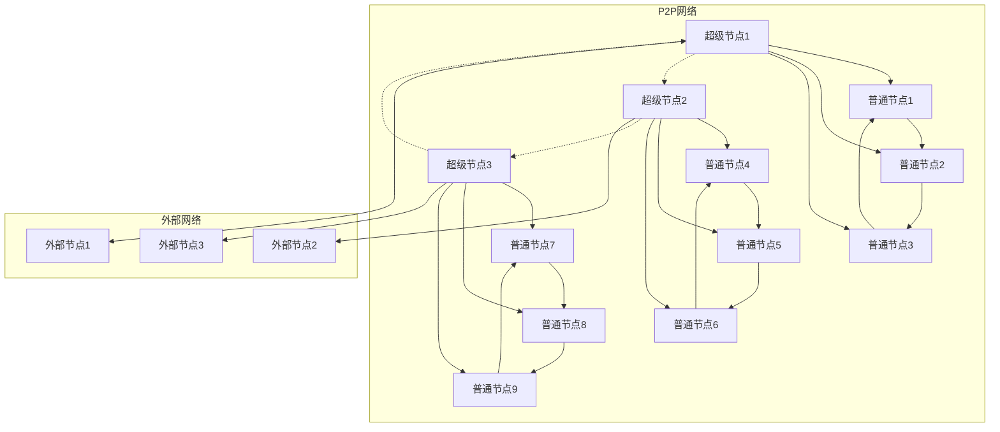
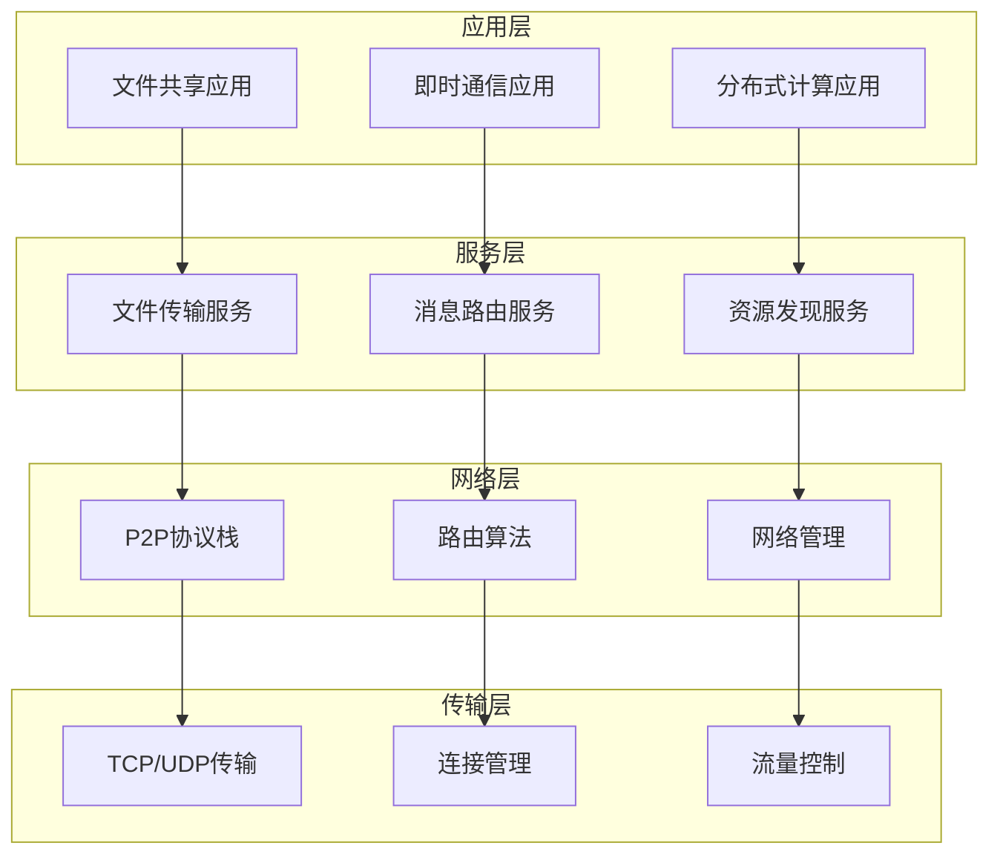
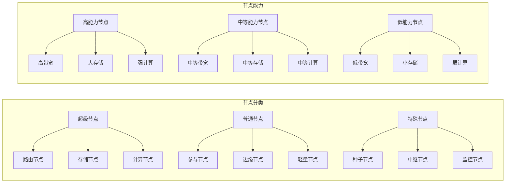
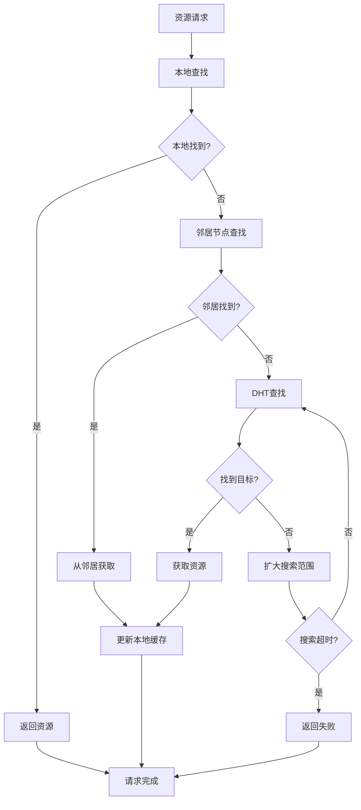
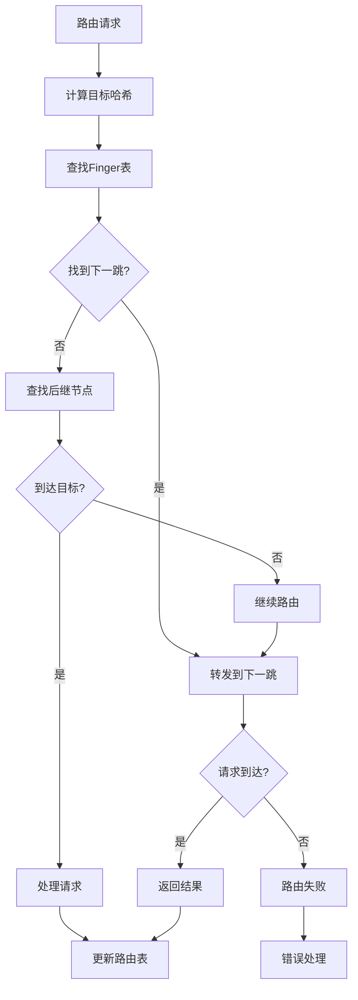
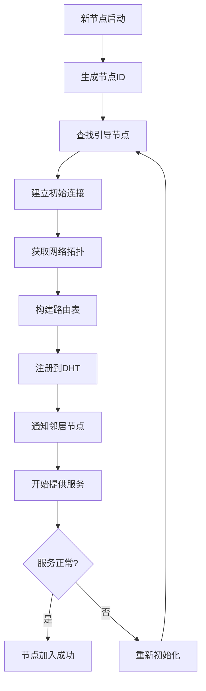
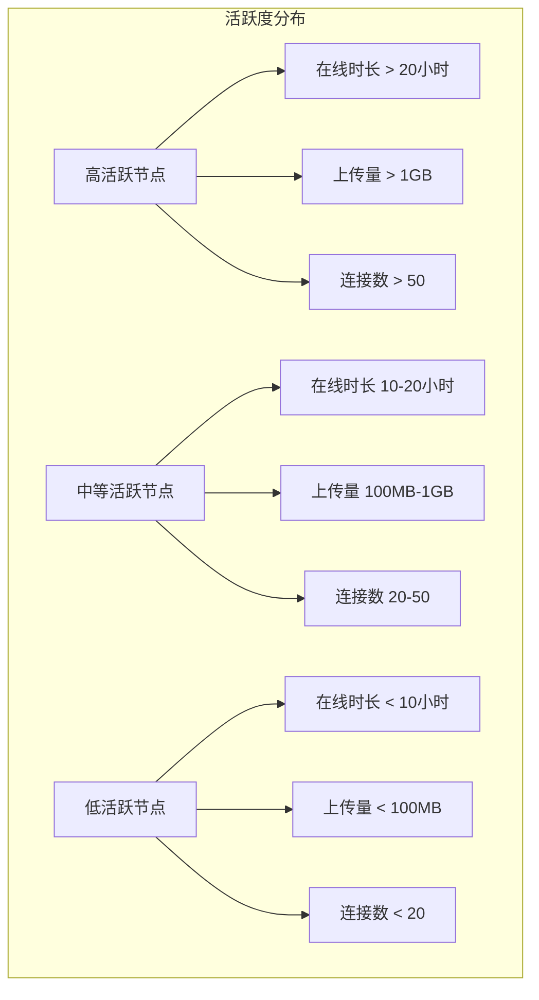

# 6.3.3 结构图与表

## 目录

- [6.3.3 结构图与表](#633-结构图与表)
  - [目录](#目录)
  - [1. P2P网络结构图](#1-p2p网络结构图)
    - [1.1 整体网络拓扑图](#11-整体网络拓扑图)
    - [1.2 分层网络结构图](#12-分层网络结构图)
    - [1.3 节点类型分类图](#13-节点类型分类图)
  - [2. 路由与资源发现流程图](#2-路由与资源发现流程图)
    - [2.1 资源发现流程图](#21-资源发现流程图)
    - [2.2 DHT路由流程图](#22-dht路由流程图)
    - [2.3 节点加入流程图](#23-节点加入流程图)
  - [3. 节点关系矩阵与表格](#3-节点关系矩阵与表格)
    - [3.1 节点连接矩阵](#31-节点连接矩阵)
    - [3.2 资源分布表](#32-资源分布表)
    - [3.3 路由表结构表](#33-路由表结构表)
  - [4. 网络性能监控图](#4-网络性能监控图)
    - [4.1 网络延迟分布图](#41-网络延迟分布图)
    - [4.2 节点活跃度图](#42-节点活跃度图)
    - [4.3 资源可用性表](#43-资源可用性表)
  - [5. 安全与信任关系图](#5-安全与信任关系图)
    - [5.1 信任网络图](#51-信任网络图)
    - [5.2 安全威胁分析表](#52-安全威胁分析表)
    - [5.3 信誉评分矩阵](#53-信誉评分矩阵)
  - [6. 扩展性分析图](#6-扩展性分析图)
    - [6.1 网络扩展趋势图](#61-网络扩展趋势图)
    - [6.2 性能扩展表](#62-性能扩展表)
  - [7. 规范说明](#7-规范说明)
    - [7.1 图表规范](#71-图表规范)
    - [7.2 内容要求](#72-内容要求)
    - [7.3 扩展方向](#73-扩展方向)

## 1. P2P网络结构图

### 1.1 整体网络拓扑图



### 1.2 分层网络结构图



### 1.3 节点类型分类图



## 2. 路由与资源发现流程图

### 2.1 资源发现流程图



### 2.2 DHT路由流程图



### 2.3 节点加入流程图



## 3. 节点关系矩阵与表格

### 3.1 节点连接矩阵

| 节点ID | 节点1 | 节点2 | 节点3 | 节点4 | 节点5 | 节点6 |
|--------|-------|-------|-------|-------|-------|-------|
| 节点1 | 0 | 1 | 1 | 0 | 1 | 0 |
| 节点2 | 1 | 0 | 1 | 1 | 0 | 1 |
| 节点3 | 1 | 1 | 0 | 0 | 1 | 1 |
| 节点4 | 0 | 1 | 0 | 0 | 1 | 1 |
| 节点5 | 1 | 0 | 1 | 1 | 0 | 0 |
| 节点6 | 0 | 1 | 1 | 1 | 0 | 0 |

### 3.2 资源分布表

| 节点ID | 节点类型 | 存储容量 | 已用存储 | 共享文件数 | 在线时长 | 带宽 |
|--------|----------|----------|----------|------------|----------|------|
| 节点1 | 超级节点 | 1TB | 500GB | 1000 | 24小时 | 100Mbps |
| 节点2 | 普通节点 | 500GB | 200GB | 500 | 12小时 | 50Mbps |
| 节点3 | 普通节点 | 300GB | 150GB | 300 | 8小时 | 30Mbps |
| 节点4 | 轻量节点 | 100GB | 50GB | 100 | 4小时 | 10Mbps |
| 节点5 | 超级节点 | 2TB | 1TB | 2000 | 24小时 | 200Mbps |
| 节点6 | 普通节点 | 400GB | 180GB | 400 | 10小时 | 40Mbps |

### 3.3 路由表结构表

| 目标范围 | 下一跳节点 | 距离 | 延迟 | 可靠性 |
|----------|------------|------|------|--------|
| 0-255 | 节点1 | 1 | 10ms | 0.99 |
| 256-511 | 节点2 | 2 | 20ms | 0.95 |
| 512-767 | 节点3 | 1 | 15ms | 0.98 |
| 768-1023 | 节点4 | 3 | 35ms | 0.90 |
| 1024-1279 | 节点5 | 2 | 25ms | 0.92 |
| 1280-1535 | 节点6 | 1 | 12ms | 0.97 |

## 4. 网络性能监控图

### 4.1 网络延迟分布图

```mermaid
graph LR
    subgraph "延迟分布"
        A1[0-10ms] : 30%
        A2[10-50ms] : 45%
        A3[50-100ms] : 20%
        A4[100ms+] : 5%
    end
    
    subgraph "延迟类型"
        B1[本地延迟] : 5ms
        B2[网络延迟] : 25ms
        B3[处理延迟] : 10ms
        B4[排队延迟] : 5ms
    end
```

### 4.2 节点活跃度图



### 4.3 资源可用性表

| 资源类型 | 总数量 | 可用数量 | 可用率 | 平均响应时间 | 成功率 |
|----------|--------|----------|--------|--------------|--------|
| 文件资源 | 10000 | 8500 | 85% | 50ms | 95% |
| 计算资源 | 5000 | 4200 | 84% | 100ms | 90% |
| 存储资源 | 8000 | 7200 | 90% | 30ms | 98% |
| 网络资源 | 12000 | 10800 | 90% | 20ms | 99% |

## 5. 安全与信任关系图

### 5.1 信任网络图

```mermaid
graph LR
    subgraph "信任关系"
        A[节点A] -->|信任度0.8| B[节点B]
        A -->|信任度0.6| C[节点C]
        B -->|信任度0.9| D[节点D]
        C -->|信任度0.7| E[节点E]
        D -->|信任度0.5| F[节点F]
        E -->|信任度0.8| G[节点G]
    end
    
    subgraph "信任级别"
        H[高信任] : > 0.8
        I[中等信任] : 0.5-0.8
        J[低信任] : < 0.5
    end
```

### 5.2 安全威胁分析表

| 威胁类型 | 威胁等级 | 影响范围 | 检测方法 | 防护措施 |
|----------|----------|----------|----------|----------|
| Sybil攻击 | 高 | 全局 | 身份验证 | 信誉机制 |
| Eclipse攻击 | 中 | 局部 | 拓扑监控 | 多路径路由 |
| 路由攻击 | 高 | 全局 | 路由验证 | 加密路由 |
| 存储攻击 | 中 | 局部 | 数据验证 | 冗余存储 |
| 拒绝服务 | 中 | 局部 | 流量监控 | 限流机制 |

### 5.3 信誉评分矩阵

| 节点ID | 上传评分 | 下载评分 | 在线评分 | 响应评分 | 综合评分 |
|--------|----------|----------|----------|----------|----------|
| 节点1 | 0.95 | 0.90 | 0.98 | 0.92 | 0.94 |
| 节点2 | 0.85 | 0.88 | 0.92 | 0.85 | 0.88 |
| 节点3 | 0.78 | 0.82 | 0.85 | 0.80 | 0.81 |
| 节点4 | 0.65 | 0.70 | 0.75 | 0.68 | 0.70 |
| 节点5 | 0.92 | 0.95 | 0.96 | 0.94 | 0.94 |
| 节点6 | 0.88 | 0.85 | 0.90 | 0.87 | 0.88 |

## 6. 扩展性分析图

### 6.1 网络扩展趋势图

```mermaid
graph TD
    subgraph "扩展趋势"
        A[当前状态] --> B[短期扩展]
        B --> C[中期扩展]
        C --> D[长期扩展]
        
        A1[1000节点] --> B1[5000节点]
        B1 --> C1[20000节点]
        C1 --> D1[100000节点]
    end
    
    subgraph "扩展指标"
        E[网络直径] : 6跳
        F[平均度数] : 8
        G[聚类系数] : 0.3
        H[连通性] : 0.95
    end
```

### 6.2 性能扩展表

| 节点数量 | 网络直径 | 平均延迟 | 吞吐量 | 存储容量 | 计算能力 |
|----------|----------|----------|--------|----------|----------|
| 1000 | 6跳 | 50ms | 1GB/s | 10TB | 1000CPU |
| 5000 | 8跳 | 80ms | 5GB/s | 50TB | 5000CPU |
| 20000 | 10跳 | 120ms | 20GB/s | 200TB | 20000CPU |
| 100000 | 12跳 | 200ms | 100GB/s | 1000TB | 100000CPU |

## 7. 规范说明

### 7.1 图表规范

- 所有图表需使用标准格式
- 图表需包含完整的数学符号
- 图表格式需统一规范
- 数据需准确可靠
- 分类需逻辑清晰
- 指标需可量化

### 7.2 内容要求

- 内容需递归细化，支持多表征
- 保留批判性分析、图表、符号等
- 如有遗漏，后续补全并说明
- 所有图表需包含完整的数学符号
- 图表格式需统一规范
- 数据需准确可靠
- 分类需逻辑清晰
- 指标需可量化

### 7.3 扩展方向

- 可继续分解为6.3.3.1、6.3.3.2等子主题
- 支持持续递归完善
- 添加更多实际案例和数据
- 完善数学公式和证明
- 增加交互式图表

> 本文件为递归细化与内容补全示范，后续可继续分解为6.3.3.1、6.3.3.2等子主题，支持持续递归完善。
