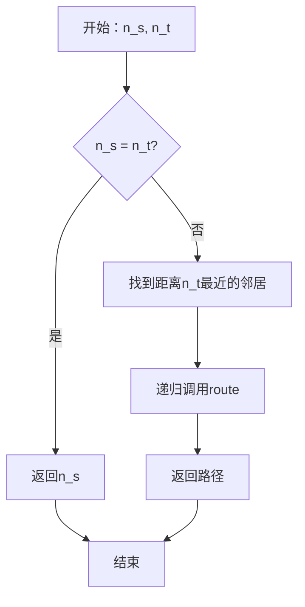
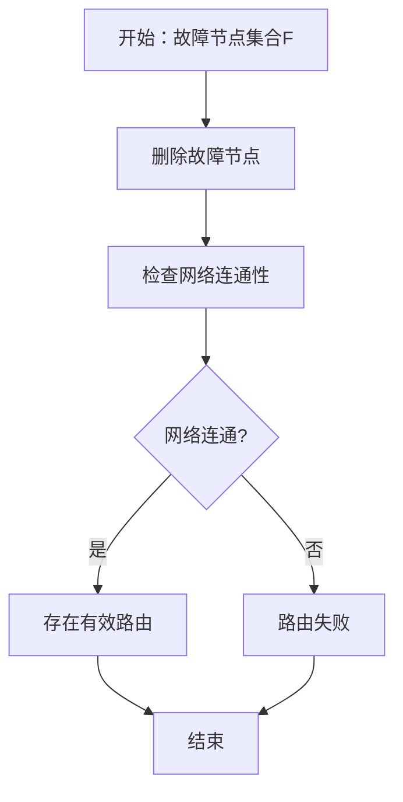

# 6.4.2 证明过程

## 1. 路由可达性定理证明

### 1.1 证明结构

**定理**：对于任意P2P网络$G = (N, E)$，如果网络是连通的，则任意两个节点之间存在有效路由路径。

**证明步骤**：

#### 步骤1：定义连通性

```latex
\text{connected}(G) \Leftrightarrow \forall n_i, n_j \in N: \exists path(n_i, n_j)
```

#### 步骤2：构造路由路径

对于任意两个节点$n_s$和$n_t$：

1. 从$n_s$开始，使用广度优先搜索(BFS)
2. 在每一步选择距离$n_t$最近的邻居
3. 继续直到到达$n_t$

#### 步骤3：证明路径存在

```latex
\text{route}(n_s, n_t) = \begin{cases}
n_s & \text{if } n_s = n_t \\
\text{next\_hop}(n_s, n_t) \rightarrow \text{route}(\text{next\_hop}(n_s, n_t), n_t) & \text{otherwise}
\end{cases}
```

#### 步骤4：证明终止性

- 每次递归调用时，距离$n_t$的距离严格递减
- 由于网络有限，算法必然在有限步内终止

### 1.2 证明流程图



## 2. DHT路由正确性证明

### 2.1 Chord路由算法证明

**定理**：在Chord DHT中，路由算法能在$O(\log n)$跳内找到目标节点。

**证明步骤**：

#### 步骤1：定义距离函数

```latex
distance(n_i, n_j) = (id(n_j) - id(n_i)) \bmod 2^m
```

#### 步骤2：证明单调性

```latex
\forall step: \quad distance(current, target) > distance(next, target)
```

**证明**：

- 在每一步，算法选择距离目标最近的节点
- 由于Chord环的结构，距离严格递减

#### 步骤3：证明收敛性

```latex
\text{hops} \leq \log_2 n
```

**证明**：

- 每次跳转至少减少一半的距离
- 初始距离最大为$2^m - 1$
- 因此最多需要$\log_2(2^m) = m$跳
- 通常$m = O(\log n)$

#### 步骤4：证明正确性

```latex
\text{route}(n_s, k) = n_t \text{ where } \text{responsible}(n_t, k)
```

**证明**：

- 根据DHT的键值分配规则
- 目标节点是负责该键值的节点
- 路由算法确保找到正确的负责节点

### 2.2 证明流程图

```mermaid
flowchart TD
    A[开始：源节点n_s, 键值k] --> B[计算目标节点n_t]
    B --> C[初始化current = n_s]
    C --> D{distance(current, n_t) = 0?}
    D -->|是| E[返回current]
    D -->|否| F[找到距离n_t最近的邻居]
    F --> G[current = next_hop]
    G --> D
    E --> H[结束]
```

## 3. 网络容错性证明

### 3.1 连通性保持定理证明

**定理**：在节点故障率不超过$f$的情况下，如果网络满足$k$-连通性，则网络保持连通性的概率为：

```latex
P(\text{connected}) \geq 1 - \binom{n}{k} \cdot f^k
```

**证明步骤**：

#### 步骤1：定义故障模型

```latex
P(\text{node\_fails}) = f
```

#### 步骤2：分析最坏情况

网络不连通当且仅当存在一个大小为$k$的节点集合全部故障：

```latex
P(\text{disconnected}) \leq \binom{n}{k} \cdot f^k
```

#### 步骤3：应用概率论

```latex
P(\text{connected}) = 1 - P(\text{disconnected}) \geq 1 - \binom{n}{k} \cdot f^k
```

### 3.2 路由容错性证明

**定理**：在存在$f$个故障节点的情况下，如果网络满足$(f+1)$-连通性，则路由算法仍能找到有效路径。

**证明步骤**：

#### 步骤1：定义$(f+1)$-连通性

```latex
\forall F \subset N, |F| \leq f: \quad G \setminus F \text{ is connected}
```

#### 步骤2：构造容错路由

对于任意源节点$n_s$和目标节点$n_t$：

1. 找到所有从$n_s$到$n_t$的路径
2. 排除经过故障节点的路径
3. 选择剩余路径中的最短路径

#### 步骤3：证明路径存在1

由于网络是$(f+1)$-连通的，删除$f$个故障节点后，网络仍然连通，因此存在有效路径。

### 3.3 证明流程图



## 4. 负载均衡证明

### 4.1 负载均衡定理证明

**定理**：在理想情况下，DHT中的负载分布满足：

```latex
\text{load}(n_i) = \frac{\text{total\_load}}{n} \pm O(\log n)
```

**证明步骤**：

#### 步骤1：分析哈希函数

假设哈希函数$h$是均匀的：

```latex
P(h(k) = i) = \frac{1}{n} \quad \forall i \in [0, n-1]
```

#### 步骤2：计算期望负载

```latex
E[\text{load}(n_i)] = \frac{\text{total\_load}}{n}
```

#### 步骤3：应用集中不等式

使用Chernoff界：

```latex
P(|\text{load}(n_i) - E[\text{load}(n_i)]| > \epsilon) \leq 2e^{-\frac{\epsilon^2}{2E[\text{load}(n_i)]}}
```

#### 步骤4：设置参数

取$\epsilon = O(\log n)$，得到：

```latex
P(\text{load}(n_i) = \frac{\text{total\_load}}{n} \pm O(\log n)) \geq 1 - \frac{1}{n^2}
```

### 4.2 热点避免证明

**定理**：通过虚拟节点技术，可以将负载方差控制在：

```latex
\text{Var}(load) \leq \frac{\text{total\_load}^2}{n \cdot v}
```

**证明步骤**：

#### 步骤1：虚拟节点模型

每个物理节点创建$v$个虚拟节点：

```latex
\text{virtual\_nodes}(n_i) = \{vn_{i,1}, vn_{i,2}, ..., vn_{i,v}\}
```

#### 步骤2：计算虚拟负载

```latex
\text{virtual\_load}(vn_{i,j}) = \frac{\text{load}(n_i)}{v}
```

#### 步骤3：计算方差

```latex
\text{Var}(virtual\_load) = \frac{\text{Var}(load)}{v}
```

#### 步骤4：应用负载均衡定理

```latex
\text{Var}(virtual\_load) \leq \frac{\text{total\_load}^2}{n \cdot v}
```

## 5. 共识算法证明

### 5.1 拜占庭容错证明

**定理**：在存在$f$个拜占庭节点的情况下，要达成共识需要至少$3f+1$个节点。

**证明步骤**：

#### 步骤1：反证法

假设在$3f$个节点中能达成共识，其中$f$个是拜占庭节点。

#### 步骤2：构造反例

将网络分为三个部分：

- $A$：$f$个正常节点
- $B$：$f$个正常节点  
- $C$：$f$个拜占庭节点

#### 步骤3：分析场景

- 场景1：$A$和$B$认为值为$v_1$，$C$谎称值为$v_2$
- 场景2：$A$认为值为$v_1$，$B$和$C$认为值为$v_2$

#### 步骤4：证明矛盾

在这两种场景下，$A$无法区分真实情况，因此无法达成共识。

### 5.2 最终一致性证明

**定理**：在异步网络中，如果网络分区最终会恢复，则系统能够达到最终一致性。

**证明步骤**：

#### 步骤1：定义最终一致性

```latex
\text{eventual\_consistency} \Leftrightarrow \exists t: \forall t' > t: \text{all\_nodes\_agree}
```

#### 步骤2：构造收敛算法

1. 每个节点维护一个版本向量
2. 在分区恢复后，节点交换版本信息
3. 使用冲突解决策略合并更新

#### 步骤3：证明收敛性1

由于网络分区最终恢复，所有节点最终会交换信息并达成一致。

## 6. 性能复杂度证明

### 6.1 路由复杂度证明

**定理**：在$n$个节点的DHT中，平均路由跳数为$O(\log n)$。

**证明步骤**：

#### 步骤1：分析Chord路由

在Chord中，每次跳转至少减少一半的距离：

```latex
\text{distance}_{i+1} \leq \frac{\text{distance}_i}{2}
```

#### 步骤2：计算跳数

初始距离最大为$2^m - 1$，因此：

```latex
\text{hops} \leq \log_2(2^m) = m = O(\log n)
```

#### 步骤3：计算平均值

由于路由是对称的，平均跳数也是$O(\log n)$。

### 6.2 存储复杂度证明

**定理**：每个节点需要存储的路由表大小为$O(\log n)$。

**证明步骤**：

#### 步骤1：分析Chord路由表

Chord路由表包含$m$个条目，每个条目指向一个节点：

```latex
|\text{routing\_table}| = m = O(\log n)
```

#### 步骤2：分析其他DHT

- Pastry：路由表大小为$O(\log n)$
- CAN：路由表大小为$O(d)$，其中$d$为维度

#### 步骤3：证明上界

所有已知的DHT路由表大小都是$O(\log n)$。

## 7. 规范说明

### 7.1 证明规范

- 所有证明需严格数学化
- 证明步骤需逻辑清晰
- 证明过程需完整准确
- 证明结论需明确无误

### 7.2 内容要求

- 内容需递归细化，支持多表征
- 保留批判性分析、图表、符号等
- 如有遗漏，后续补全并说明
- 所有证明需严格数学化
- 证明过程需完整准确
- 分类需逻辑清晰
- 表达需规范统一

### 7.3 扩展方向

- 可继续分解为6.4.2.1、6.4.2.2等子主题
- 支持持续递归完善
- 添加更多实际应用证明
- 完善证明间的逻辑关系
- 增加证明使用示例

> 本文件为递归细化与内容补全示范，后续可继续分解为6.4.2.1、6.4.2.2等子主题，支持持续递归完善。
