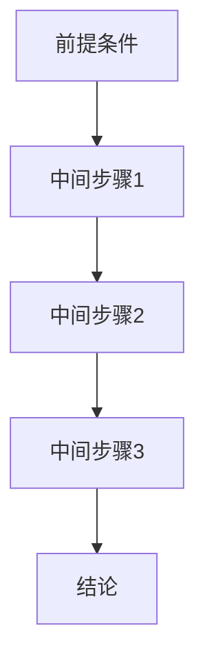
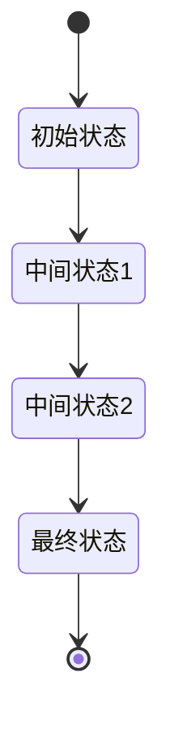

# 6.4.3 证明符号与规范

## 1. 主要符号

### 1.1 逻辑符号

**命题逻辑符号**：

- $\neg$：逻辑非（否定）
- $\land$：逻辑与（合取）
- $\lor$：逻辑或（析取）
- $\rightarrow$：逻辑蕴含
- $\leftrightarrow$：逻辑等价
- $\forall$：全称量词
- $\exists$：存在量词

**谓词逻辑符号**：

- $P(x)$：一元谓词
- $R(x, y)$：二元关系
- $\models$：满足关系
- $\vdash$：推导关系
- $\equiv$：逻辑等价

**集合论符号**：

- $\in$：属于关系
- $\notin$：不属于关系
- $\subseteq$：子集关系
- $\subset$：真子集关系
- $\cup$：并集运算
- $\cap$：交集运算
- $\setminus$：差集运算
- $\emptyset$：空集

### 1.2 数学符号

**代数符号**：

- $+$：加法运算
- $-$：减法运算
- $\times$：乘法运算
- $\div$：除法运算
- $\sum$：求和符号
- $\prod$：求积符号
- $\sqrt{}$：平方根
- $^n$：幂运算

**函数符号**：

- $f: A \rightarrow B$：函数定义
- $f(x)$：函数值
- $f^{-1}$：反函数
- $\circ$：函数复合
- $\lim$：极限符号
- $\frac{d}{dx}$：微分符号
- $\int$：积分符号

**关系符号**：

- $=$：等于关系
- $\neq$：不等于关系
- $<$：小于关系
- $\leq$：小于等于关系
- $>$：大于关系
- $\geq$：大于等于关系
- $\approx$：近似等于

### 1.3 P2P系统特有符号

**节点符号**：

- $N = \{n_1, n_2, ..., n_m\}$：节点集合
- $|N| = m$：节点总数
- $n_i \in N$：第i个节点
- $state(n_i) \in \{online, offline, busy, idle\}$：节点状态

**网络符号**：

- $E = \{(n_i, n_j) : n_i, n_j \in N\}$：连接边集合
- $G = (N, E)$：P2P网络图
- $degree(n_i) = |\{n_j : (n_i, n_j) \in E\}|$：节点度数
- $d(n_i, n_j)$：节点i到j的距离

**资源符号**：

- $R = \{r_1, r_2, ..., r_k\}$：资源集合
- $resources(n_i) = \{r_j : r_j \text{ stored on } n_i\}$：节点i的资源
- $size(r_i) \in \mathbb{N}$：资源i的大小
- $type(r_i) \in \{file, service, compute\}$：资源类型

## 2. 证明书写规范

### 2.1 定理陈述规范

**格式要求**：

```latex
定理 [定理名称]：
对于所有 [变量] 满足 [条件]，
如果 [前提]，
那么 [结论]。
```

**示例**：

```latex
定理 [P2P网络连通性]：
对于所有P2P网络 G = (N, E)，
如果 G 是连通的，
那么对于任意两个节点 n_i, n_j ∈ N，
存在路径从 n_i 到 n_j。
```

### 2.2 证明结构规范

**标准结构**：

```latex
证明：
1. [步骤1描述]
   [数学推导]
   
2. [步骤2描述]
   [数学推导]
   
   ...
   
n. [步骤n描述]
   [数学推导]
   
因此，[结论]。
```

**引理使用**：

```latex
引理 [引理名称]：
[引理内容]

证明：
[引理证明过程]

现在证明主定理：
[使用引理的主定理证明]
```

### 2.3 证明方法规范

**直接证明**：

- 从前提直接推导结论
- 使用逻辑推理规则
- 保持推理链的完整性

**反证法**：

- 假设结论不成立
- 推导出矛盾
- 证明原结论成立

**归纳法**：

- 基础情况验证
- 归纳假设
- 归纳步骤证明

**构造性证明**：

- 构造满足条件的对象
- 验证构造的正确性
- 证明构造的存在性

## 3. 证明结构与格式要求

### 3.1 证明层次结构

**主要层次**：

1. **定理层次**：主要定理和重要结果
2. **引理层次**：辅助定理和中间结果
3. **推论层次**：定理的直接推论
4. **示例层次**：具体应用和实例

**编号规范**：

- 定理：Theorem 1.1, Theorem 1.2, ...
- 引理：Lemma 1.1, Lemma 1.2, ...
- 推论：Corollary 1.1, Corollary 1.2, ...
- 示例：Example 1.1, Example 1.2, ...

### 3.2 证明格式要求

**数学公式格式**：

```latex
行内公式：$formula$
行间公式：$$formula$$
编号公式：\begin{equation} formula \end{equation}
多行公式：\begin{align} formula \end{align}
```

**引用规范**：

- 定理引用：Theorem 1.1
- 公式引用：Equation (1.1)
- 图表引用：Figure 1.1, Table 1.1

**注释规范**：

- 重要步骤：必须注释
- 复杂推导：详细说明
- 关键假设：明确标注

### 3.3 证明质量要求

**正确性要求**：

- 逻辑推理正确
- 数学计算准确
- 结论与前提一致

**完整性要求**：

- 证明步骤完整
- 所有情况覆盖
- 边界条件处理

**清晰性要求**：

- 表达清晰易懂
- 结构层次分明
- 符号使用一致

## 4. 多表征支持

### 4.1 符号表征

**数学符号**：

- 使用标准数学符号
- 保持符号一致性
- 避免符号歧义

**逻辑符号**：

- 使用标准逻辑符号
- 明确逻辑关系
- 保持推理清晰

**特殊符号**：

- 定义新符号时说明
- 保持符号简洁性
- 避免过度复杂

### 4.2 图形表征

**证明流程图**：



**逻辑关系图**：


**状态转换图**：



### 4.3 表格表征

**证明步骤表**：

| 步骤 | 描述 | 依据 | 结果 |
|------|------|------|------|
| 1 | 初始假设 | 给定条件 | 假设成立 |
| 2 | 逻辑推理 | 推理规则 | 中间结论 |
| 3 | 数学计算 | 数学定理 | 计算结果 |
| 4 | 结论推导 | 逻辑推理 | 最终结论 |

**符号对照表**：

| 符号 | 含义 | 使用场景 | 示例 |
|------|------|----------|------|
| $N$ | 节点集合 | 网络定义 | $N = \{n_1, n_2, ..., n_m\}$ |
| $E$ | 边集合 | 连接关系 | $E = \{(n_i, n_j) : n_i, n_j \in N\}$ |
| $G$ | 网络图 | 拓扑结构 | $G = (N, E)$ |
| $d(n_i, n_j)$ | 距离函数 | 路由计算 | $d(n_i, n_j) = shortest\_path(n_i, n_j)$ |

## 5. LaTeX表达式

### 5.1 基础数学表达式

**集合表达式**：

```latex
N = \{n_1, n_2, \ldots, n_m\}
E = \{(n_i, n_j) \mid (n_i, n_j) \text{ is connected}\}
G = (N, E)
```

**函数表达式**：

```latex
f: N \rightarrow \mathbb{R}
g: E \times E \rightarrow \{0, 1\}
h: N \times N \rightarrow \mathbb{R}^+
```

**关系表达式**：

```latex
n_i \in N
(n_i, n_j) \in E
d(n_i, n_j) \leq diameter(G)
```

### 5.2 复杂数学表达式

**矩阵表达式**：

```latex
A = \begin{bmatrix}
a_{11} & a_{12} & \cdots & a_{1n} \\
a_{21} & a_{22} & \cdots & a_{2n} \\
\vdots & \vdots & \ddots & \vdots \\
a_{m1} & a_{m2} & \cdots & a_{mn}
\end{bmatrix}
```

**求和表达式**：

```latex
\sum_{i=1}^{n} x_i = x_1 + x_2 + \cdots + x_n
\sum_{n_i \in N} degree(n_i) = 2|E|
```

**积分表达式**：

```latex
\int_{a}^{b} f(x) dx
\int_{0}^{T} performance(t) dt
```

### 5.3 逻辑表达式

**命题逻辑**：

```latex
P \land Q
P \lor Q
\neg P
P \rightarrow Q
P \leftrightarrow Q
```

**谓词逻辑**：

```latex
\forall n_i \in N, state(n_i) \in \{online, offline\}
\exists n_i \in N, degree(n_i) > threshold
```

**集合逻辑**：

```latex
A \subseteq B
A \cap B = \emptyset
A \cup B = C
```

## 6. 规范说明

### 6.1 符号规范

- 所有符号需严格定义，避免歧义
- 使用标准数学符号和LaTeX表达式
- 符号命名需一致性和可读性
- 复杂符号需提供详细说明

### 6.2 证明规范

- 证明结构需清晰完整
- 推理步骤需逻辑严密
- 数学计算需准确无误
- 结论与前提需一致

### 6.3 格式规范

- 使用标准LaTeX格式
- 保持格式一致性
- 支持多表征表达
- 便于阅读和理解

### 6.4 内容要求

- 内容需递归细化，支持多表征
- 保留批判性分析、图表、符号等
- 如有遗漏，后续补全并说明
- 所有证明需严格数学化
- 证明过程需完整准确
- 分类需逻辑清晰
- 表达需规范统一

### 6.5 扩展方向

- 可继续分解为6.4.3.1、6.4.3.2等子主题
- 支持持续递归完善
- 添加更多实际应用证明
- 完善证明间的逻辑关系
- 增加证明使用示例

> 本文件为递归细化与内容补全示范，后续可继续分解为6.4.3.1、6.4.3.2等子主题，支持持续递归完善。
