# 6.5.1 概念图

## 概述

P2P系统概念图通过图形化方式展示P2P系统的核心概念、网络拓扑、协议算法和关系，帮助理解P2P系统的整体框架和内在逻辑。

## 1. P2P系统总体概念图 (Overall P2P System Concept Map)

### 1.1 核心概念层次图

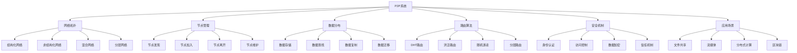

### 1.2 P2P系统发展历程图

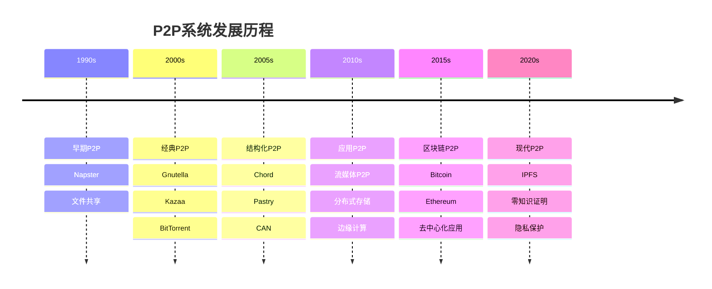

## 2. 网络拓扑概念图 (Network Topology Concept Maps)

### 2.1 拓扑类型分类图

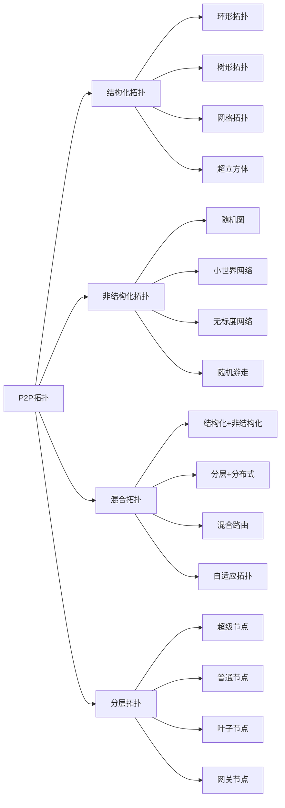

### 2.2 网络结构分析图

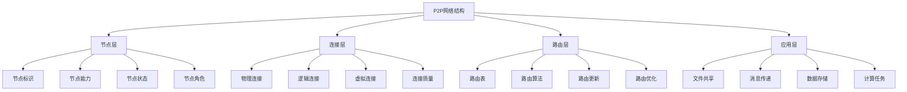

## 3. 节点管理概念图 (Node Management Concept Maps)

### 3.1 节点生命周期图

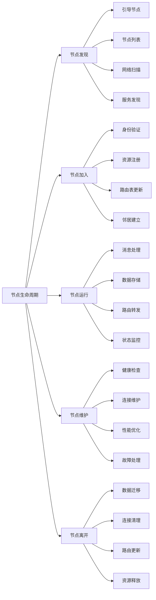

### 3.2 节点角色分类图

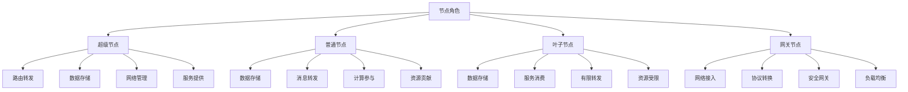

## 4. 数据分布概念图 (Data Distribution Concept Maps)

### 4.1 数据存储策略图

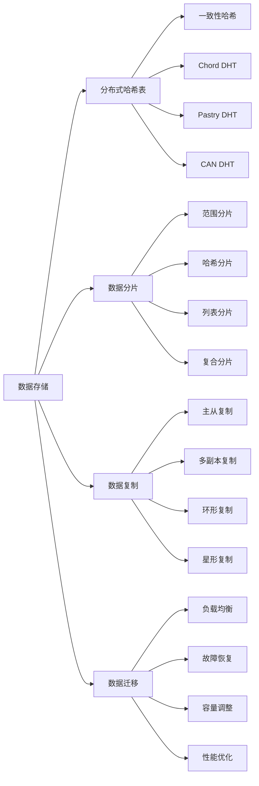

### 4.2 数据查找算法图

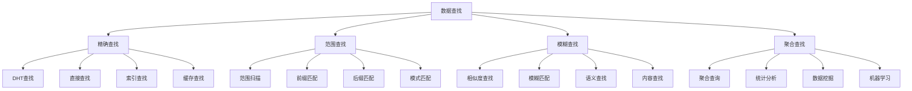

## 5. 路由算法概念图 (Routing Algorithm Concept Maps)

### 5.1 路由算法分类图

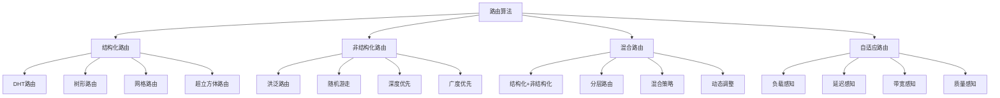

### 5.2 DHT路由算法图

```mermaid
graph LR
    A[DHT路由] --> B[Chord]
    A --> C[Pastry]
    A --> D[CAN]
    A --> E[Kademlia]
    
    B --> B1[环形拓扑]
    B --> B2[手指表]
    B --> B3[O(log N)路由]
    B --> B4[一致性哈希]
    
    C --> C1[前缀路由]
    C --> C2[叶子集]
    C --> C3[邻居集]
    C --> C4[O(log N)路由]
    
    D --> D1[多维空间]
    D --> D2[坐标路由]
    D --> D3[区域分割]
    D --> D4[O(d)路由]
    
    E --> E1[XOR距离]
    E --> E2[K桶]
    E --> E3[并行查找]
    E --> E4[O(log N)路由]
```

## 6. 安全机制概念图 (Security Mechanism Concept Maps)

### 6.1 安全威胁分类图

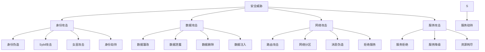

### 6.2 安全防护策略图

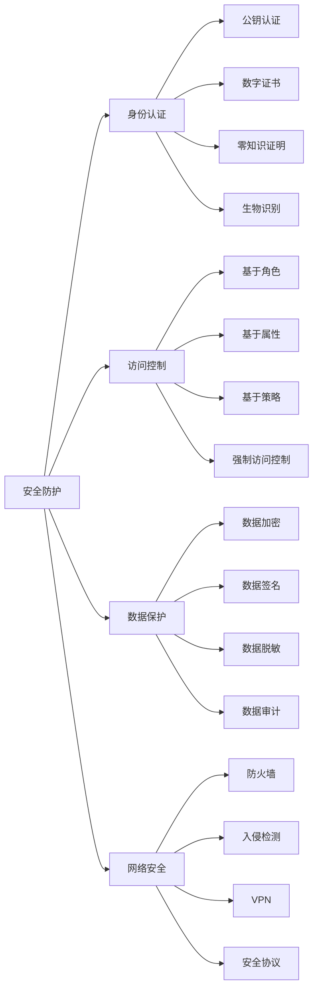

## 7. 信任机制概念图 (Trust Mechanism Concept Maps)

### 7.1 信任模型分类图

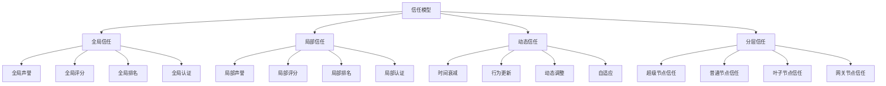

### 7.2 信任计算算法图

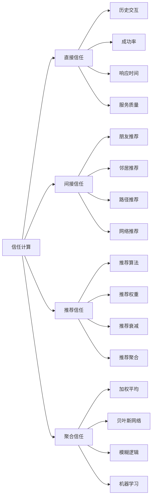

## 8. 应用场景概念图 (Application Scenario Concept Maps)

### 8.1 应用类型分类图

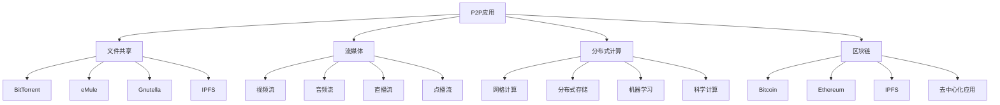

### 8.2 应用特性分析图

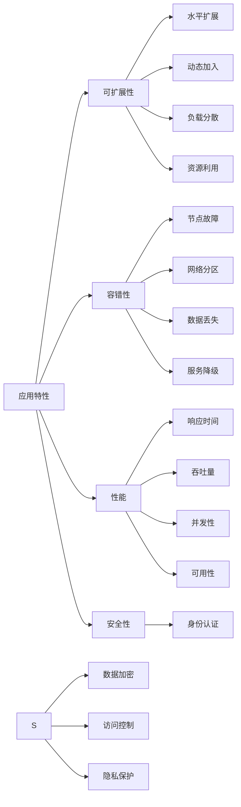

## 9. 性能优化概念图 (Performance Optimization Concept Maps)

### 9.1 性能指标分析图

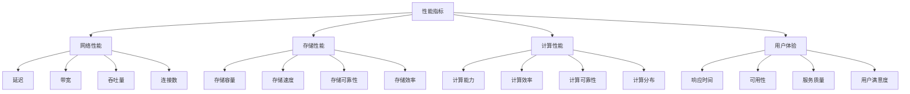

### 9.2 优化策略分析图

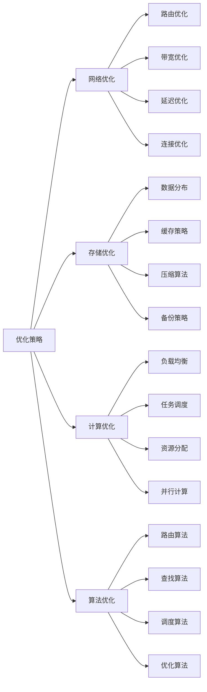

## 10. 发展趋势概念图 (Development Trend Concept Maps)

### 10.1 技术趋势分析图

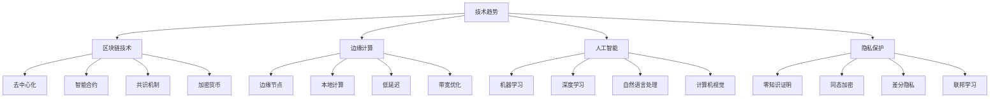

### 10.2 应用趋势分析图

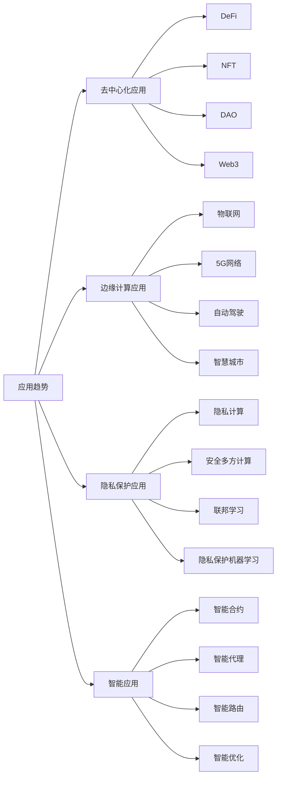
