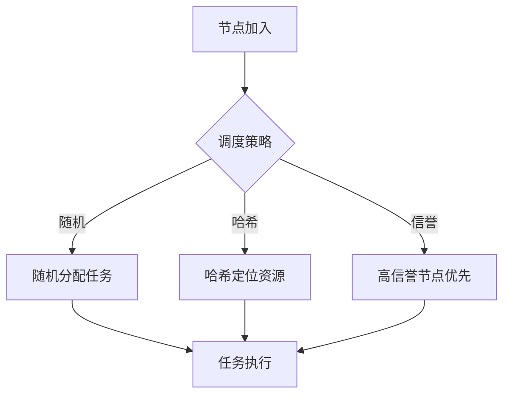

# 6.7.1 运行时行为与调度模型


<!-- TOC START -->

- [6.7.1 运行时行为与调度模型](#671-运行时行为与调度模型)
  - [1. 主题简介](#1-主题简介)
  - [2. 典型运行时行为](#2-典型运行时行为)
  - [3. 调度模型分类与对比](#3-调度模型分类与对比)
  - [4. Mermaid 调度流程示意图](#4-mermaid-调度流程示意图)
  - [5. 伪代码/公式](#5-伪代码公式)
  - [6. 工程案例](#6-工程案例)
  - [7. 未来展望](#7-未来展望)

<!-- TOC END -->

## 1. 主题简介

- 概述P2P系统运行时行为的特点与调度模型的核心作用。
- 强调去中心化、节点自治、动态性等对运行时语义的特殊要求。

## 2. 典型运行时行为

- 节点发现与连接
- 资源查找与分发
- 任务调度与负载均衡
- 故障检测与恢复

## 3. 调度模型分类与对比

| 调度模型 | 主要特征 | 适用场景 | 优缺点 |
|---|---|---|---|
| 随机调度 | 简单、分散 | 小规模P2P | 实现简单，效率低 |
| 基于哈希 | 一致性、分布均匀 | DHT网络 | 负载均衡好，维护复杂 |
| 基于信誉 | 节点信誉驱动 | 文件分享 | 激励有效，易被攻击 |
| 协同调度 | 多节点协作 | 大规模P2P | 灵活，通信开销大 |

## 4. Mermaid 调度流程示意图



## 5. 伪代码/公式

```pseudo
// 基于哈希的任务分配伪代码
for 每个任务T:
    计算T的哈希值
    分配到对应节点
```

## 6. 工程案例

- BitTorrent分片调度
- Kademlia DHT任务分配

## 7. 未来展望

- AI驱动自适应调度
- 动态信誉与安全调度
