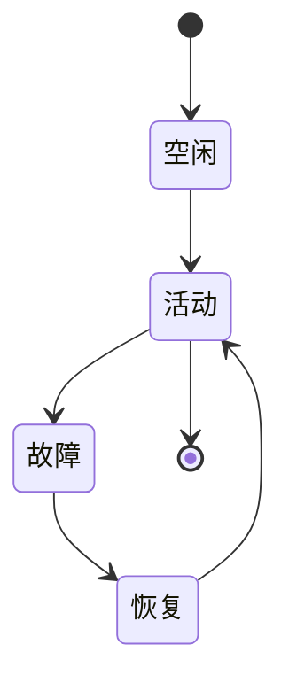

# 6.7.3 运行时语义建模与形式化验证

<!-- TOC START -->

- [6.7.3 运行时语义建模与形式化验证](#673-运行时语义建模与形式化验证)
  - [1. 主题简介](#1-主题简介)
  - [2. 运行时语义建模方法](#2-运行时语义建模方法)
  - [3. 形式化验证技术](#3-形式化验证技术)
  - [4. Mermaid 状态机示意图](#4-mermaid-状态机示意图)
  - [5. LTL/CTL公式示例](#5-ltlctl公式示例)
  - [6. 工程案例](#6-工程案例)
  - [7. 未来展望](#7-未来展望)

<!-- TOC END -->

## 1. 主题简介

- 探讨P2P系统运行时语义的建模方法与形式化验证手段。

## 2. 运行时语义建模方法

- P2P状态机建模
- Petri网建模
- DHT结构建模

## 3. 形式化验证技术

- LTL/CTL时序逻辑
- 模型检测（Model Checking）
- P2P一致性与健壮性验证

## 4. Mermaid 状态机示意图

## 5. LTL/CTL公式示例

- 一致性保证：AG(request -> AF response)
- 故障恢复：AG(failure -> AF recovery)

## 6. 工程案例

- TLA+ P2P协议验证
- Kademlia一致性LTL验证

## 7. 未来展望

- 自动化形式化验证
- 大规模P2P系统的可扩展建模
