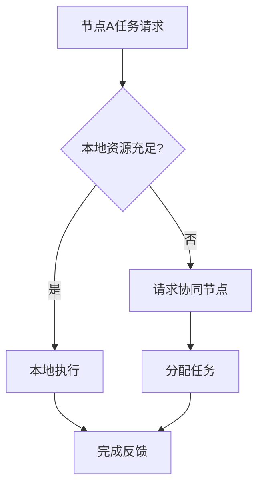

# 6.7.4 多节点协同与动态调度

## 1. 主题简介

- 探讨P2P系统中多节点协同机制与动态调度策略。

## 2. 多节点协同机制

- 分布式任务分配
- 节点间同步与通信
- 协同容错与一致性

## 3. 动态调度策略

- 负载均衡
- 节点动态加入/退出
- 异构资源感知调度

## 4. Mermaid 协同与调度流程图



## 5. 伪代码/公式

```pseudo
// 负载均衡调度伪代码
if 节点负载高:
    迁移部分任务到负载低的节点
```

## 6. 工程案例

- BitTorrent多节点分片调度
- Kademlia节点协同查找

## 7. 未来展望

- AI驱动的自适应协同调度
- 跨域多网络协同优化
