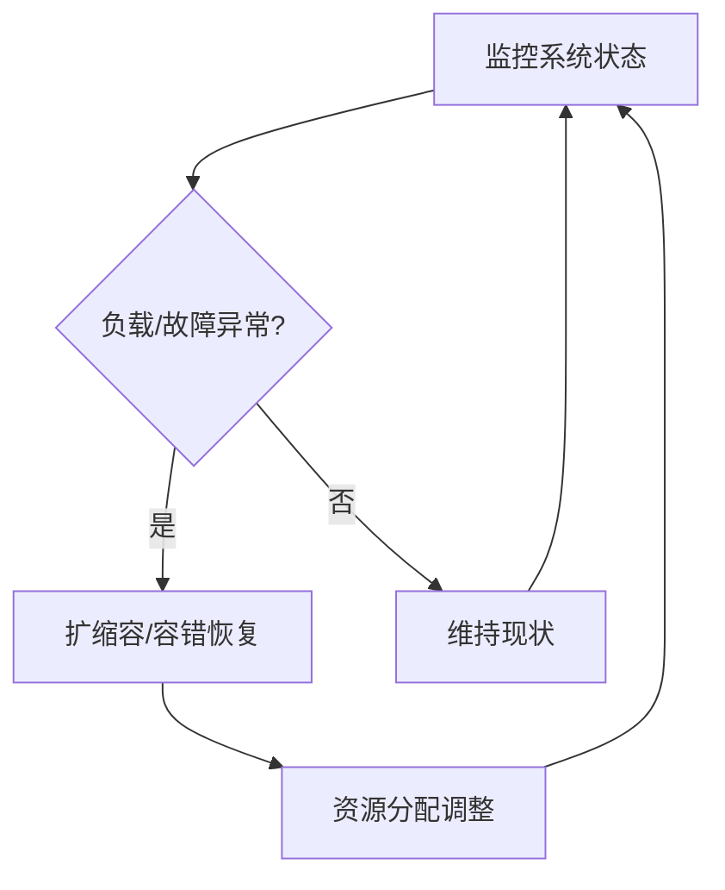

# 6.7.5 自适应与弹性运行机制


<!-- TOC START -->

- [6.7.5 自适应与弹性运行机制](#675-自适应与弹性运行机制)
  - [1. 主题简介](#1-主题简介)
  - [2. 自适应机制分类](#2-自适应机制分类)
  - [3. 弹性运行策略](#3-弹性运行策略)
  - [4. Mermaid 弹性机制流程图](#4-mermaid-弹性机制流程图)
  - [5. 伪代码/公式](#5-伪代码公式)
  - [6. 工程案例](#6-工程案例)
  - [7. 未来展望](#7-未来展望)

<!-- TOC END -->

## 1. 主题简介

- 介绍P2P系统自适应与弹性运行机制的基本原理与重要性。

## 2. 自适应机制分类

- 负载感知自适应
- 故障自愈机制
- 异构资源自适应

## 3. 弹性运行策略

- 动态资源扩缩容
- 容错与恢复
- 服务降级与迁移

## 4. Mermaid 弹性机制流程图



## 5. 伪代码/公式

```pseudo
// 动态扩缩容伪代码
if 当前负载 > 阈值:
    增加可用节点
if 当前负载 < 下限:
    减少部分节点
```

## 6. 工程案例

- BitTorrent节点自愈机制
- Kademlia弹性路由

## 7. 未来展望

- 智能化自愈与弹性调度
- 跨域自适应资源管理
