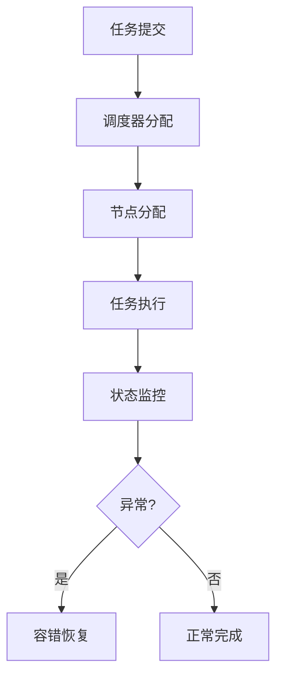

# 6.7.6 工程案例与实践


<!-- TOC START -->

- [6.7.6 工程案例与实践](#676-工程案例与实践)
  - [1. 主题简介](#1-主题简介)
  - [2. 典型案例汇总](#2-典型案例汇总)
  - [3. 关键技术剖析](#3-关键技术剖析)
  - [4. Mermaid 案例流程图](#4-mermaid-案例流程图)
  - [5. 伪代码/公式](#5-伪代码公式)
  - [6. 案例对比分析](#6-案例对比分析)
  - [7. 未来展望](#7-未来展望)

<!-- TOC END -->

## 1. 主题简介

- 汇总P2P系统运行时语义相关的工程实践与典型案例。

## 2. 典型案例汇总

- BitTorrent分片调度
- Kademlia弹性路由
- Gnutella节点协同

## 3. 关键技术剖析

- 分布式哈希表（DHT）
- 动态节点管理
- 协同容错机制

## 4. Mermaid 案例流程图



## 5. 伪代码/公式

```pseudo
// 节点容错恢复伪代码
if 节点执行失败:
    启动任务迁移与恢复流程
```

## 6. 案例对比分析

| 案例 | 关键机制 | 优势 | 挑战 |
|---|---|---|---|
| BitTorrent | 分片调度 | 高效 | 节点波动大 |
| Kademlia | 弹性路由 | 灵活 | 路由维护复杂 |
| Gnutella | 协同查找 | 简单 | 扩展性差 |

## 7. 未来展望

- 跨平台运行时优化
- 智能化工程实践
