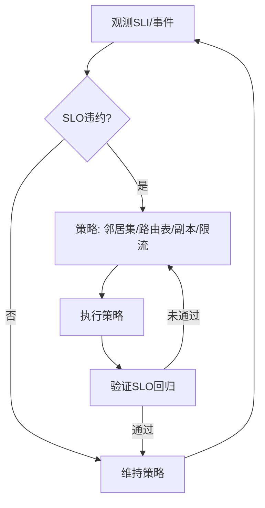

# P2P系统运行时语义


<!-- TOC START -->

- [P2P系统运行时语义](#p2p系统运行时语义)
  - [概述](#概述)
  - [目录结构](#目录结构)
  - [核心概念](#核心概念)
    - [运行时行为](#运行时行为)
    - [调度模型](#调度模型)
    - [语义建模](#语义建模)
  - [SLO/SLI 驱动的运行时闭环](#slosli-驱动的运行时闭环)
  - [Mermaid 运行时治理闭环](#mermaid-运行时治理闭环)
  - [伪代码示例](#伪代码示例)
  - [策略选择矩阵（示例）](#策略选择矩阵示例)
  - [学习目标](#学习目标)
  - [应用领域](#应用领域)
  - [相关资源](#相关资源)
  - [实践项目](#实践项目)

<!-- TOC END -->

## 概述

P2P系统运行时语义研究对等网络系统在运行过程中的行为特征、状态转换、资源调度和动态特性，为P2P系统的运行时行为分析和优化提供理论基础。

## 目录结构

- **6.7.1 运行时行为与调度模型** - P2P系统的运行时行为模型和调度机制
- **6.7.2 典型运行时机制分析** - 常见P2P系统运行时机制的分析
- **6.7.3 运行时语义建模与形式化验证** - 运行时语义的形式化建模和验证
- **6.7.4 多节点协同与动态调度** - 多节点系统的协同运行和动态调度
- **6.7.5 自适应与弹性运行机制** - 系统的自适应和弹性运行特性
- **6.7.6 工程案例与实践** - 实际工程中的运行时语义应用
- **6.7.7 未来发展与挑战** - 运行时语义领域的发展趋势和挑战

## 核心概念

### 运行时行为

- **节点状态**：P2P节点在不同状态间的转换规律
- **网络拓扑**：P2P网络拓扑的动态变化机制
- **路由行为**：P2P路由的动态调整和优化
- **数据分发**：数据在P2P网络中的分发机制

### 调度模型

- **对等调度**：P2P环境下的任务调度策略
- **负载均衡**：P2P网络负载的均衡分配
- **资源发现**：P2P网络中的资源发现机制
- **性能优化**：P2P系统性能的优化策略

### 语义建模

- **节点语义**：P2P节点操作的语义定义
- **网络语义**：P2P网络行为的数学抽象
- **路由语义**：P2P路由的语义描述
- **数据语义**：数据分发的语义定义

## SLO/SLI 驱动的运行时闭环

- SLI：查找成功率、P99 查询延迟、路由跳数、连接稳定度、分片负载熵、错误预算消耗率。
- SLO：如 P99 查找 < 200ms、查找成功率 ≥ 99.9%、平均跳数 ≤ 3、可用性 99.95%。
- 闭环：观测 → 诊断 → 策略（副本/路由表/邻居集/限流/降级）→ 执行 → 验证 → 回滚/巩固。

## Mermaid 运行时治理闭环



## 伪代码示例

```pseudo
// 邻居集自适应优化
if P99_latency 上升 或 查找失败率上升:
    替换劣化邻居(更低延迟/更稳定)
    扩充近邻覆盖(减少跳数)

// 热点分片缓解
if 分片负载熵 降低 且 热点出现:
    增加副本 或 迁移热点键
```

## 策略选择矩阵（示例）

| 场景 | 首选策略 | 备选 | 权衡 |
|---|---|---|---|
| 查找延迟升高 | 邻居集优化 + 路由表刷新 | 限流/缓存 | 表维护开销 |
| 节点频繁抖动 | 稳定性打分 + 亲和 | 再试/回退 | 路由收敛时间 |
| 热点分片 | 增副本/迁移 | 请求合并 | 一致性与成本 |
| 恶意流量 | 限速+黑名单 | 信誉系统 | 误封风险 |

## 学习目标

1. **理解P2P系统运行时语义的基本概念**
2. **掌握P2P系统的运行时行为建模方法**
3. **学会分析和设计P2P调度算法**
4. **了解形式化验证技术在P2P系统中的应用**
5. **掌握P2P网络的协同运行机制**
6. **理解P2P系统的自适应和弹性运行**

## 应用领域

- **文件共享系统**
- **内容分发网络**
- **分布式存储系统**
- **流媒体传输**
- **区块链网络**
- **分布式计算**

## 相关资源

- **经典文献**：《Peer-to-Peer: Harnessing the Power of Disruptive Technologies》、《Distributed Systems》
- **学术期刊**：IEEE Transactions on Parallel and Distributed Systems、ACM Computing Surveys
- **会议论文**：SIGCOMM、INFOCOM、ICDCS等顶级会议
- **在线资源**：P2P协议文档、网络分析工具

## 实践项目

1. **P2P调度器实现**：实现基本的P2P任务调度算法
2. **负载均衡机制**：设计P2P网络负载均衡策略
3. **资源发现系统**：实现P2P网络中的资源发现
4. **性能监控平台**：构建P2P系统的性能监控平台
